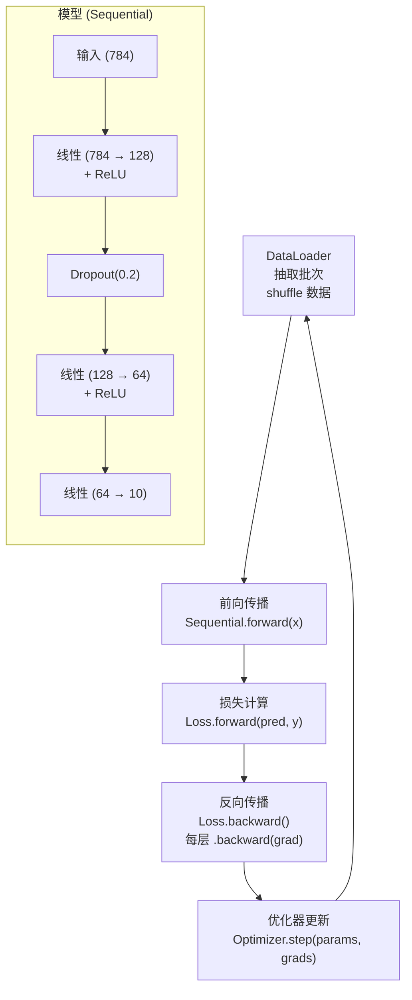
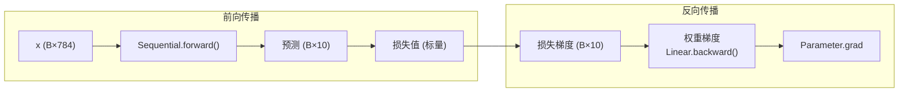

# 微型框架：集成所有组件

> 你构建了引擎的每一部分。现在将它们组装成一辆可驾驶的车。训练 MNIST。

**类型：** Build
**语言：** Python
**前置知识：** 课程 03.01-03.09
**时间：** 约 90 分钟

## 学习目标

- 将反向传播（课程 03.03）、模块化设计、层、激活（课程 03.04）、损失（课程 03.05）、优化器（课程 03.06）和初始化（课程 03.08）组装成一个功能完整的微型深度学习框架
- 实现一个模块化、可组合的类层次结构，包含 Module、Linear、Sequential、DataLoader、激活函数、损失函数和各种优化器
- 使用你的微型框架端到端训练 MNIST 分类器，达到 > 95% 测试准确率
- 追踪整个训练循环中的激活幅度和梯度范数，以理解为什么特定的初始化 + 激活组合有效

## 问题

你花了一周构建组件。每个部分在孤立中有效。现在你必须让它们一起工作。前向传播需要流经离散的模块化部分。梯度需要反向流经相同的部分。优化器需要收集这些梯度并更新参数。训练循环需要协调这一切 10,000 次不爆炸。

这是软件工程挑战，也是学习验证。如果你的反向传播（课程 03.03）正确，梯度应该从损失流到每个参数。如果你的初始化（课程 03.08）正确，训练应该从第 1 步开始收敛。如果你的优化器（课程 03.06）正确，损失应该平滑下降。如果它们不正确，你会看到。NaN。振荡。永远不会低于 10% 的准确率。好消息：追踪这些失败正是你如何学习深度学习调试的方式。

## 概念

### 模块化设计

框架需要以下组件——每个作为独立的、可组合的类：

- **Module**：所有组件的基类。支持 forward()、backward()、parameters()、train()、eval()
- **Linear**：完全连接的权重层。在前向中做仿射变换，在后向中计算梯度。
- **Sequential**：将层链接成序列。前向逐个传递，反向逆序
- **激活**：ReLU、Sigmoid、Tanh——每个处理其特定函数和导数
- **损失**：MSELoss、CrossEntropyLoss——计算最终错误并播种梯度
- **优化器**：SGD、Adam——读取每个参数的梯度，应用更新规则
- **DataLoader**：批量数据、shuffle、batching——训练的燃油泵

### 架构



### 训练循环解剖

标准循环有 7 个步骤。每个都需要正确：

```python
for epoch in range(n_epochs):
    for batch in dataloader:
        # 1. 前向传播
        pred = model.forward(batch.x)

        # 2. 计算损失
        loss = loss_fn.forward(pred, batch.y)

        # 3. 计算准确率（监控，不用于训练）
        acc = accuracy(pred, batch.y)

        # 4. 零梯度
        zero_grad(params)

        # 5. 反向传播
        loss_grad = loss_fn.backward()
        model.backward(loss_grad)

        # 6. 收集梯度并更新
        grads = [param.grad for param in params]
        optimizer.step(params, grads)
```

### 数据流



### Value 类（来自课程 03.03）

如果你构建了自动微分引擎，像这样用它包装参数：

```python
class Value:
    def __init__(self, data, children=(), op=''):
        self.data = data
        self.grad = 0.0
        self._backward = lambda: None
        self._children = set(children)
        self._op = op
```

否则，为你的层单独实现 backward() 方法——每个方法接收传入梯度，将其乘以层的局部梯度，并将结果传递给它的输入（链式法则）。

### 故障排除

| 症状 | 可能原因 | 修复 |
|---------|----------------|------|
| 损失不下降 | 学习率太低或初始化错误 | 尝试 lr 从 0.001 翻倍到 0.01、0.1。检查层输出幅度。 |
| 损失发散到无穷 | 学习率太高 | 将 lr 减 10 倍。验证 nans 在何处开始。 |
| 训练准确率冻结在 10%（随机） | 逆传播中某个步骤有 bug | 检查每个 Layer 的 backprop 是否调用 input.grad |
| 损失下降但准确率不提升 | 损失函数或目标标签不匹配 | 验证标签是整数索引而非 one-hot |
| 准确率在第 1 epoch 跳到 98% 然后变平 | 模型看到整个图片作为输入？ | 确保 DataLoader 没有在 shuffle 前全部加载到内存 |
| 梯度出现 NaN | 激活前值爆炸 | 插入 debug 打印 logits 和 softmax 范围 |
| 一切都是零（损失、准确率、梯度） | 零初始化 | 使用 Kaiming init |

## Build It

### 第 1 步：核心 Module 类

```python
class Module:
    def __init__(self):
        self.training = True

    def forward(self, x):
        raise NotImplementedError("子类必须实现前向传播")

    def backward(self, grad):
        raise NotImplementedError("子类必须实现反向传播")

    def parameters(self):
        return []

    def train(self):
        self.training = True

    def eval(self):
        self.training = False
```

### 第 2 步：线性层

```python
import math
import random


class Linear(Module):
    def __init__(self, in_features, out_features):
        super().__init__()
        self.in_features = in_features
        self.out_features = out_features
        self.W = self._init_weights(in_features, out_features)
        self.b = [0.0] * out_features
        self.x = None

    def _init_weights(self, fan_in, fan_out):
        std = math.sqrt(2.0 / fan_in)
        return [[random.gauss(0, std) for _ in range(fan_in)] for _ in range(fan_out)]

    def forward(self, x):
        self.x = x
        return [sum(w * xi for w, xi in zip(row, self.x)) + bi
                for row, bi in zip(self.W, self.b)]

    def backward(self, grad):
        batch_size = 1
        self.grad_W = [[g * xi for xi in self.x] for g in grad]
        self.grad_b = grad
        grad_x = [sum(self.W[j][i] * grad[j] for j in range(self.out_features))
                  for i in range(self.in_features)]
        return grad_x

    def parameters(self):
        params = []
        for row in self.W:
            for w in row:
                params.append(Value(w))
        for b in self.b:
            params.append(Value(b))
        return params
```

### 第 3 步：激活层

```python
class ReLU(Module):
    def forward(self, x):
        self.x = x
        return [max(0.0, xi) for xi in x]

    def backward(self, grad):
        return [g if xi > 0 else 0.0 for g, xi in zip(grad, self.x)]


class Sigmoid(Module):
    def forward(self, x):
        self.x = x
        return [1.0 / (1.0 + math.exp(-max(-500, min(500, xi)))) for xi in x]

    def backward(self, grad):
        return [g * s * (1 - s) for g, s in zip(grad, self.forward(self.x))]


class Tanh(Module):
    def forward(self, x):
        self.x = x
        return [math.tanh(xi) for xi in x]

    def backward(self, grad):
        return [g * (1 - t ** 2) for g, t in zip(grad, self.forward(self.x))]
```

### 第 4 步：Sequential 容器

```python
class Sequential(Module):
    def __init__(self, *layers):
        super().__init__()
        self.layers = list(layers)

    def forward(self, x):
        for layer in self.layers:
            x = layer.forward(x)
        return x

    def backward(self, grad):
        for layer in reversed(self.layers):
            grad = layer.backward(grad)
        return grad

    def parameters(self):
        params = []
        for layer in self.layers:
            params.extend(layer.parameters())
        return params

    def train(self):
        self.training = True
        for layer in self.layers:
            layer.train()

    def eval(self):
        self.training = False
        for layer in self.layers:
            layer.eval()
```

### 第 5 步：DataLoader

```python
import random


class DataLoader:
    def __init__(self, x, y, batch_size=32, shuffle=True):
        self.x = x
        self.y = y
        self.batch_size = batch_size
        self.shuffle = shuffle
        self.n = len(x)

    def __iter__(self):
        self.indices = list(range(self.n))
        if self.shuffle:
            random.shuffle(self.indices)
        self.current = 0
        return self

    def __next__(self):
        if self.current >= self.n:
            raise StopIteration
        start = self.current
        end = min(start + self.batch_size, self.n)
        self.current = end
        batch_idx = self.indices[start:end]
        return [self.x[i] for i in batch_idx], [self.y[i] for i in batch_idx]
```

### 第 6 步：训练循环

```python
def train(model, dataloader, loss_fn, optimizer, n_epochs=10):
    for epoch in range(n_epochs):
        total_loss = 0.0
        correct = 0
        total = 0
        n_batches = 0

        for x_batch, y_batch in dataloader:
            preds = model.forward(x_batch)
            loss = loss_fn.forward(preds, y_batch)
            loss_grad = loss_fn.backward()
            model.backward(loss_grad)

            grads = []
            for p in model.parameters():
                grads.append(p.grad)
                p.grad = 0.0

            params = [p for p in model.parameters()]
            optimizer.step(params, grads)

            total_loss += loss
            correct += sum(1 for p, y in zip(preds, y_batch) if argmax(p) == y)
            total += len(y_batch)
            n_batches += 1

        acc = correct / total * 100
        avg_loss = total_loss / n_batches
        print(f"Epoch {epoch+1}: loss={avg_loss:.4f}, acc={acc:.2f}%")
```

### 第 7 步：组装管道

```python
model = Sequential(
    Linear(784, 128),
    ReLU(),
    Linear(128, 64),
    ReLU(),
    Linear(64, 10),
)

loss_fn = CrossEntropyLoss()
optimizer = Adam(lr=0.001)
train(model, train_loader, loss_fn, optimizer, n_epochs=10)
```

## Ship It

本课产出：
- `outputs/framework.py` -- 完整的微型深度学习框架
- `outputs/mnist-training.py` -- 完整的训练脚本
- `outputs/mini-framework-weights.json` -- 训练后的模型权重
- `outputs/prompt-pipeline-audit.md` -- 调试训练管道的提示词

## 练习

1. MNIST 分类器：在 MNIST（或 Fashion-MNIST）数据集上训练 MLP，目标 > 95% 验证准确率。用 AdamW 训练 20 epoch。若第 5 epoch 仍低于 80%，检查 backprop 实现或 lr 设置。

2. 消融研究：移除两个层之一——只用 1 层线性（784→10）对比 3 层（784→256→128→10）对比 5 层。记录不同深度的准确率和训练时间，分析增加层是否能带来更好的性能。

3. 添加 Dropout：在第一个 ReLU 之后插入一个 Dropout(0.5) 层。对比添加前后的过拟合差距，以及是否需要更多 epoch 才能收敛。

4. 混合优化器：前 5 epoch 用 Adam 训练，后 5 epoch 用 SGD 继续。比较切换前后的最终准确率和损失曲线。

5. 比较优化器：使用你的框架分别使用 SGD、带动量的 SGD、Adam 训练相同模型。记录每个达到 90%+ 准确率的速度，以及收敛时的训练损失。

## 关键术语

| 术语 | 人们说的 | 实际含义 |
|------|----------------|----------------------|
| Module | "所有神经网络的基类" | 定义 forward、backward、parameters、train/eval 模式的标准抽象接口 |
| Sequential | "层链" | 按顺序连接模块的容器类，前向逐个调用，反向逆序调用 |
| DataLoader | "批数据迭代器" | 用于批处理、shuffle、遍历数据集的迭代器 |
| 训练循环 | "前向、损失、反向、更新" | 标准化迭代：向前、计算错误、向后、应用梯度的结构化流程 |
| 梯度归零 | "在每个 batch 之后将梯度设置为 0" | 在下一个 batch 开始前将所有参数的梯度重置为零，防止跨 batch 累积 |
| 管道 | "组装好的完整流程" | 整合模块、损失函数、优化器、数据加载的端到端流程 |
| 消融 | "逐一移除组件" | 通过有选择地移除组件并测量性能来研究它们的贡献 |

## 延伸阅读

- [PyTorch Module documentation](https://pytorch.org/docs/stable/notes/modules.html) -- PyTorch 的模块系统参考，与你的实现比对
- [Karpathy's micrograd](https://github.com/karpathy/micrograd) -- 微型自动微分引擎，本课精神相同但侧重略有不同
- [Yann LeCun's MNIST page](http://yann.lecun.com/exdb/mnist/) -- 原始 MNIST 数据集，用于练习和模型验证