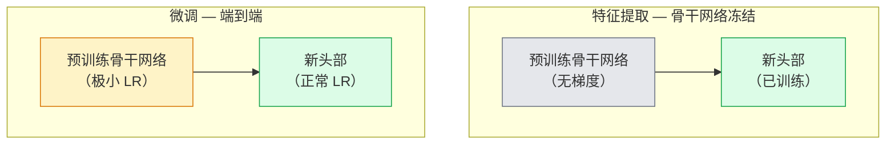

# 迁移学习与微调

> 别人花了一百万 GPU 小时教会一个网络边缘、纹理和物体部件长什么样。你应该借用那些特征，然后再训练你自己的。

**类型：** 构建
**语言：** Python
**前置课程：** 阶段 4 第 03 课（CNN）、阶段 4 第 04 课（图像分类）
**时间：** 约 75 分钟

## 学习目标

- 区分特征提取和微调，并根据数据集大小、领域距离和计算预算选择正确的方法
- 加载预训练骨干网络，替换其分类头，并在 20 行代码内仅训练头部达到可用基线
- 使用差异化学习率逐步解冻各层，使早期通用特征比后期任务特定特征得到更小的更新
- 诊断三种常见失败：解冻块上过高学习率导致的特征偏移、小数据集上批归一化统计量崩溃、以及灾难性遗忘

## 问题

训练一个 ResNet-50 on ImageNet 大约需要 2,000 GPU 小时。很少有团队对他们交付的每个任务都能有这个预算。几乎每个团队实际交付的是预训练骨干加上在几百或几千张任务特定图像上训练的新头部。

这不是捷径。任何 ImageNet 训练 CNN 的第一个卷积块学习边缘和类 Gabor 滤波器。接下来的几个块学习纹理和简单图案。中间块学习物体部件。最后的块学习开始看起来像 1,000 个 ImageNet 类别的组合。该层次结构的前 90% 几乎不做修改地迁移到医学成像、工业检测、卫星数据以及其他所有视觉任务——因为自然界中边缘和纹理的词汇量是有限的。最后 10% 才是你实际训练的内容。

迁移学习中有三个等着你的 bug：用过高学习率破坏预训练特征、冻结太多导致模型信息匮乏、让 BatchNorm 的运行统计量漂向网络从未学习过的微小数据集。本课有目的地逐一演练这些。

## 概念

### 特征提取 vs 微调

两种方案，根据你对预训练特征的信任程度以及你拥有的数据量来选择。



经验法则：

| 数据集大小 | 领域距离 | 配方 |
|-----------|---------|------|
| < 1k 图像 | 接近 ImageNet | 冻结骨干网络，仅训练头部 |
| 1k-10k | 接近 | 冻结前 2-3 阶段，微调其余 |
| 10k-100k | 任意 | 使用差异化 LR 端到端微调 |
| 100k+ | 远 | 微调一切；如果领域足够远，考虑从头训练 |

"接近 ImageNet"大致意味着具有物体类内容的自然 RGB 照片。医学 CT 扫描、俯拍卫星图像和显微镜属于远领域——特征仍然有帮助，但你需要让更多层适应。

### 为什么冻结能发挥作用

CNN 学习的 ImageNet 特征并不专用于那 1,000 个类别。它们专用于自然图像的统计特性：特定方向的边缘、纹理、对比度模式、形状原语。这些统计特性在几乎所有人类能命名的视觉领域中都是稳定的。这就是为什么在 ImageNet 上训练、仅用一个新线性头（不对骨干进行微调）在 CIFAR-10 上零样本评估的模型能达到 80%+ 的准确率。头部正在学习为这个任务对已经学到的特征进行加权。

### 差异化学习率

当你确实要解冻时，早期层的训练速度应该比后期层慢。早期层编码了你想要保留的通用特征；后期层编码了你需要大量移动的任务特定结构。

```
典型配方：

  stage 0（stem + 第一组）：lr = base_lr / 100    （基本固定）
  stage 1：                  lr = base_lr / 10
  stage 2：                  lr = base_lr / 3
  stage 3（最后一个骨干组）：lr = base_lr
  head：                     lr = base_lr  （或稍高）
```

在 PyTorch 中，这只是传给优化器的参数组列表。一个模型，五个学习率，零额外代码。

### BatchNorm 问题

BN 层持有在 ImageNet 上计算的 `running_mean` 和 `running_var` 缓冲区。如果你的任务有不同像素分布——不同光照、不同传感器、不同色彩空间——这些缓冲区就是错的。三个选项，按偏好排序：

1. **在训练模式下微调 BN。** 让 BN 随其他一切一起更新其运行统计量。当任务数据集是中等规模（>= 5k 样本）时的默认选择。
2. **在评估模式下冻结 BN。** 保持 ImageNet 统计量，仅训练权重。当你的数据集小到 BN 的移动平均会噪声很大时这是正确的。
3. **用 GroupNorm 替换 BN。** 完全消除移动平均问题。用于每 GPU 批次大小极小的检测和分割骨干网络。

搞错这一点会悄然降低 5-15% 的准确率。

### 头部设计

分类头是 1-3 个线性层加上一个可选的 dropout。每个 torchvision 骨干网络都带有一个默认头，你将其替换：

```
backbone.fc = nn.Linear(backbone.fc.in_features, num_classes)          # ResNet
backbone.classifier[1] = nn.Linear(..., num_classes)                    # EfficientNet、MobileNet
backbone.heads.head = nn.Linear(..., num_classes)                       # torchvision ViT
```

对于小数据集，单个线性层通常就足够了。当任务分布与骨干网络的训练分布差异较大时，添加隐藏层（Linear -> ReLU -> Dropout -> Linear）有帮助。

### 逐层 LR 衰减

现代微调中使用的差异化 LR 的更平滑版本（BEiT、DINOv2、ViT-B 微调）。不是将层分组到阶段中，而是给每一层一个比其上层略小的 LR：

```
lr_layer_k = base_lr * decay^(L - k)
```

对于 decay = 0.75 和 L = 12 个 transformer 块，第一个块的训练速率是头部 LR 的 `0.75^11 ≈ 0.04x`。对 transformer 微调比对 CNN 更重要，对于后者阶段分组的 LR 通常就足够了。

### 该评估什么

迁移学习运行需要两个你不会在从头训练运行中跟踪的数字：

- **仅预训练准确率** — 骨干冻结时头部的准确率。这是你的下限。
- **微调准确率** — 端到端训练后同一模型的准确率。这是你的上限。

如果微调结果比仅预训练还差，你就有学习率或 BN 的 bug。始终打印两者。

## 构建它

### 步骤 1：加载预训练骨干网络并检查它

```python
import torch
import torch.nn as nn
from torchvision.models import resnet18, ResNet18_Weights

backbone = resnet18(weights=ResNet18_Weights.IMAGENET1K_V1)
print(backbone)
print()
print("classifier head:", backbone.fc)
print("feature dim:", backbone.fc.in_features)
```

`ResNet18` 有四个阶段（`layer1..layer4`）加上一个 stem 和一个 `fc` 头。每个 torchvision 分类骨干网络都有类似的结构。

### 步骤 2：特征提取 — 冻结一切，替换头部

```python
def make_feature_extractor(num_classes=10):
    model = resnet18(weights=ResNet18_Weights.IMAGENET1K_V1)
    for p in model.parameters():
        p.requires_grad = False
    model.fc = nn.Linear(model.fc.in_features, num_classes)
    return model

model = make_feature_extractor(num_classes=10)
trainable = sum(p.numel() for p in model.parameters() if p.requires_grad)
frozen = sum(p.numel() for p in model.parameters() if not p.requires_grad)
print(f"trainable: {trainable:>10,}")
print(f"frozen:    {frozen:>10,}")
```

只有 `model.fc` 是可训练的。骨干网络是一个冻结的特征提取器。

### 步骤 3：差异化微调

一个构建具有阶段特定学习率的参数组的工具函数。

```python
def discriminative_param_groups(model, base_lr=1e-3, decay=0.3):
    stages = [
        ["conv1", "bn1"],
        ["layer1"],
        ["layer2"],
        ["layer3"],
        ["layer4"],
        ["fc"],
    ]
    groups = []
    for i, names in enumerate(stages):
        lr = base_lr * (decay ** (len(stages) - 1 - i))
        params = [p for n, p in model.named_parameters()
                  if any(n.startswith(k) for k in names)]
        if params:
            groups.append({"params": params, "lr": lr, "name": "_".join(names)})
    return groups

model = resnet18(weights=ResNet18_Weights.IMAGENET1K_V1)
model.fc = nn.Linear(model.fc.in_features, 10)
for p in model.parameters():
    p.requires_grad = True

groups = discriminative_param_groups(model)
for g in groups:
    print(f"{g['name']:>10s}  lr={g['lr']:.2e}  params={sum(p.numel() for p in g['params']):>8,}")
```

`decay=0.3` 意味着每个阶段以下一阶段 30% 的速率训练。`fc` 获得 `base_lr`，`layer4` 获得 `0.3 * base_lr`，`conv1` 获得 `0.3^5 * base_lr ≈ 0.00243 * base_lr`。听起来极端；经验上它有效。

### 步骤 4：BatchNorm 处理

冻结 BN 运行统计量而不冻结其权重的辅助函数。

```python
def freeze_bn_stats(model):
    for m in model.modules():
        if isinstance(m, (nn.BatchNorm1d, nn.BatchNorm2d, nn.BatchNorm3d)):
            m.eval()
            for p in m.parameters():
                p.requires_grad = False
    return model
```

在每轮开始时设置 `model.train()` 之后调用它。`model.train()` 将所有内容翻转为训练模式；这仅为 BN 层反转它。

### 步骤 5：一个最小的端到端微调循环

```python
from torch.optim import SGD
from torch.utils.data import DataLoader
from torch.optim.lr_scheduler import CosineAnnealingLR
import torch.nn.functional as F

def fine_tune(model, train_loader, val_loader, device, epochs=5, base_lr=1e-3, freeze_bn=False):
    model = model.to(device)
    groups = discriminative_param_groups(model, base_lr=base_lr)
    optimizer = SGD(groups, momentum=0.9, weight_decay=1e-4, nesterov=True)
    scheduler = CosineAnnealingLR(optimizer, T_max=epochs)

    for epoch in range(epochs):
        model.train()
        if freeze_bn:
            freeze_bn_stats(model)
        tr_loss, tr_correct, tr_total = 0.0, 0, 0
        for x, y in train_loader:
            x, y = x.to(device), y.to(device)
            logits = model(x)
            loss = F.cross_entropy(logits, y, label_smoothing=0.1)
            optimizer.zero_grad()
            loss.backward()
            optimizer.step()
            tr_loss += loss.item() * x.size(0)
            tr_total += x.size(0)
            tr_correct += (logits.argmax(-1) == y).sum().item()
        scheduler.step()

        model.eval()
        va_total, va_correct = 0, 0
        with torch.no_grad():
            for x, y in val_loader:
                x, y = x.to(device), y.to(device)
                pred = model(x).argmax(-1)
                va_total += x.size(0)
                va_correct += (pred == y).sum().item()
        print(f"epoch {epoch}  train {tr_loss/tr_total:.3f}/{tr_correct/tr_total:.3f}  "
              f"val {va_correct/va_total:.3f}")
    return model
```

在 CIFAR-10 上用上述配方五轮，`ResNet18-IMAGENET1K_V1` 从约 70% 的零样本线性探测准确率提升到约 93% 的微调准确率。仅靠头部则会在约 86% 处达到平台期，而从不触及骨干网络。

### 步骤 6：渐进式解冻

一个调度方案，每轮从末尾向开头解冻一个阶段。以一些额外轮数为代价缓解特征偏移。

```python
def progressive_unfreeze_schedule(model):
    stages = ["layer4", "layer3", "layer2", "layer1"]
    yielded = set()

    def start():
        for p in model.parameters():
            p.requires_grad = False
        for p in model.fc.parameters():
            p.requires_grad = True

    def unfreeze(epoch):
        if epoch < len(stages):
            name = stages[epoch]
            yielded.add(name)
            for n, p in model.named_parameters():
                if n.startswith(name):
                    p.requires_grad = True
            return name
        return None

    return start, unfreeze
```

在第一轮之前调用 `start()` 一次。在每轮开始时调用 `unfreeze(epoch)`。每当可训练参数集合改变时重建优化器，否则冻结的参数仍然持有混淆优化器的缓存动量。

## 使用它

对于大多数真实任务，`torchvision.models` 加三行代码就足够了。以上的重型机制在你遇到库默认值无法解决的问题时才会用到。

```python
from torchvision.models import resnet50, ResNet50_Weights

model = resnet50(weights=ResNet50_Weights.IMAGENET1K_V2)
model.fc = nn.Linear(model.fc.in_features, num_classes)
optimizer = torch.optim.AdamW(model.parameters(), lr=1e-4, weight_decay=1e-4)
```

另外两个生产级默认选项：

- `timm` 提供约 800 个预训练视觉骨干，具有一致的 API（`timm.create_model("resnet50", pretrained=True, num_classes=10)`）。对于 torchvision 模型库之外的任何微调，它是标准。
- 对于 Transformer，`transformers.AutoModelForImageClassification.from_pretrained(name, num_labels=N)` 给你 ViT / BEiT / DeiT，具有与文本模型相同的加载语义。

## 交付它

本课产出：

- `outputs/prompt-fine-tune-planner.md` — 一个提示词，根据数据集大小、领域距离和计算预算选择特征提取 vs 渐进式 vs 端到端微调。
- `outputs/skill-freeze-inspector.md` — 一个技能，给定 PyTorch 模型，报告哪些参数可训练、哪些 BatchNorm 层处于评估模式，以及优化器是否真的在被喂给可训练参数。

## 练习

1. **（简单）** 在同一个合成 CIFAR 数据集上训练 `ResNet18` 作为线性探测（骨干冻结）和完整微调。并排报告两种准确率。解释哪个差距告诉你特征迁移良好，哪个告诉你特征迁移不好。
2. **（中等）** 故意引入一个 bug：将骨干阶段的 `base_lr` 设为 `1e-1` 而不是头部。展示训练损失爆炸，然后通过应用 `discriminative_param_groups` 辅助函数恢复。记录每个阶段开始发散的学习率。
3. **（困难）** 取一个医学成像数据集（例如 CheXpert-small、PatchCamelyon 或 HAM10000）并比较三种方案：(a) ImageNet 预训练冻结骨干 + 线性头；(b) ImageNet 预训练端到端微调；(c) 从头训练。报告每种方案的准确率和计算成本。在什么数据集大小下，从头训练变得有竞争力？

## 关键术语

| 术语 | 人们怎么说 | 它实际意味着什么 |
|------|-----------|----------------|
| 特征提取 | "冻结然后训练头部" | 骨干参数冻结，仅新的分类头接收梯度 |
| 微调 | "端到端再训练" | 所有参数可训练，通常使用比从头训练小得多的 LR |
| 差异化 LR | "早期层用更小的 LR" | 优化器参数组，其中早期阶段 LR 是晚期阶段 LR 的一个分数 |
| 逐层 LR 衰减 | "平滑的 LR 梯度" | 每层 LR 乘以 decay^(L - k)；在 transformer 微调中常见 |
| 灾难性遗忘 | "模型丢失了 ImageNet" | 过高的 LR 在新任务信号被学到之前覆盖了预训练特征 |
| BN 统计量漂移 | "运行均值是错的" | BatchNorm 的 running_mean/var 在与当前任务不同的分布上计算，悄然损害准确率 |
| 线性探测 | "冻结骨干 + 线性头" | 预训练特征的评估——在冻结表示之上的最佳线性分类器的准确率 |
| 灾难性崩塌 | "一切预测同一类" | 当微调使用高到足以在头部梯度稳定之前破坏特征的学习率时发生 |

## 进一步阅读

- [How transferable are features in deep neural networks? (Yosinski et al., 2014)](https://arxiv.org/abs/1411.1792) — 量化了跨层特征迁移能力的论文
- [Universal Language Model Fine-tuning (ULMFiT, Howard & Ruder, 2018)](https://arxiv.org/abs/1801.06146) — 原始的差异化 LR / 渐进式解冻配方；这些思想直接迁移到视觉领域
- [timm 文档](https://huggingface.co/docs/timm) — 现代视觉骨干及其训练所用精确微调默认值的参考资料
- [A Simple Framework for Linear-Probe Evaluation (Kornblith et al., 2019)](https://arxiv.org/abs/1805.08974) — 为什么线性探测准确率重要以及如何正确报告它