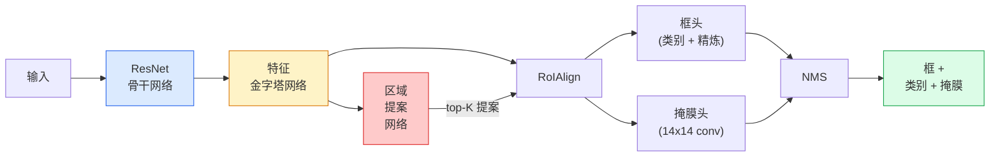

# 实例分割 — Mask R-CNN

> 在 Faster R-CNN 检测器上添加一个小型掩膜分支，你就有了实例分割。困难的部分是 RoIAlign，它比看上去更难。

**类型：** 构建 + 学习
**语言：** Python
**前置课程：** 阶段 4 第 06 课（YOLO）、阶段 4 第 07 课（U-Net）
**时间：** 约 75 分钟

## 学习目标

- 端到端追踪 Mask R-CNN 架构：骨干网络、FPN、RPN、RoIAlign、框头、掩膜头
- 从零实现 RoIAlign，并解释为什么 RoIPool 不再使用
- 使用 torchvision 的 `maskrcnn_resnet50_fpn_v2` 预训练模型获取生产质量的实例掩膜，并正确读取其输出格式
- 在一个小型自定义数据集上微调 Mask R-CNN，替换框头和掩膜头，保持骨干网络冻结

## 问题

语义分割为你提供每个类别一个掩膜。实例分割为你提供每个物体一个掩膜，即使两个物体共享同一个类别。计数个体、跨帧追踪和测量事物（墙上每块砖的边界框、显微镜图像中的每个细胞）都需要实例分割。

Mask R-CNN（He et al., 2017）通过将实例分割重新定义为检测加掩膜来解决这个问题。这个设计如此简洁，以至于接下来五年几乎每篇实例分割论文都是 Mask R-CNN 的变体，而 torchvision 实现仍然是中小型数据集的生产默认选择。

困难的工程问题是采样：你如何从提案框中裁剪固定大小的特征区域，而该框的角并不对齐像素边界？在这方面出错会在各处损失十分之几个 mAP 点。RoIAlign 就是答案。

## 概念

### 架构



需要理解的五个部分：

1. **骨干网络** — 在 ImageNet 上训练的 ResNet-50 或 ResNet-101。产生步长为 4、8、16、32 的特征图层次结构。
2. **FPN（特征金字塔网络）** — 自上而下 + 横向连接，为每个级别提供 C 个通道的语义丰富特征。检测根据物体大小查询匹配的 FPN 级别。
3. **RPN（区域提案网络）** — 一个小的卷积头，在每个锚框位置预测"这里有物体吗？"和"我如何精炼这个框？"。每张图像产生约 1000 个提案。
4. **RoIAlign** — 从任何 FPN 级别的任何框中采样固定大小（例如 7x7）的特征块。双线性采样，无量化。
5. **头** — 两层框头精炼框并选择类别，加上一个小的卷积头，为每个提案输出一个 `28x28` 的二值掩膜。

### 为什么是 RoIAlign，而不是 RoIPool

原始的 Fast R-CNN 使用 RoIPool，它将提案框分割成网格，取每个单元中的最大特征，并将所有坐标舍入为整数。这种舍入使特征图与输入像素坐标之间的对齐偏差最多可达一个完整的特征图像素——在 224x224 图像上很小，但当特征图步长为 32 时是灾难性的。

```
RoIPool:
  box (34.7, 51.3, 98.2, 142.9)
  舍入 -> (34, 51, 98, 142)
  分割网格 -> 舍入每个单元边界
  每一步都积累不对齐

RoIAlign:
  box (34.7, 51.3, 98.2, 142.9)
  使用双线性插值在精确浮点坐标处采样
  处处无舍入
```

RoIAlign 在 COCO 上免费提升了 3-4 个掩膜 AP 点。现在每个关心定位的检测器都使用它——YOLOv7 seg、RT-DETR、Mask2Former 都一样。

### RPN 一段话概括

在特征图的每个位置，放置 K 个不同大小和形状的锚框。为每个锚框预测一个目标性分数和一个回归偏移，将锚框转化为更好的拟合框。按分数保留前约 1,000 个框，应用 IoU 0.7 的 NMS，将幸存者交给头。RPN 用自己的 mini-loss 训练——与第 6 课 YOLO 损失相同的结构，只是有两个类别（物体 / 无物体）。

### 掩膜头

对于每个提案（RoIAlign 之后），掩膜头是一个微型 FCN：四个 3x3 卷积、一个 2x 反卷积、一个最终 1x1 卷积，在 `28x28` 分辨率上产生 `num_classes` 个输出通道。只保留预测类别对应的通道；其他被忽略。这将掩膜预测与分类解耦。

将 28x28 掩膜上采样到提案的原始像素大小以产生最终的二值掩膜。

### 损失

Mask R-CNN 有四个损失相加：

```
L = L_rpn_cls + L_rpn_box + L_box_cls + L_box_reg + L_mask
```

- `L_rpn_cls`、`L_rpn_box` — RPN 提案的目标性 + 框回归。
- `L_box_cls` — 在头的分类器上对 (C+1) 个类别（包括背景）的交叉熵。
- `L_box_reg` — 在头的框精炼上的 smooth L1。
- `L_mask` — 在 28x28 掩膜输出上的逐像素二值交叉熵。

每个损失有自己的默认权重；torchvision 实现将它们暴露为构造函数参数。

### 输出格式

`torchvision.models.detection.maskrcnn_resnet50_fpn_v2` 返回一个字典列表，每张图像一个：

```
{
    "boxes":  (N, 4) 在 (x1, y1, x2, y2) 像素坐标中,
    "labels": (N,) 类别 ID，0 = 背景，所以索引从 1 开始,
    "scores": (N,) 置信度分数,
    "masks":  (N, 1, H, W) 浮点掩膜在 [0, 1] — 以 0.5 为阈值获得二值,
}
```

掩膜已经是全图像分辨率。28x28 的头部输出已在内部上采样。

## 构建它

### 步骤 1：从零实现 RoIAlign

这是 Mask R-CNN 中作为代码比作为文字更容易理解的组件。

```python
import torch
import torch.nn.functional as F

def roi_align_single(feature, box, output_size=7, spatial_scale=1 / 16.0):
    """
    feature: (C, H, W) 单张图像特征图
    box: (x1, y1, x2, y2) 原始图像像素坐标
    output_size: 输出网格的边长（7 用于框头，14 用于掩膜头）
    spatial_scale: 特征图步长的倒数
    """
    C, H, W = feature.shape
    x1, y1, x2, y2 = [c * spatial_scale - 0.5 for c in box]
    bin_w = (x2 - x1) / output_size
    bin_h = (y2 - y1) / output_size

    grid_y = torch.linspace(y1 + bin_h / 2, y2 - bin_h / 2, output_size)
    grid_x = torch.linspace(x1 + bin_w / 2, x2 - bin_w / 2, output_size)
    yy, xx = torch.meshgrid(grid_y, grid_x, indexing="ij")

    gx = 2 * (xx + 0.5) / W - 1
    gy = 2 * (yy + 0.5) / H - 1
    grid = torch.stack([gx, gy], dim=-1).unsqueeze(0)
    sampled = F.grid_sample(feature.unsqueeze(0), grid, mode="bilinear",
                            align_corners=False)
    return sampled.squeeze(0)
```

每个数字都在双线性采样位置上。无舍入、无量化和无梯度丢失。

### 步骤 2：与 torchvision 的 RoIAlign 比较

```python
from torchvision.ops import roi_align

feature = torch.randn(1, 16, 50, 50)
boxes = torch.tensor([[0, 10, 20, 100, 90]], dtype=torch.float32)  # (batch_idx, x1, y1, x2, y2)

ours = roi_align_single(feature[0], boxes[0, 1:].tolist(), output_size=7, spatial_scale=1/4)
theirs = roi_align(feature, boxes, output_size=(7, 7), spatial_scale=1/4, sampling_ratio=1, aligned=True)[0]

print(f"shape ours:   {tuple(ours.shape)}")
print(f"shape theirs: {tuple(theirs.shape)}")
print(f"max|diff|:    {(ours - theirs).abs().max().item():.3e}")
```

使用 `sampling_ratio=1` 和 `aligned=True`，两者在 `1e-5` 范围内匹配。

### 步骤 3：加载预训练 Mask R-CNN

```python
import torch
from torchvision.models.detection import maskrcnn_resnet50_fpn_v2, MaskRCNN_ResNet50_FPN_V2_Weights

model = maskrcnn_resnet50_fpn_v2(weights=MaskRCNN_ResNet50_FPN_V2_Weights.DEFAULT)
model.eval()
print(f"params: {sum(p.numel() for p in model.parameters()):,}")
print(f"classes (including background): {len(model.roi_heads.box_predictor.cls_score.out_features * [0])}")
```

46M 参数，91 个类别（COCO）。第一个类别（id 0）是背景；模型实际检测的所有内容从 id 1 开始。

### 步骤 4：运行推理

```python
with torch.no_grad():
    x = torch.randn(3, 400, 600)
    predictions = model([x])
p = predictions[0]
print(f"boxes:  {tuple(p['boxes'].shape)}")
print(f"labels: {tuple(p['labels'].shape)}")
print(f"scores: {tuple(p['scores'].shape)}")
print(f"masks:  {tuple(p['masks'].shape)}")
```

掩膜张量形状为 `(N, 1, H, W)`。以 0.5 为阈值获取每个物体的二值掩膜：

```python
binary_masks = (p['masks'] > 0.5).squeeze(1)  # (N, H, W) 布尔值
```

### 步骤 5：为自定义类别数替换头

常见的微调配方：重用骨干网络、FPN 和 RPN；替换两个分类器头。

```python
from torchvision.models.detection.faster_rcnn import FastRCNNPredictor
from torchvision.models.detection.mask_rcnn import MaskRCNNPredictor

def build_custom_maskrcnn(num_classes):
    model = maskrcnn_resnet50_fpn_v2(weights=MaskRCNN_ResNet50_FPN_V2_Weights.DEFAULT)
    in_features = model.roi_heads.box_predictor.cls_score.in_features
    model.roi_heads.box_predictor = FastRCNNPredictor(in_features, num_classes)
    in_features_mask = model.roi_heads.mask_predictor.conv5_mask.in_channels
    hidden_layer = 256
    model.roi_heads.mask_predictor = MaskRCNNPredictor(in_features_mask, hidden_layer, num_classes)
    return model

custom = build_custom_maskrcnn(num_classes=5)
print(f"custom cls_score.out_features: {custom.roi_heads.box_predictor.cls_score.out_features}")
```

`num_classes` 必须包含背景类，因此有 4 个物体类别的数据集使用 `num_classes=5`。

### 步骤 6：冻结不需要训练的部分

在小型数据集上，冻结骨干网络和 FPN。只有 RPN 目标性 + 回归以及两个头学习。

```python
def freeze_backbone_and_fpn(model):
    # torchvision Mask R-CNN 将 FPN 打包在 `model.backbone` 中（作为
    # `model.backbone.fpn`），所以迭代 `model.backbone.parameters()` 涵盖
    # ResNet 特征层和 FPN 横向/输出卷积。
    for p in model.backbone.parameters():
        p.requires_grad = False
    return model

custom = freeze_backbone_and_fpn(custom)
trainable = sum(p.numel() for p in custom.parameters() if p.requires_grad)
print(f"trainable after freeze: {trainable:,}")
```

在 500 张图像的数据集上，这是收敛和过拟合之间的区别。

## 使用它

Mask R-CNN 在 torchvision 中的完整训练循环是 40 行，不同任务之间没有实质性变化——切换数据集即可开始。

```python
def train_step(model, images, targets, optimizer):
    model.train()
    loss_dict = model(images, targets)
    losses = sum(loss for loss in loss_dict.values())
    optimizer.zero_grad()
    losses.backward()
    optimizer.step()
    return {k: v.item() for k, v in loss_dict.items()}
```

`targets` 列表必须有每张图像的字典，包含 `boxes`、`labels` 和 `masks`（作为 `(num_instances, H, W)` 二值张量）。模型在训练期间返回四个损失的字典，在评估期间返回预测列表，取决于 `model.training`。

`pycocotools` 评估器为框和掩膜产生 mAP@IoU=0.5:0.95；你需要这两个数字来知道框头还是掩膜头是瓶颈。

## 交付它

本课产出：

- `outputs/prompt-instance-vs-semantic-router.md` — 一个提示词，询问三个问题后在实例、语义和全景之间选择，以及起点使用的确切模型。
- `outputs/skill-mask-rcnn-head-swapper.md` — 一个技能，生成在任何 torchvision 检测模型上替换头的 10 行代码，给定新的 `num_classes`。

## 练习

1. **（简单）** 在 100 个随机框上验证你的 RoIAlign 与 `torchvision.ops.roi_align`。报告最大绝对差。同时运行 RoIPool（2017 年前的行为），展示在靠近边界的框上它会偏离约 1-2 个特征图像素。
2. **（中等）** 在 50 张图像的自定义数据集（任意两个类别：气球、鱼、坑洞、标志）上微调 `maskrcnn_resnet50_fpn_v2`。冻结骨干网络，训练 20 轮，报告掩膜 AP@0.5。
3. **（困难）** 将 Mask R-CNN 的掩膜头替换为预测 56x56 而非 28x28 的头。测量前后的 mAP@IoU=0.75。解释收益（或没有收益）为何匹配预期的边界精度 / 内存权衡。

## 关键术语

| 术语 | 人们怎么说 | 它实际意味着什么 |
|------|-----------|----------------|
| Mask R-CNN | "检测加掩膜" | Faster R-CNN + 一个小型 FCN 头，为每个提案每个类别预测 28x28 掩膜 |
| FPN | "特征金字塔" | 自上而下 + 横向连接，为每个步长级别提供 C 通道的语义丰富特征 |
| RPN | "区域提案器" | 一个小型卷积头，每张图像产生约 1000 个物体/无物体提案 |
| RoIAlign | "无舍入裁剪" | 从任何浮点坐标框中双线性采样固定大小的特征网格 |
| RoIPool | "2017 年前的裁剪" | 与 RoIAlign 相同目的但舍入框坐标；已过时 |
| 掩膜 AP | "实例 mAP" | 使用掩膜 IoU 而非框 IoU 计算的平均精度；COCO 实例分割指标 |
| 二值掩膜头 | "每类掩膜" | 为每个提案每个类别预测一个二值掩膜；只保留预测类别的通道 |
| 背景类别 | "类别 0" | 包罗万象的"无物体"类别；真实类别的索引从 1 开始 |

## 进一步阅读

- [Mask R-CNN (He et al., 2017)](https://arxiv.org/abs/1703.06870) — 论文；第 3 节关于 RoIAlign 是关键阅读
- [FPN: Feature Pyramid Networks (Lin et al., 2017)](https://arxiv.org/abs/1612.03144) — FPN 论文；每个现代检测器都使用它
- [torchvision Mask R-CNN 教程](https://pytorch.org/tutorials/intermediate/torchvision_tutorial.html) — 微调循环的参考
- [Detectron2 模型库](https://github.com/facebookresearch/detectron2/blob/main/MODEL_ZOO.md) — 生产实现，几乎每个检测和分割变体都有训练好的权重