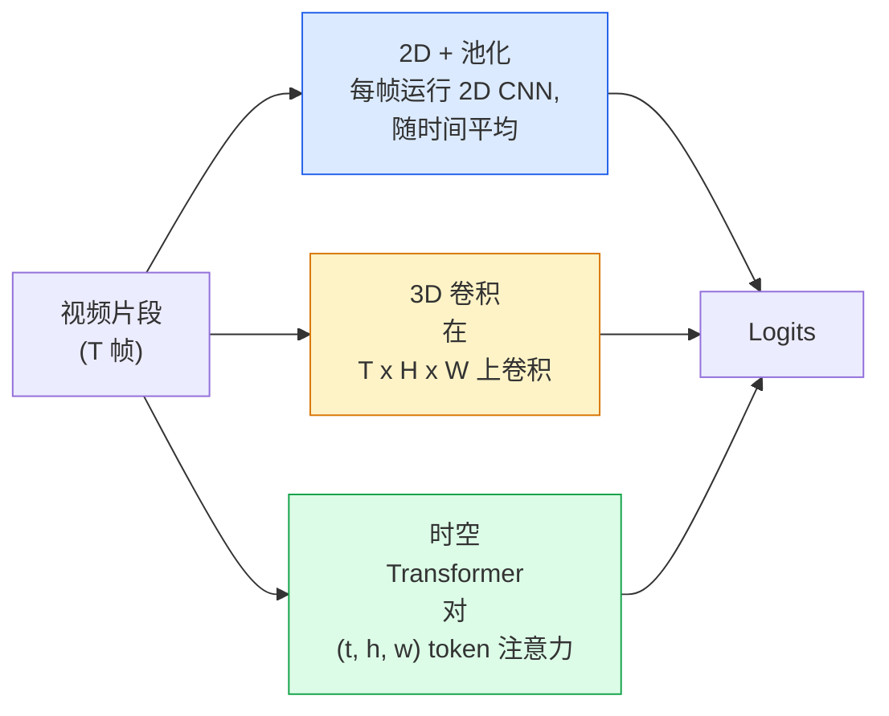

# 视频理解 — 时序建模

> 视频是一系列图像加上连接它们的物理规律。每个视频模型要么将时间视为额外轴（3D 卷积），视为要关注的序列（Transformer），要么视为一次提取然后池化的特征（2D+池化）。

**类型：** 学习 + 构建
**语言：** Python
**前置课程：** 阶段 4 第 03 课（CNN）、阶段 4 第 04 课（图像分类）
**时间：** 约 45 分钟

## 学习目标

- 区分三种主要的视频建模方法（2D+池化、3D 卷积、时空 Transformer）并预测它们的成本和准确率权衡
- 在 PyTorch 中实现帧采样、时序池化和 2D+池化基线分类器
- 解释为什么 I3D 的"膨胀"3D 卷积核从 ImageNet 权重迁移良好，以及分解 (2+1)D 卷积的不同之处
- 阅读标准动作识别数据集和指标：Kinetics-400/600、UCF101、Something-Something V2；片段级别和视频级别的 top-1 准确率

## 问题

30 fps 的 30 秒视频是 900 张图像。朴素地，视频分类是对 900 张图像运行图像分类然后进行某种聚合。当动作在几乎每帧中都可见时（体育、烹饪、健身视频），这能工作；当动作由运动本身定义时则严重失败："将某物从左推到右"在每一帧中看起来像两个静止物体。

每个视频架构的核心问题是：时序结构什么时候被建模，以及如何建模？答案驱动一切——计算成本、预训练策略、能否重用 ImageNet 权重、模型在什么数据集上训练。

本节课有意比静态图像课程短。核心图像机制已经就位，视频理解主要是时序故事：采样、建模和聚合。

## 概念

### 三种架构家族



### 2D + 池化

取一个 2D CNN（ResNet、EfficientNet、ViT）。在每张采样帧上独立运行。对每帧嵌入取平均（或最大池化、或注意力池化）。将池化后的向量送入分类器。

优点：
- ImageNet 预训练直接迁移。
- 最容易实现。
- 便宜：T 帧 * 单张图像推理成本。

缺点：
- 无法建模运动。动作 = 外观的聚合。
- 时序池化是顺序不变的；"开门"和"关门"看起来相同。

何时使用：外观为主的任务、小型视频数据集上的迁移学习、初始基线。

### 3D 卷积

用 3D (T, H, W) 卷积核替换 2D (H, W) 卷积核。网络同时在空间和时间上卷积。早期家族：C3D、I3D、SlowFast。

I3D 技巧：取一个预训练的 2D ImageNet 模型，通过沿新的时间轴复制每个 2D 卷积核来"膨胀"它。一个 3x3 的 2D 卷积变成 3x3x3 的 3D 卷积。这给 3D 模型强大的预训练权重，而无需从零训练。

优点：
- 直接建模运动。
- I3D 膨胀提供免费的迁移学习。

缺点：
- 比 2D 对应物多 T/8 的 FLOPs（对于堆叠 3 次的时序卷积核为 3）。
- 时序卷积核很小；长距离运动需要金字塔或双流方法。

何时使用：运动是信号的动作识别（Something-Something V2、运动量大的 Kinetics 类别）。

### 时空 Transformer

将视频标记为时空块的网格，并对所有这些块进行注意力。TimeSformer、ViViT、Video Swin、VideoMAE。

重要的注意力模式：
- **联合** — 对 (t, h, w) 进行一次大注意力。`T*H*W` 的二次复杂度；昂贵。
- **分隔** — 每块两次注意力：一次时间，一次空间。近似线性扩展。
- **分解** — 时间注意力与空间注意力跨块交替。

优点：
- 每个主要基准上的 SOTA 准确率。
- 通过块膨胀从图像 Transformer（ViT）迁移。
- 通过稀疏注意力支持长上下文视频。

缺点：
- 计算量大。
- 需要仔细选择注意力模式，否则运行时会爆炸。

何时使用：大数据集、高保真视频理解、多模态视频+文本任务。

### 帧采样

30 fps 的 10 秒片段是 300 帧；将所有 300 帧送入任何模型都是浪费。标准策略：

- **均匀采样** — 在片段中均匀选择 T 帧。2D+池化的默认选择。
- **密集采样** — 随机连续的 T 帧窗口。3D 卷积的常见选择，因为运动需要相邻帧。
- **多片段** — 从同一视频采样多个 T 帧窗口，对每个分类，在测试时平均预测。

T 通常是 8、16、32 或 64。更高的 T = 更多的时序信号，更多的计算。

### 评估

两个级别：
- **片段级别准确率** — 模型看到一个 T 帧片段，报告 top-k。
- **视频级别准确率** — 对每个视频的多个片段的片段级预测取平均；更高且更稳定。

始终报告两者。得分 78% 片段 / 82% 视频的模型严重依赖测试时平均；得分 80% / 81% 的模型每个片段更鲁棒。

### 你会遇到的数据集

- **Kinetics-400 / 600 / 700** — 通用动作数据集。40 万个片段；YouTube URL（许多现已失效）。
- **Something-Something V2** — 运动定义的动作（"将 X 从左移到右"）。无法被 2D+池化解决。
- **UCF-101**、**HMDB-51** — 更老、更小，仍有报告。
- **AVA** — 空间和时间上的动作*定位*；比分类更难。

## 构建它

### 步骤 1：帧采样器

适用于帧列表（或视频张量）的均匀和密集采样器。

```python
import numpy as np

def sample_uniform(num_frames_total, T):
    if num_frames_total <= T:
        return list(range(num_frames_total)) + [num_frames_total - 1] * (T - num_frames_total)
    step = num_frames_total / T
    return [int(i * step) for i in range(T)]


def sample_dense(num_frames_total, T, rng=None):
    rng = rng or np.random.default_rng()
    if num_frames_total <= T:
        return list(range(num_frames_total)) + [num_frames_total - 1] * (T - num_frames_total)
    start = int(rng.integers(0, num_frames_total - T + 1))
    return list(range(start, start + T))
```

两者返回 `T` 个索引，你用来切片视频张量。

### 步骤 2：2D+池化基线

在每帧上运行 2D ResNet-18，对特征进行平均池化，分类。

```python
import torch
import torch.nn as nn
from torchvision.models import resnet18, ResNet18_Weights

class FramePool(nn.Module):
    def __init__(self, num_classes=400, pretrained=True):
        super().__init__()
        weights = ResNet18_Weights.IMAGENET1K_V1 if pretrained else None
        backbone = resnet18(weights=weights)
        self.features = nn.Sequential(*(list(backbone.children())[:-1]))  # 全局平均池化保留
        self.head = nn.Linear(512, num_classes)

    def forward(self, x):
        # x: (N, T, 3, H, W)
        N, T = x.shape[:2]
        x = x.view(N * T, *x.shape[2:])
        feats = self.features(x).view(N, T, -1)
        pooled = feats.mean(dim=1)
        return self.head(pooled)

model = FramePool(num_classes=10)
x = torch.randn(2, 8, 3, 224, 224)
print(f"output: {model(x).shape}")
print(f"params: {sum(p.numel() for p in model.parameters()):,}")
```

1100 万参数，ImageNet 预训练，按帧运行，平均，分类。这个基线在外观为主的任务上通常距离真正的 3D 模型 5-10 个点——有时更好，因为它重用了更强的 ImageNet 骨干网络。

### 步骤 3：I3D 风格膨胀 3D 卷积

通过沿新的时间轴重复权重将单个 2D 卷积转为 3D 卷积。

```python
def inflate_2d_to_3d(conv2d, time_kernel=3):
    out_c, in_c, kh, kw = conv2d.weight.shape
    weight_3d = conv2d.weight.data.unsqueeze(2)  # (out, in, 1, kh, kw)
    weight_3d = weight_3d.repeat(1, 1, time_kernel, 1, 1) / time_kernel
    conv3d = nn.Conv3d(in_c, out_c, kernel_size=(time_kernel, kh, kw),
                        padding=(time_kernel // 2, conv2d.padding[0], conv2d.padding[1]),
                        stride=(1, conv2d.stride[0], conv2d.stride[1]),
                        bias=False)
    conv3d.weight.data = weight_3d
    return conv3d

conv2d = nn.Conv2d(3, 64, kernel_size=3, padding=1, bias=False)
conv3d = inflate_2d_to_3d(conv2d, time_kernel=3)
print(f"2D weight shape:  {tuple(conv2d.weight.shape)}")
print(f"3D weight shape:  {tuple(conv3d.weight.shape)}")
x = torch.randn(1, 3, 8, 56, 56)
print(f"3D output shape:  {tuple(conv3d(x).shape)}")
```

除以 `time_kernel` 保持激活幅度大致恒定——这对不破坏第一次传递时的批归一化统计很重要。

### 步骤 4：分解 (2+1)D 卷积

将 3D 卷积拆分为 2D（空间）和 1D（时序）卷积。相同的感受野，更少参数，在某些基准上更好的准确率。

```python
class Conv2Plus1D(nn.Module):
    def __init__(self, in_c, out_c, kernel_size=3):
        super().__init__()
        mid_c = (in_c * out_c * kernel_size * kernel_size * kernel_size) \
                // (in_c * kernel_size * kernel_size + out_c * kernel_size)
        self.spatial = nn.Conv3d(in_c, mid_c, kernel_size=(1, kernel_size, kernel_size),
                                 padding=(0, kernel_size // 2, kernel_size // 2), bias=False)
        self.bn = nn.BatchNorm3d(mid_c)
        self.act = nn.ReLU(inplace=True)
        self.temporal = nn.Conv3d(mid_c, out_c, kernel_size=(kernel_size, 1, 1),
                                  padding=(kernel_size // 2, 0, 0), bias=False)

    def forward(self, x):
        return self.temporal(self.act(self.bn(self.spatial(x))))

c = Conv2Plus1D(3, 64)
x = torch.randn(1, 3, 8, 56, 56)
print(f"(2+1)D output: {tuple(c(x).shape)}")
```

完整的 R(2+1)D 网络与 ResNet-18 相同，每个 3x3 卷积替换为 `Conv2Plus1D`。

## 使用它

两个库涵盖生产视频工作：

- `torchvision.models.video` — R(2+1)D、MViT、Swin3D 带有预训练 Kinetics 权重。与图像模型相同的 API。
- `pytorchvideo`（Meta）— 模型库、Kinetics / SSv2 / AVA 的数据加载器、标准变换。

对于视觉-语言视频模型（视频字幕、视频问答），使用 `transformers`（`VideoMAE`、`VideoLLaMA`、`InternVideo`）。

## 交付它

本课产出：

- `outputs/prompt-video-architecture-picker.md` — 一个提示词，基于外观 vs 运动、数据集大小和计算预算选择 2D+池化 / I3D / (2+1)D / Transformer。
- `outputs/skill-frame-sampler-auditor.md` — 一个技能，检查视频流水线的采样器并标记常见错误：差一索引、`num_frames < T` 时采样不均、缺少保持宽高比的裁剪等。

## 练习

1. **（简单）** 计算 T=8 时 FramePool 与 I3D 风格 3D ResNet 的近似 FLOPs。证明为什么 2D+池化便宜 3-5 倍。
2. **（中等）** 生成合成视频数据集：随机球以随机方向移动，按移动方向标记（"左到右"、"右到左"、"对角向上"）。在其上训练 FramePool。展示它达到接近随机的准确率，证明仅外观不足以完成运动任务。
3. **（困难）** 通过将 ResNet-18 中的每个 Conv2d 替换为 `Conv2Plus1D` 构建 R(2+1)D-18。从 ImageNet 预训练 ResNet-18 膨胀第一个卷积的权重。在练习 2 的运动数据集上训练并击败 FramePool。

## 关键术语

| 术语 | 人们怎么说 | 它实际意味着什么 |
|------|-----------|----------------|
| 2D + 池化 | "逐帧分类器" | 在每张采样帧上运行 2D CNN，跨时间平均池化特征，分类 |
| 3D 卷积 | "时空卷积核" | 在 (T, H, W) 上卷积的卷积核；可以原生建模运动 |
| 膨胀 | "将 2D 权重提升为 3D" | 通过沿新时间轴重复 2D 卷积权重除以 kernel_T 来初始化 3D 卷积权重，保持激活尺度 |
| (2+1)D | "分解卷积" | 将 3D 拆分为 2D 空间 + 1D 时序；更少参数，中间有额外非线性 |
| 分隔注意力 | "先时间后空间" | 每层有两次注意力的 Transformer 块：一次对同帧的 token，一次对同位置的 token |
| 片段 | "T 帧窗口" | T 帧的采样子序列；视频模型消费的单元 |
| 片段 vs 视频准确率 | "两种评估设置" | 片段 = 每视频一个样本，视频 = 跨多个采样片段平均 |
| Kinetics | "视频的 ImageNet" | 400-700 动作类别，30 万+ YouTube 片段，标准视频预训练语料 |

## 进一步阅读

- [I3D: Quo Vadis, Action Recognition (Carreira & Zisserman, 2017)](https://arxiv.org/abs/1705.07750) — 引入膨胀和 Kinetics 数据集
- [R(2+1)D: A Closer Look at Spatiotemporal Convolutions (Tran et al., 2018)](https://arxiv.org/abs/1711.11248) — 分解卷积，仍是强基线
- [TimeSformer: Is Space-Time Attention All You Need? (Bertasius et al., 2021)](https://arxiv.org/abs/2102.05095) — 第一个强大的视频 Transformer
- [VideoMAE (Tong et al., 2022)](https://arxiv.org/abs/2203.12602) — 视频的掩膜自编码器预训练；当前主导的预训练配方