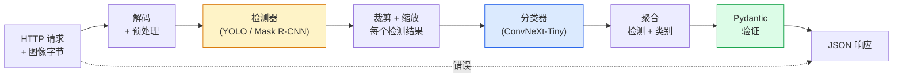

# 构建完整视觉管线——综合项目

> 生产级视觉系统是由数据契约缝合的模型和规则链条。零件本身已经在本阶段学过了；综合项目将它们端到端地串联起来。

**类型：** 构建
**语言：** Python
**前置知识：** Phase 4 Lessons 01-15
**时间：** ~120 分钟

## 学习目标

- 设计一个生产级视觉管线：检测物体、分类物体并输出结构化 JSON——并处理每种失败路径
- 将一个检测器（Mask R-CNN 或 YOLO）、一个分类器（ConvNeXt-Tiny）和一个数据契约（Pydantic）接入一个服务
- 对端到端管线进行基准测试并找出第一个瓶颈（通常是预处理，然后是检测器）
- 交付一个最小的 FastAPI 服务：接收图像上传，运行管线，返回带分类的检测结果

## 问题

单个视觉模型是有用的；视觉产品是它们的链条。零售货架审计是检测器 + 产品分类器 + 价格 OCR 管线。自动驾驶是 2D 检测器 + 3D 检测器 + 分割器 + 跟踪器 + 规划器。医疗预筛查是分割器 + 区域分类器 + 临床医生 UI。

串联这些链条是区分 ML 原型和产品的部分。模型之间的每个接口都是新的 bug 来源。每次坐标变换、每次归一化、每次 mask 缩放都是无声失败的候选者。管线的强度取决于其最弱的接口。

这个综合项目搭建最小可行管线：检测 + 分类 + 结构化输出 + 服务层。Phase 4 中的所有其他内容都可以插入这个骨架：将 Mask R-CNN 换为 YOLOv8，添加 OCR 头，添加分割分支，添加跟踪器。架构是稳定的；组件是可插拔的。

## 核心概念

### 管线



七个阶段。两个模型阶段是昂贵的；其他五个阶段是 bug 所在之处。

### 使用 Pydantic 的数据契约

每个模型边界都变成一个类型化对象。这将无声失败变成响亮的失败。

```
Detection(
    box: tuple[float, float, float, float],   # (x1, y1, x2, y2)，绝对像素坐标
    score: float,                              # [0, 1]
    class_id: int,                             # 检测器的标签映射
    mask: Optional[list[list[int]]],           # RLE 编码（如果有）
)

PipelineResult(
    image_id: str,
    detections: list[Detection],
    classifications: list[Classification],
    inference_ms: float,
)
```

当检测器以 `(cx, cy, w, h)` 而不是 `(x1, y1, x2, y2)` 返回边界框时，Pydantic 的验证会在边界处失败，你会立即发现，而不是调试下游一个无声返回空区域的裁剪操作。

### 延迟分布在哪里

三条真相几乎适用于所有视觉管线：

1. **预处理通常是最大的单一块。** 解码 JPEG、转换颜色空间、缩放——这些都是 CPU 密集型的，容易被遗忘。
2. **检测器占据 GPU 时间的主导地位。** 70-90% 的 GPU 时间在检测前向传播中。
3. **后处理（NMS、RLE 编码/解码）在 GPU 上便宜，在 CPU 上昂贵。** 始终在实际目标上做性能分析。

了解这个分布是将优化转化为优先级列表的关键。

### 失败模式

- **空检测**——返回空列表，不要崩溃。记录日志。
- **越界框**——在裁剪前 clamp 到图像尺寸。
- **裁剪太小**——跳过分类比分类器最小输入还小的框。
- **损坏的上传**——400 响应带特定错误码，而非 500。
- **模型加载失败**——在服务启动时失败，而非在第一个请求时。

生产级管线要处理以上每种情况，而不是写一个泛型的 `try/except` 隐藏失败。每种失败都有命名代码和响应。

### 批处理

生产级服务要为多个客户端服务。跨请求批处理检测和分类可以倍增吞吐量。代价是：等待批处理填满带来的额外延迟。典型设置：收集请求最多 20ms，批处理在一起，处理，分发响应。`torchserve` 和 `triton` 原生支持；负载可预测的小服务可以自己实现微批处理器。

## 构建

### 步骤 1：数据契约

```python
from pydantic import BaseModel, Field
from typing import List, Optional, Tuple

class Detection(BaseModel):
    box: Tuple[float, float, float, float]
    score: float = Field(ge=0, le=1)
    class_id: int = Field(ge=0)
    mask_rle: Optional[str] = None


class Classification(BaseModel):
    detection_index: int
    class_id: int
    class_name: str
    score: float = Field(ge=0, le=1)


class PipelineResult(BaseModel):
    image_id: str
    detections: List[Detection]
    classifications: List[Classification]
    inference_ms: float
```

五秒钟的代码节省任何严肃管线上一个小时的调试时间。

### 步骤 2：最小 Pipeline 类

```python
import time
import numpy as np
import torch
from PIL import Image

class VisionPipeline:
    def __init__(self, detector, classifier, class_names,
                 device="cpu", min_crop=32):
        self.detector = detector.to(device).eval()
        self.classifier = classifier.to(device).eval()
        self.class_names = class_names
        self.device = device
        self.min_crop = min_crop

    def preprocess(self, image):
        """
        image: PIL.Image 或 np.ndarray (H, W, 3) uint8
        返回: CHW float tensor 在设备上
        """
        if isinstance(image, Image.Image):
            image = np.asarray(image.convert("RGB"))
        tensor = torch.from_numpy(image).permute(2, 0, 1).float() / 255.0
        return tensor.to(self.device)

    @torch.no_grad()
    def detect(self, image_tensor):
        return self.detector([image_tensor])[0]

    @torch.no_grad()
    def classify(self, crops):
        if len(crops) == 0:
            return []
        batch = torch.stack(crops).to(self.device)
        logits = self.classifier(batch)
        probs = logits.softmax(-1)
        scores, cls = probs.max(-1)
        return list(zip(cls.tolist(), scores.tolist()))

    def run(self, image, image_id="anonymous"):
        t0 = time.perf_counter()
        tensor = self.preprocess(image)
        det = self.detect(tensor)

        crops = []
        detections = []
        valid_indices = []
        for i, (box, score, cls) in enumerate(zip(det["boxes"], det["scores"], det["labels"])):
            x1, y1, x2, y2 = [max(0, int(b)) for b in box.tolist()]
            x2 = min(x2, tensor.shape[-1])
            y2 = min(y2, tensor.shape[-2])
            detections.append(Detection(
                box=(x1, y1, x2, y2),
                score=float(score),
                class_id=int(cls),
            ))
            if (x2 - x1) < self.min_crop or (y2 - y1) < self.min_crop:
                continue
            crop = tensor[:, y1:y2, x1:x2]
            crop = torch.nn.functional.interpolate(
                crop.unsqueeze(0),
                size=(224, 224),
                mode="bilinear",
                align_corners=False,
            )[0]
            crops.append(crop)
            valid_indices.append(i)

        class_preds = self.classify(crops)

        classifications = []
        for valid_idx, (cls_id, cls_score) in zip(valid_indices, class_preds):
            classifications.append(Classification(
                detection_index=valid_idx,
                class_id=int(cls_id),
                class_name=self.class_names[cls_id],
                score=float(cls_score),
            ))

        return PipelineResult(
            image_id=image_id,
            detections=detections,
            classifications=classifications,
            inference_ms=(time.perf_counter() - t0) * 1000,
        )
```

每个接口都是类型化的。每个失败路径都有特定的处理决策。

### 步骤 3：接入检测器和分类器

```python
from torchvision.models.detection import maskrcnn_resnet50_fpn_v2
from torchvision.models import convnext_tiny

# 使用 ImageNet 预训练权重构建现实管线，无需训练
detector = maskrcnn_resnet50_fpn_v2(weights="DEFAULT")
classifier = convnext_tiny(weights="DEFAULT")
class_names = [f"imagenet_class_{i}" for i in range(1000)]

pipe = VisionPipeline(detector, classifier, class_names)

# 用合成图像做冒烟测试
test_image = (np.random.rand(400, 600, 3) * 255).astype(np.uint8)
result = pipe.run(test_image, image_id="demo")
print(result.model_dump_json(indent=2)[:500])
```

### 步骤 4：FastAPI 服务

```python
from fastapi import FastAPI, UploadFile, HTTPException
from io import BytesIO

app = FastAPI()
pipe = None  # 在启动时初始化

@app.on_event("startup")
def load():
    global pipe
    detector = maskrcnn_resnet50_fpn_v2(weights="DEFAULT").eval()
    classifier = convnext_tiny(weights="DEFAULT").eval()
    pipe = VisionPipeline(detector, classifier, class_names=[f"c{i}" for i in range(1000)])

@app.post("/detect")
async def detect_endpoint(file: UploadFile):
    if file.content_type not in {"image/jpeg", "image/png", "image/webp"}:
        raise HTTPException(status_code=400, detail="unsupported image type")
    data = await file.read()
    try:
        img = Image.open(BytesIO(data)).convert("RGB")
    except Exception:
        raise HTTPException(status_code=400, detail="cannot decode image")
    result = pipe.run(img, image_id=file.filename or "upload")
    return result.model_dump()
```

用 `uvicorn main:app --host 0.0.0.0 --port 8000` 运行。用 `curl -F 'file=@dog.jpg' http://localhost:8000/detect` 测试。

### 步骤 5：基准测试管线

```python
import time

def benchmark(pipe, num_runs=20, image_size=(400, 600)):
    img = (np.random.rand(*image_size, 3) * 255).astype(np.uint8)
    pipe.run(img)  # 预热

    stages = {"preprocess": [], "detect": [], "classify": [], "total": []}
    for _ in range(num_runs):
        t0 = time.perf_counter()
        tensor = pipe.preprocess(img)
        t1 = time.perf_counter()
        det = pipe.detect(tensor)
        t2 = time.perf_counter()
        crops = []
        for box in det["boxes"]:
            x1, y1, x2, y2 = [max(0, int(b)) for b in box.tolist()]
            x2 = min(x2, tensor.shape[-1])
            y2 = min(y2, tensor.shape[-2])
            if (x2 - x1) >= pipe.min_crop and (y2 - y1) >= pipe.min_crop:
                crop = tensor[:, y1:y2, x1:x2]
                crop = torch.nn.functional.interpolate(
                    crop.unsqueeze(0), size=(224, 224), mode="bilinear", align_corners=False
                )[0]
                crops.append(crop)
        pipe.classify(crops)
        t3 = time.perf_counter()
        stages["preprocess"].append((t1 - t0) * 1000)
        stages["detect"].append((t2 - t1) * 1000)
        stages["classify"].append((t3 - t2) * 1000)
        stages["total"].append((t3 - t0) * 1000)

    for stage, times in stages.items():
        times.sort()
        print(f"{stage:12s}  p50={times[len(times)//2]:.1f}ms  p95={times[int(len(times)*0.95)]:.1f}ms")
```

不要跳过这一步。管线前三慢的部分通常和你想的不一样。

## 使用

生产级管线从这里开始演化：

- **A/B 测试**——用不同的分类器分叉管线，比较分类结果。
- **异步后处理**——将分类卸载到队列中，先返回检测结果，再 patch 分类。
- **模型热重载**——在不重启服务的情况下换入新的检测器/分类器权重。
- **指标和告警**——跟踪检测计数、分类熵和延迟百分位数。

## 交付物

本课产出：

- `outputs/prompt-vision-service-shape-reviewer.md`——一个 prompt，审计输入/输出形状并标记不匹配的维度、错误的颜色通道顺序或缺失的归一化。
- `outputs/skill-pipeline-budget-planner.md`——一个 skill，给定延迟 SLA 和每个模型的基准，为 2-4 阶段视觉管线规划内存和延迟预算。

## 练习

1. **（简单）** 用无头合成图像（噪声）运行管线。验证返回的 `PipelineResult` JSON 结构正确，即使检测器没有找到任何东西。
2. **（中等）** 用 `torchserve` 添加批处理：在延迟增加不超过 20ms 的情况下将吞吐量提高 2 倍。
3. **（困难）** 实现热模型重载：将检测器换成 YOLO，验证服务不重启即可切换。

## 关键术语

| 术语 | 别人说的 | 实际含义 |
|------|---------|---------|
| 数据契约 | "类型化接口" | Pydantic 模型定义边界处的精确形状；将无声失败转为响亮失败 |
| 预处理 | "数据准备" | 解码、颜色空间转换、缩放、归一化——通常占延迟的 30-50% |
| NMS 后处理 | "清理检测结果" | 过滤重叠框并编码 mask；在 CPU 上昂贵，在 GPU 上便宜 |
| 空检测 | "没看到任何东西" | 零框输出；不是一个错误，返回空列表 |
| 模型热重载 | "不重启就切换模型" | 无需停机就原子性地将服务指向新权重 |
| 批处理 | "合并请求" | 收集短时间窗口内的输入，批量推理；以微小延迟换取更大吞吐量 |
| 管线基准测试 | "性能分析" | 逐阶段计时；揭示瓶颈的实际分布 |

## 进一步阅读

- [FastAPI 文档](https://fastapi.tiangolo.com/) — 本管线中使用的服务框架
- [Pydantic v2 文档](https://docs.pydantic.dev/) — 数据契约基础
- [torchserve 文档](https://pytorch.org/serve/) — 带批处理、A/B 测试和指标的生产级模型服务
- [Triton Inference Server](https://github.com/triton-inference-server/server) — NVIDIA 的 multi-framework 推理服务器