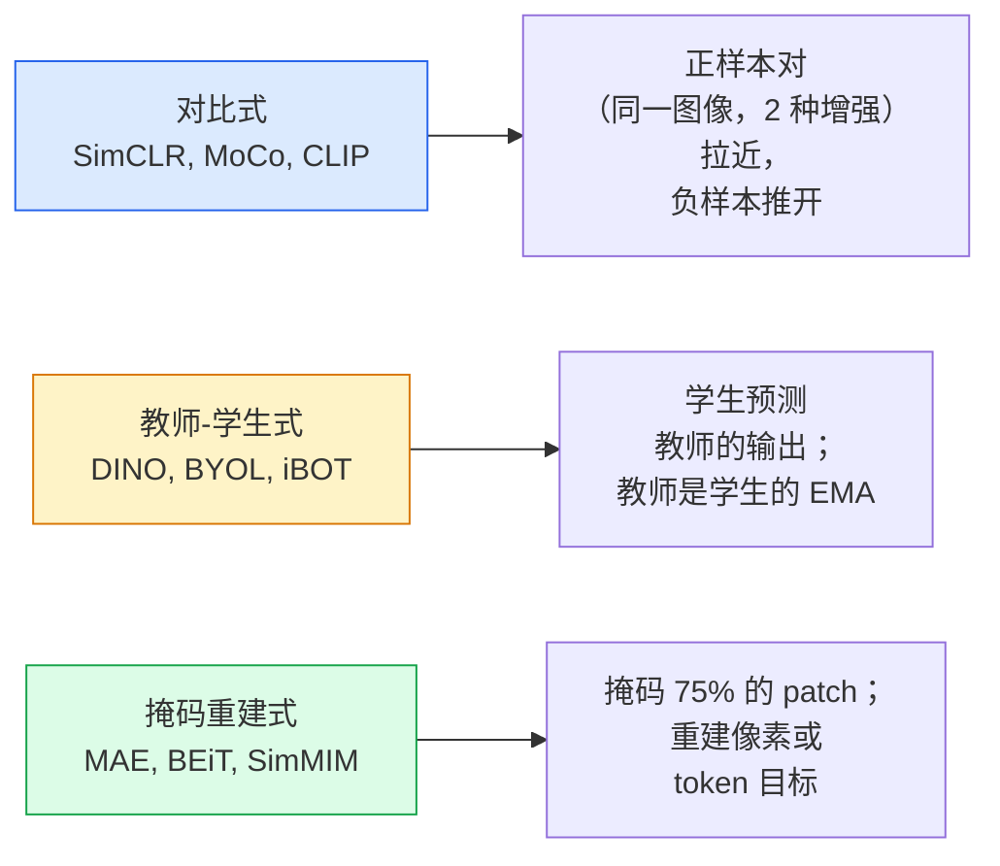

# 自监督视觉——SimCLR、DINO、MAE

> 标签是有监督视觉的瓶颈。自监督预训练移除了它们：从 1 亿张无标签图像中学习视觉特征，在 1 万张有标签图像上微调。

**类型：** 学习 + 构建
**语言：** Python
**前置知识：** Phase 4 Lesson 04（图像分类）、Phase 4 Lesson 14（ViT）
**时间：** ~75 分钟

## 学习目标

- 梳理三大自监督流派——对比式（SimCLR）、教师-学生式（DINO）、掩码重建式（MAE）——并说明每个优化的是什么
- 从零实现 InfoNCE 损失并解释为什么 batch size 512 可以但 32 不行
- 解释为什么 MAE 的 75% 掩码率并非随意选择，以及它与 BERT 文本 15% 掩码率的区别
- 使用 DINOv2 或 MAE ImageNet 检查点进行线性探测和零样本检索

## 问题

有监督 ImageNet 有 130 万张标注图像，估计花费了 1000 万美元进行标注。医学和工业数据集更小，标注成本更高。每个视觉团队都会问：能不能在廉价的未标注数据上预训练——YouTube 帧、网络爬虫、摄像头画面、卫星扫描——然后在少量标注数据上微调？

自监督学习就是答案。一个在 LAION 或 JFT 上训练的现代自监督 ViT，微调后达到或超越有监督 ImageNet 准确率。它在下游任务（检测、分割、深度）上的迁移也比有监督预训练更好。DINOv2（Meta, 2023）和 MAE（Meta, 2022）是当前可迁移视觉特征的生产级默认选择。

概念上的转变在于：预训练任务（pretext task）——模型被训练去完成的事情——不必是下游任务。重要的是它迫使模型学习有用的特征。给灰度图像预测颜色、旋转图像让模型分类旋转角度、掩码 patch 然后重建——这些方法都成功过。能够大规模扩展的三种方法是对比学习、教师-学生蒸馏和掩码重建。

## 核心概念

### 三大流派



### 对比学习（SimCLR）

取一张图像，应用两次随机增强，得到两个视图。将两者送入相同的编码器加投影头。最小化一个损失：要求"这两个嵌入应该接近"且"这个嵌入应该远离批次中所有其他图像的嵌入"。

```
正样本对 (z_i, z_j) 的损失，从 2N 个视图/批次中：

   L_ij = -log( exp(sim(z_i, z_j) / tau) / sum_k in batch \ {i} exp(sim(z_i, z_k) / tau) )

sim = 余弦相似度
tau = 温度（0.1 为标准值）
```

这就是 InfoNCE 损失。它要求每个正样本有很多负样本，所以 batch size 很重要——SimCLR 需要 512-8192。MoCo 引入了过去批次的动量队列来将负样本数量与 batch size 解耦。

### 教师-学生式（DINO）

两个相同架构的网络：学生和教师。教师是学生权重的指数滑动平均（EMA）。两者都看到图像的增强视图。学生的输出被训练去匹配教师的输出——没有显式的负样本。

```
loss = CE( student_output(view_1),  teacher_output(view_2) )
     + CE( student_output(view_2),  teacher_output(view_1) )

teacher_weights = m * teacher_weights + (1 - m) * student_weights   (m ≈ 0.996)
```

为什么不会坍缩到"预测一个常数"：教师的输出经过中心化（减去每维均值）和锐化（除以小温度）。中心化防止某一维度主导；锐化防止输出坍缩到均匀分布。

DINO 就是 DINOv2 放大到 1.42 亿张精选图像上的方法。得到的特征是零样本视觉检索和密集预测的当前 SOTA。

### 掩码重建（MAE）

掩码 ViT 输入的 75% 的 patch。只将可见的 25% 送过编码器。一个小解码器接收编码器的输出加上掩码位置的 mask token，被训练去重建掩码 patch 的像素。

```
编码器:  可见的 25% patch -> 特征
解码器:  特征 + 掩码位置的 mask token -> 重建像素
损失:    仅对掩码 patch 计算重建像素与原始像素的 MSE
```

使 MAE 有效的关键设计选择：

- **75% 掩码率**——很高。迫使编码器学习语义特征；重建 25% 几乎太简单（相邻像素高度相关，CNN 就能做到）。
- **不对称编码器/解码器**——大的 ViT 编码器只看到可见 patch；小解码器（8 层，512 维）处理重建。比朴素 BEiT 快 3 倍预训练。
- **像素空间重建目标**——比 BEiT 的 token 化目标更简单，在 ViT 上效果更好。

预训练后，丢弃解码器。编码器就是特征提取器。

### 为什么是 75% 而不是 15%

BERT 掩码 15% 的 token。MAE 掩码 75%。区别在于信息密度。

- 自然语言每个 token 有高熵。预测 15% 的 token 仍然很难，因为每个掩码位置有许多可能的补全。
- 图像 patch 有低熵——一个未掩码的邻域几乎可以精确确定掩码 patch 的像素。要使预测需要语义理解，必须激进地掩码。

75% 足够高以至于简单的空间外推无法解决任务；编码器必须表示图像内容。

### 线性探测评估

自监督预训练后，标准评估是**线性探测（linear probe）**：冻结编码器，在其上训练一个线性分类器，使用 ImageNet 标签。报告 top-1 准确率。

- SimCLR ResNet-50: ~71%（2020）
- DINO ViT-S/16: ~77%（2021）
- MAE ViT-L/16: ~76%（2022）
- DINOv2 ViT-g/14: ~86%（2023）

线性探测是对特征质量的纯粹度量；微调通常增加 2-5 个百分点，但也混合了头部重新训练的影响。

## 构建

### 步骤 1：双视图增强管线

```python
import torch
import torchvision.transforms as T

two_view_train = lambda: T.Compose([
    T.RandomResizedCrop(96, scale=(0.2, 1.0)),
    T.RandomHorizontalFlip(),
    T.ColorJitter(0.4, 0.4, 0.4, 0.1),
    T.RandomGrayscale(p=0.2),
    T.ToTensor(),
])


class TwoViewDataset(torch.utils.data.Dataset):
    def __init__(self, base):
        self.base = base
        self.aug = two_view_train()

    def __len__(self):
        return len(self.base)

    def __getitem__(self, i):
        img, _ = self.base[i]
        v1 = self.aug(img)
        v2 = self.aug(img)
        return v1, v2
```

每个 `__getitem__` 返回同一图像的两个增强视图；标签不需要。

### 步骤 2：InfoNCE 损失

```python
import torch.nn.functional as F

def info_nce(z1, z2, tau=0.1):
    """
    z1, z2: (N, D) 成对视图的 L2 归一化嵌入
    """
    N, D = z1.shape
    z = torch.cat([z1, z2], dim=0)  # (2N, D)
    sim = z @ z.T / tau              # (2N, 2N)

    mask = torch.eye(2 * N, dtype=torch.bool, device=z.device)
    sim = sim.masked_fill(mask, float("-inf"))

    targets = torch.cat([torch.arange(N, 2 * N), torch.arange(0, N)]).to(z.device)
    return F.cross_entropy(sim, targets)
```

调用前对嵌入做 L2 归一化。`tau=0.1` 是 SimCLR 的默认值；更低的温度使损失更尖锐，需要更多负样本。

### 步骤 3：InfoNCE 完整性检查

```python
z1 = F.normalize(torch.randn(16, 32), dim=-1)
z2 = z1.clone()
loss_same = info_nce(z1, z2, tau=0.1).item()
z2_random = F.normalize(torch.randn(16, 32), dim=-1)
loss_random = info_nce(z1, z2_random, tau=0.1).item()
print(f"相同对的 InfoNCE:  {loss_same:.3f}")
print(f"随机对的 InfoNCE:  {loss_random:.3f}")
```

相同对应给出低损失（对于大 batch 和低温度接近 0）。随机对应给出 log(2N-1) = ~log(31) = ~3.4，对于 16 对的批次。

### 步骤 4：MAE 风格掩码

```python
def random_mask_indices(num_patches, mask_ratio=0.75, seed=0):
    g = torch.Generator().manual_seed(seed)
    n_keep = int(num_patches * (1 - mask_ratio))
    perm = torch.randperm(num_patches, generator=g)
    visible = perm[:n_keep]
    masked = perm[n_keep:]
    return visible.sort().values, masked.sort().values


num_patches = 196
visible, masked = random_mask_indices(num_patches, mask_ratio=0.75)
print(f"可见: {len(visible)} / {num_patches}")
print(f"掩码: {len(masked)} / {num_patches}")
```

简单、快速，对给定种子确定性。真正的 MAE 实现会对这个进行批处理并保持每个样本的掩码。

## 使用

DINOv2 是 2026 年的生产标准：

```python
import torch
from transformers import AutoImageProcessor, AutoModel

processor = AutoImageProcessor.from_pretrained("facebook/dinov2-base")
model = AutoModel.from_pretrained("facebook/dinov2-base")
model.eval()

# 用于零样本检索的每张图像嵌入
with torch.no_grad():
    inputs = processor(images=[pil_image], return_tensors="pt")
    outputs = model(**inputs)
    embedding = outputs.last_hidden_state[:, 0]  # CLS token
```

得到的 768 维嵌入是现代图像检索、密集对应和零样本迁移管线的骨干。在下游任务上微调很少需要超过一个线性头。

对于图像-文本嵌入，SigLIP 或 OpenCLIP 是对等的；对于 MAE 风格微调，`timm` 仓库提供所有 MAE 检查点。

## 交付物

本课产出：

- `outputs/prompt-ssl-pretraining-picker.md`——一个 prompt，根据数据集大小、算力和下游任务选择 SimCLR / MAE / DINOv2。
- `outputs/skill-linear-probe-runner.md`——一个 skill，为任何冻结编码器 + 标注数据集编写线性探测评估。

## 练习

1. **（简单）** 验证：InfoNCE 损失在降低温度时对良好对齐的嵌入下降，对随机嵌入上升。绘制 `tau in [0.05, 0.1, 0.2, 0.5]` vs 损失的图。
2. **（中等）** 实现 DINO 风格的中心缓冲区。展示没有中心化时，学生在几个 epoch 内坍缩为常数向量。
3. **（困难）** 在 CIFAR-100 上用 Lesson 10 的 TinyUNet 作为骨干训练 MAE。报告 10、50 和 200 epoch 的线性探测准确率。展示 MAE 预训练的线性探测在同一个 1000 张图像子集上优于从零开始的有监督线性探测。

## 关键术语

| 术语 | 别人说的 | 实际含义 |
|------|---------|---------|
| 自监督 | "无标签" | 从无标签数据中产生有用表示的预训练任务 |
| 预训练任务 | "假任务" | SSL 期间使用的目标（重建 patch、匹配视图）；预训练后丢弃 |
| 线性探测 | "冻结编码器 + 线性头" | 标准 SSL 评估：仅在冻结特征上训练线性分类器 |
| InfoNCE | "对比损失" | 余弦相似度上的 softmax；正样本对是目标类，其他都是负样本 |
| EMA 教师 | "移动平均教师" | 权重是学生权重指数滑动平均的教师；BYOL、MoCo、DINO 使用 |
| 掩码率 | "隐藏的 patch 百分比" | MAE 期间掩码的 patch 比例；视觉 75%，文本 15% |
| 表示坍缩 | "常数输出" | SSL 失败模式，编码器对所有输入输出常数向量；通过中心化、锐化或负样本来防止 |
| DINOv2 | "生产级 SSL 骨干" | Meta 2023 年自监督 ViT；2026 年最强的通用图像特征 |

## 进一步阅读

- [SimCLR (Chen et al., 2020)](https://arxiv.org/abs/2002.05709) — 对比学习参考
- [DINO (Caron et al., 2021)](https://arxiv.org/abs/2104.14294) — 带动量、中心化、锐化的教师-学生方法
- [MAE (He et al., 2022)](https://arxiv.org/abs/2111.06377) — ViT 的掩码自编码器预训练
- [DINOv2 (Oquab et al., 2023)](https://arxiv.org/abs/2304.07193) — 将自监督 ViT 扩展到生产级特征