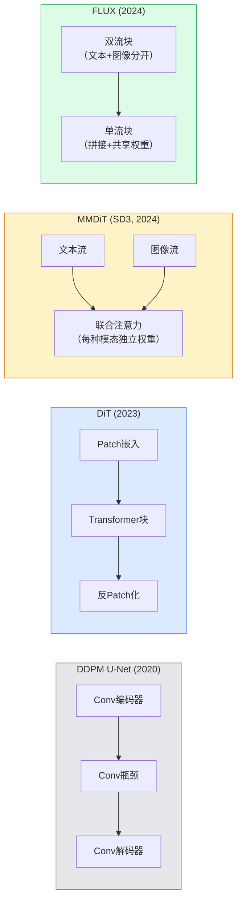

# 扩散Transformer与整流流

> U-Net不是扩散的秘密。用Transformer替换它，将噪声调度替换为直线流，突然你就有了SD3、FLUX和2026年所有的文本到图像模型。

**类型:** 学习 + 构建
**语言:** Python
**前置条件:** 第四阶段第10课（扩散DDPM），第四阶段第14课（ViT），第七阶段第2课（自注意力）
**时间:** ~75分钟

## 学习目标

- 追溯从U-Net DDPM（第10课）到扩散Transformer（DiT）、MMDiT（SD3）和单流+双流DiT（FLUX）的演变
- 解释整流流：为什么噪声和数据之间的直线轨迹让模型在20步而非1000步内采样
- 实现一个微型DiT块和一个整流流训练循环，均不超过100行
- 按架构、参数量和许可证区分模型变体（SD3、FLUX.1-dev、FLUX.1-schnell、Z-Image、Qwen-Image）

## 问题

第10课使用U-Net去噪器构建了一个DDPM。该配方主导了2020-2023年：U-Net + beta调度 + 噪声预测损失。它产生了Stable Diffusion 1.5和2.1以及DALL-E 2。

2026年所有最先进的文本到图像模型都已超越它。Stable Diffusion 3、FLUX、SD4、Z-Image、Qwen-Image、Hunyuan-Image——没有一个使用U-Net。它们使用扩散Transformer（DiT）。SD3和FLUX还将DDPM噪声调度替换为整流流，这拉直了从噪声到数据的路径，并使用一致性或蒸馏变体实现了1-4步推理。

这种转变很重要，因为它是扩散图像生成变得可控、提示准确（SD3/SD4解决了文本渲染）且生产速度快的原因。理解DiT + 整流流就是理解2026年生成图像技术栈。

## 概念

### 从U-Net到Transformer



- **DiT**（Peebles & Xie, 2023）——用类似ViT的Transformer替换U-Net，在潜在patches上操作。通过自适应层归一化（AdaLN）进行条件化。
- **MMDiT**（SD3, Esser et al., 2024）——两条流，文本和图像token具有独立权重，共享联合注意力。
- **FLUX**（Black Forest Labs, 2024）——前N个块为双流（类似SD3），后续块拼接并共享权重（单流）以在更深层次上提高效率。
- **Z-Image**（2025）——一个高效的6B参数单流DiT，挑战"不惜一切代价扩展规模"。

### 整流流一句话概括

DDPM将前向过程定义为噪声SDE，其中`x_t`逐渐被破坏。学习的逆向是第二个SDE，通过1000个小步骤求解。

整流流定义了干净数据和纯噪声之间的**直线**插值：

```
x_t = (1 - t) * x_0 + t * epsilon,     t in [0, 1]
```

训练网络预测速度`v_theta(x_t, t) = epsilon - x_0`——沿从干净数据到噪声的直线路径的前向方向（`dx_t/dt`）。在采样过程中，你反向积分这个速度以从噪声走向数据。得到的ODE更接近直线，因此需要的积分步骤少得多。

SD3称之为**整流流匹配**。FLUX、Z-Image和大多数2026年模型使用相同的目标。典型推理：20-30步Euler（确定性）对比旧DDPM体系中的50+步DDIM。蒸馏/turbo/schnell/LCM变体将其降至1-4步。

### AdaLN条件化

DiT通过**自适应层归一化**对时间步和类别/文本进行条件化：从条件向量预测`scale`和`shift`，并在LayerNorm之后应用它们。比U-Net中FiLM风格的调制更简洁，是每个现代DiT的默认选择。

```
cond -> MLP -> (scale, shift, gate)
norm(x) * (1 + scale) + shift, 然后残差加 * gate
```

### SD3和FLUX中的文本编码器

- **SD3**使用三个文本编码器：两个CLIP模型 + T5-XXL。嵌入拼接并作为文本条件输入图像流。
- **FLUX**使用一个CLIP-L + T5-XXL。
- **Qwen-Image / Z-Image**变体使用与基础大语言模型对齐的自研文本编码器。

文本编码器是SD3/FLUX理解提示比SD1.5好得多的主要原因。T5-XXL本身就是4.7B参数。

### 无分类器引导仍然有效

整流流改变的是采样器，而不是条件化。无分类器引导（训练时以10%概率丢弃文本，推理时混合条件和无条件预测）与整流流的工作原理相同。大多数2026年模型使用引导尺度3.5-5——低于SD1.5的7.5，因为整流流模型默认更紧密地遵循提示。

### Consistency, Turbo, Schnell, LCM

四种名称，同一想法：将一个慢的多步模型蒸馏成一个快的少步模型。

- **LCM（潜在一致性模型）**——训练一个学生模型，在一步内从任意中间`x_t`预测最终的`x_0`。
- **SDXL Turbo / FLUX schnell**——使用对抗扩散蒸馏训练的1-4步模型。
- **SD Turbo**——适应于潜在扩散的OpenAI风格一致性模型。

任何新模型的生产服务都同时发布"全质量"检查点和"turbo/schnell"变体。Schnell（德语"快"，Black Forest Labs的惯例）在1-4步中运行，适合实时流水线。

### 2026年模型概况

| 模型 | 规模 | 架构 | 许可证 |
|-------|------|--------------|---------|
| Stable Diffusion 3 Medium | 2B | MMDiT | SAI Community |
| Stable Diffusion 3.5 Large | 8B | MMDiT | SAI Community |
| FLUX.1-dev | 12B | 双流 + 单流 DiT | 非商业 |
| FLUX.1-schnell | 12B | 相同，蒸馏 | Apache 2.0 |
| FLUX.2 | — | 迭代FLUX.1 | 混合 |
| Z-Image | 6B | S3-DiT（可扩展单流） | 宽松 |
| Qwen-Image | ~20B | DiT + Qwen文本塔 | Apache 2.0 |
| Hunyuan-Image-3.0 | ~80B | DiT | 研究 |
| SD4 Turbo | 3B | DiT + 蒸馏 | SAI Commercial |

FLUX.1-schnell是2026年开源默认选择。Z-Image是效率领导者。FLUX.2和SD4是当前质量尖端。

### 为什么这个阶段转变很重要

DDPM + U-Net有效。DiT + 整流流**更好、更快、且扩展更干净**。这一转变与NLP中从RNN到Transformer的过渡相似：两种架构都解决了相同的问题，但Transformer扩展得更好，现在占据主导地位。2026年每篇关于图像、视频或3D生成的论文都使用DiT形状的去噪器，通常还使用整流流目标。U-Net DDPM现在主要是教学目的（第10课）。

## 构建部分

### 步骤1：带AdaLN的DiT块

```python
import torch
import torch.nn as nn


class AdaLNZero(nn.Module):
    """
    带门控的自适应LayerNorm。从条件预测(scale, shift, gate)。
    初始化使整个块以恒等映射开始（"零初始化"）。
    """

    def __init__(self, dim, cond_dim):
        super().__init__()
        self.norm = nn.LayerNorm(dim, elementwise_affine=False)
        self.mlp = nn.Linear(cond_dim, dim * 3)
        nn.init.zeros_(self.mlp.weight)
        nn.init.zeros_(self.mlp.bias)

    def forward(self, x, cond):
        scale, shift, gate = self.mlp(cond).chunk(3, dim=-1)
        h = self.norm(x) * (1 + scale.unsqueeze(1)) + shift.unsqueeze(1)
        return h, gate.unsqueeze(1)


class DiTBlock(nn.Module):
    def __init__(self, dim=192, heads=3, mlp_ratio=4, cond_dim=192):
        super().__init__()
        self.adaln1 = AdaLNZero(dim, cond_dim)
        self.attn = nn.MultiheadAttention(dim, heads, batch_first=True)
        self.adaln2 = AdaLNZero(dim, cond_dim)
        self.mlp = nn.Sequential(
            nn.Linear(dim, dim * mlp_ratio),
            nn.GELU(),
            nn.Linear(dim * mlp_ratio, dim),
        )

    def forward(self, x, cond):
        h, gate1 = self.adaln1(x, cond)
        a, _ = self.attn(h, h, h, need_weights=False)
        x = x + gate1 * a
        h, gate2 = self.adaln2(x, cond)
        x = x + gate2 * self.mlp(h)
        return x
```

`AdaLNZero`以恒等映射开始，因为其MLP权重初始化为零。训练将块从恒等映射推开；这极大地稳定了深度Transformer扩散模型。

### 步骤2：微型DiT

```python
def timestep_embedding(t, dim):
    import math
    half = dim // 2
    freqs = torch.exp(-math.log(10000) * torch.arange(half, device=t.device) / half)
    args = t[:, None].float() * freqs[None]
    return torch.cat([args.sin(), args.cos()], dim=-1)


class TinyDiT(nn.Module):
    def __init__(self, image_size=16, patch_size=2, in_channels=3, dim=96, depth=4, heads=3):
        super().__init__()
        self.patch_size = patch_size
        self.num_patches = (image_size // patch_size) ** 2
        self.patch = nn.Conv2d(in_channels, dim, kernel_size=patch_size, stride=patch_size)
        self.pos = nn.Parameter(torch.zeros(1, self.num_patches, dim))
        self.time_mlp = nn.Sequential(
            nn.Linear(dim, dim * 2),
            nn.SiLU(),
            nn.Linear(dim * 2, dim),
        )
        self.blocks = nn.ModuleList([DiTBlock(dim, heads, cond_dim=dim) for _ in range(depth)])
        self.norm_out = nn.LayerNorm(dim, elementwise_affine=False)
        self.head = nn.Linear(dim, patch_size * patch_size * in_channels)

    def forward(self, x, t):
        n = x.size(0)
        x = self.patch(x)
        x = x.flatten(2).transpose(1, 2) + self.pos
        t_emb = self.time_mlp(timestep_embedding(t, self.pos.size(-1)))
        for blk in self.blocks:
            x = blk(x, t_emb)
        x = self.norm_out(x)
        x = self.head(x)
        return self._unpatchify(x, n)

    def _unpatchify(self, x, n):
        p = self.patch_size
        h = w = int(self.num_patches ** 0.5)
        x = x.view(n, h, w, p, p, -1).permute(0, 5, 1, 3, 2, 4).reshape(n, -1, h * p, w * p)
        return x
```

### 步骤3：整流流训练

```python
import torch.nn.functional as F

def rectified_flow_train_step(model, x0, optimizer, device):
    model.train()
    x0 = x0.to(device)
    n = x0.size(0)
    t = torch.rand(n, device=device)
    epsilon = torch.randn_like(x0)
    x_t = (1 - t[:, None, None, None]) * x0 + t[:, None, None, None] * epsilon

    target_velocity = epsilon - x0
    pred_velocity = model(x_t, t)

    loss = F.mse_loss(pred_velocity, target_velocity)
    optimizer.zero_grad()
    loss.backward()
    optimizer.step()
    return loss.item()
```

与DDPM的噪声预测损失（第10课）比较：相同的结构，不同的目标。我们不预测噪声`epsilon`，而是预测**速度**`epsilon - x_0`，它沿直线插值从数据指向噪声。

### 步骤4：Euler采样器

整流流是一个ODE。Euler方法是最简单的，对于训练良好的整流流模型，在20+步时几乎与高阶求解器一样准确。

```python
@torch.no_grad()
def rectified_flow_sample(model, shape, steps=20, device="cpu"):
    model.eval()
    x = torch.randn(shape, device=device)
    dt = 1.0 / steps
    t = torch.ones(shape[0], device=device)
    for _ in range(steps):
        v = model(x, t)
        x = x - dt * v
        t = t - dt
    return x
```

20步。在训练好的模型上，这产生的样本与1000步DDPM相当。

### 步骤5：端到端冒烟测试

```python
import numpy as np

def synthetic_blobs(num=200, size=16, seed=0):
    rng = np.random.default_rng(seed)
    out = np.zeros((num, 3, size, size), dtype=np.float32)
    yy, xx = np.meshgrid(np.arange(size), np.arange(size), indexing="ij")
    for i in range(num):
        cx, cy = rng.uniform(4, size - 4, size=2)
        r = rng.uniform(2, 4)
        mask = (xx - cx) ** 2 + (yy - cy) ** 2 < r ** 2
        colour = rng.uniform(-1, 1, size=3)
        for c in range(3):
            out[i, c][mask] = colour[c]
    return torch.from_numpy(out)
```

在此基础上使用整流流训练`TinyDiT`。500步后，采样输出应该看起来像模糊的彩色斑点。

## 使用部分

对于使用FLUX / SD3 / Z-Image的真实图像生成，`diffusers`为每个模型提供了统一API：

```python
from diffusers import FluxPipeline, StableDiffusion3Pipeline
import torch

pipe = FluxPipeline.from_pretrained(
    "black-forest-labs/FLUX.1-schnell",
    torch_dtype=torch.bfloat16,
).to("cuda")

out = pipe(
    prompt="a golden retriever surfing a tsunami, hyperrealistic, studio lighting",
    guidance_scale=0.0,           # schnell训练时没有CFG
    num_inference_steps=4,
    max_sequence_length=256,
).images[0]
out.save("surf.png")
```

三行代码。四步`FLUX.1-schnell`。将模型id换为`black-forest-labs/FLUX.1-dev`可在20-30步使用CFG获得更高质量。

对于SD3：

```python
pipe = StableDiffusion3Pipeline.from_pretrained(
    "stabilityai/stable-diffusion-3.5-large",
    torch_dtype=torch.bfloat16,
).to("cuda")
out = pipe(prompt, guidance_scale=3.5, num_inference_steps=28).images[0]
```

## 交付物

本课产生：

- `outputs/prompt-dit-model-picker.md`——根据质量、延迟和许可证约束在SD3、FLUX.1-dev、FLUX.1-schnell、Z-Image、SD4 Turbo之间选择的提示词。
- `outputs/skill-rectified-flow-trainer.md`——编写使用AdaLN DiT和Euler采样的完整整流流训练循环的技能。

## 练习

1. **（简单）** 在合成斑点数据集上训练上述TinyDiT 500步。比较使用10、20和50步Euler产生的样本。
2. **（中等）** 通过将学习的类别嵌入拼接到时间嵌入中来添加文本条件化（按颜色分10个斑点"类别"）。使用类别0、5和9进行采样并验证颜色匹配。
3. **（困难）** 计算相同规模网络的整流流和DDPM版本在相同数据上训练相同步数后生成样本之间的Fréchet距离（FID代理）。报告哪个收敛更快。

## 关键术语

| 术语 | 人们怎么说 | 实际含义 |
|------|-----------|---------|
| DiT | "扩散Transformer" | 替换U-Net作为扩散去噪器的Transformer；在patch化潜在变量上操作 |
| AdaLN | "自适应层归一化" | 通过学习到的scale、shift、gate在LayerNorm后应用来进行时间步/文本条件化；每个现代DiT的标准 |
| MMDiT | "多模态DiT（SD3）" | 文本和图像token具有独立权重流，共享联合自注意力 |
| 单流/双流 | "FLUX技巧" | 前N个块为双流（每种模态独立权重），后续块为单流（拼接+共享权重）以提高效率 |
| 整流流 | "直线噪声到数据" | 数据和噪声之间的线性插值；网络预测速度；推理时需要的ODE步骤更少 |
| 速度目标 | "epsilon - x_0" | 整流流中的回归目标；从干净数据指向噪声 |
| CFG引导 | "无分类器引导" | 混合条件和无条件预测；仍在整流流模型中使用 |
| Schnell / turbo / LCM | "1-4步蒸馏" | 从全质量模型蒸馏的小步数变体；用于生产实时场景 |

## 进一步阅读

- [Scalable Diffusion Models with Transformers (Peebles & Xie, 2023)](https://arxiv.org/abs/2212.09748) — DiT论文
- [Scaling Rectified Flow Transformers (Esser et al., SD3论文)](https://arxiv.org/abs/2403.03206) — 大规模MMDiT和整流流
- [FLUX.1模型卡和技术报告 (Black Forest Labs)](https://huggingface.co/black-forest-labs/FLUX.1-dev) — 双流+单流细节
- [Z-Image: Efficient Image Generation Foundation Model (2025)](https://arxiv.org/html/2511.22699v1) — 6B单流DiT
- [Elucidating the Design Space of Diffusion (Karras et al., 2022)](https://arxiv.org/abs/2206.00364) — 每个扩散设计权衡的参考
- [Latent Consistency Models (Luo et al., 2023)](https://arxiv.org/abs/2310.04378) — LCM-LoRA如何让你四步推理