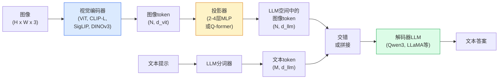

# 视觉语言模型——ViT-MLP-LLM模式

> 视觉编码器将图像转换为token。MLP投影器将这些token映射到LLM的嵌入空间。语言模型完成其余工作。这个模式——ViT-MLP-LLM——是2026年每个生产VLM的架构。

**类型:** 学习 + 使用
**语言:** Python
**前置条件:** 第四阶段第14课（ViT），第四阶段第18课（CLIP），第七阶段第2课（自注意力）
**时间:** ~75分钟

## 学习目标

- 陈述ViT-MLP-LLM架构并解释三个组件各自贡献什么
- 按参数量、上下文长度和基准性能比较Qwen3-VL、InternVL3.5、LLaVA-Next和GLM-4.6V
- 解释DeepStack：为什么多层级ViT特征比单一最后一层特征更好地收紧视觉-语言对齐
- 使用跨模态错误率（CMER）测量生产中的VLM幻觉并根据信号采取行动

## 问题

CLIP（第四阶段第18课）为图像和文本提供了一个共享嵌入空间，这足以进行零样本分类和检索。它无法回答"这张图片中有多少辆红色汽车？"因为CLIP不生成文本——它只评分相似度。

视觉语言模型（VLMs）——Qwen3-VL、InternVL3.5、LLaVA-Next、GLM-4.6V——将CLIP家族的图像编码器连接到完整的语言模型。模型看到图像加问题并生成答案。到2026年，开源VLM在多模态基准（MMMU、MMBench、DocVQA、ChartQA、MathVista、OSWorld）上与GPT-5和Gemini-2.5-Pro匹敌或超越。

三个组件的组合（ViT、投影器、LLM）是标准。模型之间的区别在于使用哪个ViT、哪个投影器、哪个LLM、训练数据和对齐配方。一旦你理解了模式，替换任何组件都是机械性的。

## 概念

### ViT-MLP-LLM架构



1. **视觉编码器**——预训练的ViT（CLIP-L/14、SigLIP、DINOv3或微调变体）。产生patch token。
2. **投影器**——一个小模块（2-4层MLP或Q-former），将视觉token映射到LLM的嵌入维度。这是大部分微调发生的地方。
3. **LLM**——仅解码器语言模型（Qwen3、Llama、Mistral、GLM、InternLM）。按顺序读取视觉+文本token，生成文本。

三个部分在原则上都是可训练的。在实践中，视觉编码器和LLM在投影器训练期间大多保持冻结——用少量参数传递信号。

### DeepStack

普通投影仅使用最后一层ViT。DeepStack（Qwen3-VL）从多个ViT深度采样特征并堆叠它们。更深的层携带高层语义；较浅的层携带细粒度空间和纹理信息。将两者都输入LLM缩小了"图像包含什么"（语义）和"具体在哪"（空间定位）之间的差距。

### 三个训练阶段

现代VLM分阶段训练：

1. **对齐**——冻结ViT和LLM。仅训练投影器在图像-描述对上。教会投影器将视觉空间映射到语言空间。
2. **预训练**——解冻所有部分。在大规模交错图文数据（5亿+对）上训练。构建模型的视觉知识。
3. **指令微调**——在精心策划的（图像、问题、答案）三元组上微调。教会对话行为和任务格式。这是将"视觉感知LM"转变为可用助手的过程。

大多数LoRA微调以少量标注数据集针对阶段3。

### 模型家族比较（2026年初）

| 模型 | 参数 | 视觉编码器 | LLM | 上下文 | 优势 |
|-------|--------|----------------|-----|---------|-----------|
| Qwen3-VL-235B-A22B (MoE) | 235B (22B活跃) | 自定义ViT + DeepStack | Qwen3 | 256K | 通用SOTA, GUI智能体 |
| Qwen3-VL-30B-A3B (MoE) | 30B (3B活跃) | 自定义ViT + DeepStack | Qwen3 | 256K | 较小的MoE替代方案 |
| Qwen3-VL-8B (dense) | 8B | 自定义ViT | Qwen3 | 128K | 生产密集默认选择 |
| InternVL3.5-38B | 38B | InternViT-6B | Qwen3 + GPT-OSS | 128K | 强劲的MMBench / MMVet |
| InternVL3.5-241B-A28B | 241B (28B活跃) | InternViT-6B | Qwen3 | 128K | 与GPT-4o竞争 |
| LLaVA-Next 72B | 72B | SigLIP | Llama-3 | 32K | 开放，易于微调 |
| GLM-4.6V | ~70B | 自定义 | GLM | 64K | 开源，强劲OCR |
| MiniCPM-V-2.6 | 8B | SigLIP | MiniCPM | 32K | 边缘设备友好 |

### 视觉智能体

Qwen3-VL-235B在OSWorld上达到了全球顶级性能——一个用于操作GUI（桌面、移动、网页）的**视觉智能体**基准。模型看到截图，理解UI，并发出动作（点击、输入、滚动）。结合工具，它完成了常见桌面任务的闭环。这是大多数2026年"AI PC"演示底层运行的内容。

### 智能体能力 + RoPE变体

VLM需要知道帧在视频中的**时间位置**。Qwen3-VL从T-RoPE（时间旋转位置嵌入）演变为**基于文本的时间对齐**——与视频帧交织的显式时间戳文本token。模型看到"`<timestamp 00:32>` frame, prompt"并可以对时序关系进行推理。

### 对齐问题

爬取数据集中12%的图文对包含不完全基于图像的描述。在此之上训练的VLM会静默地学会幻觉——捏造对象、读错数字、发明关系。在生产中，这是主要失败模式。

Skywork.ai引入了**跨模态错误率（CMER）**来追踪它：

```
CMER = 文本置信度高但图文相似度（通过CLIP家族检查器）低的输出比例
```

高CMER意味着模型在自信地表达未基于图像的内容。监控CMER并将其作为生产KPI处理，在他们的部署中将幻觉率降低了约35%。技巧不是"修复模型"，而是"将高CMER输出路由到人工审核"。

### 使用LoRA / QLoRA微调

完整微调70B VLM对大多数团队来说不可行。在注意力和投影器层上的LoRA（秩16-64），或使用4位基础权重的QLoRA，可以放在单张A100 / H100上。成本：5,000-50,000个样本，$100-$5,000计算费用，2-10小时训练。

### 空间推理仍然薄弱

当前VLM在空间推理基准（上下、左右、计数、距离）上得分50-60%。如果你的用例依赖于"哪个对象在哪个对象之上"，需大量验证——通用VLM性能低于人类。纯空间任务比VLM更好的替代方案：专门的关键点/姿态估计器、深度模型或带框几何后处理的检测模型。

## 构建部分

### 步骤1：投影器

你最常见训练的部分。2-4层MLP带GELU。

```python
import torch
import torch.nn as nn


class Projector(nn.Module):
    def __init__(self, vit_dim=768, llm_dim=4096, hidden=4096):
        super().__init__()
        self.net = nn.Sequential(
            nn.Linear(vit_dim, hidden),
            nn.GELU(),
            nn.Linear(hidden, llm_dim),
        )

    def forward(self, x):
        return self.net(x)
```

输入是`(N_patches, d_vit)` token张量。输出是`(N_patches, d_llm)`。LLM将每个输出行视为另一个token。

### 步骤2：端到端组装ViT-MLP-LLM

最小化VLM前向传递的骨架。实际代码使用`transformers`；这是概念布局。

```python
class MinimalVLM(nn.Module):
    def __init__(self, vit, projector, llm, image_token_id):
        super().__init__()
        self.vit = vit
        self.projector = projector
        self.llm = llm
        self.image_token_id = image_token_id  # 文本提示中的占位符token

    def forward(self, image, input_ids, attention_mask):
        # 1. 视觉特征
        vision_tokens = self.vit(image)                     # (B, N_patches, d_vit)
        vision_embeds = self.projector(vision_tokens)       # (B, N_patches, d_llm)

        # 2. 文本嵌入
        text_embeds = self.llm.get_input_embeddings()(input_ids)  # (B, M, d_llm)

        # 3. 用视觉嵌入替换图像占位符token
        merged = self._merge(text_embeds, vision_embeds, input_ids)

        # 4. 运行LLM
        return self.llm(inputs_embeds=merged, attention_mask=attention_mask)

    def _merge(self, text_embeds, vision_embeds, input_ids):
        out = text_embeds.clone()
        expected = vision_embeds.size(1)
        for b in range(input_ids.size(0)):
            positions = (input_ids[b] == self.image_token_id).nonzero(as_tuple=True)[0]
            if len(positions) != expected:
                raise ValueError(
                    f"批次项 {b} 有 {len(positions)} 个图像token，但vision_embeds有 {expected} 个patches。"
                    " 批次中的每个样本必须预先填充到相同数量的图像占位符token。")
            out[b, positions] = vision_embeds[b]
        return out
```

文本中的`<image>`占位符token被替换为真实的图像嵌入——与LLaVA、Qwen-VL和InternVL使用的模式相同。

### 步骤3：CMER计算

一个轻量级运行时检查。

```python
import torch.nn.functional as F


def cross_modal_error_rate(image_emb, text_emb, text_confidence, sim_threshold=0.25, conf_threshold=0.8):
    """
    image_emb, text_emb: 图像和生成文本的嵌入（内部归一化）
    text_confidence:     平均逐token概率，范围 [0, 1]
    返回:             高置信度但图文对齐低的输出比例
    """
    image_emb = F.normalize(image_emb, dim=-1)
    text_emb = F.normalize(text_emb, dim=-1)
    sim = (image_emb * text_emb).sum(dim=-1)        # 余弦相似度
    high_conf_low_sim = (text_confidence > conf_threshold) & (sim < sim_threshold)
    return high_conf_low_sim.float().mean().item()
```

将CMER作为生产KPI处理。按端点、按提示类型、按客户进行监控。CMER上升表示模型在某种输入分布上开始产生幻觉。

### 步骤4：玩具VLM分类器（可运行）

演示投影器的训练。虚假的"ViT特征"输入；一个微型LLM风格token预测一个类别。

```python
class ToyVLM(nn.Module):
    def __init__(self, vit_dim=32, llm_dim=64, num_classes=5):
        super().__init__()
        self.projector = Projector(vit_dim, llm_dim, hidden=64)
        self.head = nn.Linear(llm_dim, num_classes)

    def forward(self, vision_tokens):
        projected = self.projector(vision_tokens)
        pooled = projected.mean(dim=1)
        return self.head(pooled)
```

可以在合成（特征，类别）对上在不到200步内拟合——足以证明投影器模式有效。

## 使用部分

2026年生产团队使用VLM的三种方式：

- **托管API**——OpenAI Vision、Anthropic Claude Vision、Google Gemini Vision。零基础设施，有供应商风险。
- **开源自托管**——Qwen3-VL或InternVL3.5通过`transformers`和`vllm`运行。完全控制，前期投入更高。
- **领域微调**——加载Qwen2.5-VL-7B或LLaVA-1.6-7B，在5k-50k自定义样本上LoRA，使用`vllm`或`TGI`提供服务。

```python
from transformers import AutoProcessor, AutoModelForVision2Seq
import torch
from PIL import Image

model_id = "Qwen/Qwen3-VL-8B-Instruct"
processor = AutoProcessor.from_pretrained(model_id)
model = AutoModelForVision2Seq.from_pretrained(model_id, torch_dtype=torch.bfloat16, device_map="auto")

messages = [{
    "role": "user",
    "content": [
        {"type": "image", "image": Image.open("plot.png")},
        {"type": "text", "text": "What does this chart show?"},
    ],
}]
inputs = processor.apply_chat_template(messages, add_generation_prompt=True, tokenize=True, return_dict=True, return_tensors="pt").to("cuda")
generated = model.generate(**inputs, max_new_tokens=256)
answer = processor.decode(generated[0][inputs["input_ids"].shape[1]:], skip_special_tokens=True)
```

`apply_chat_template`隐藏了`<image>`占位符分词；模型在内部处理合并。

## 交付物

本课产生：

- `outputs/prompt-vlm-selector.md`——根据准确率、延迟、上下文长度和预算选择Qwen3-VL / InternVL3.5 / LLaVA-Next / API的提示词。
- `outputs/skill-cmer-monitor.md`——生成使用跨模态错误率检测生产VLM端点的代码，包括逐端点仪表板和告警阈值。

## 练习

1. **（简单）** 在五张图像上通过任意开源VLM运行三个提示（"这是什么？"、"数物体数量"、"描述场景"）。手工将每个答案评分为正确/部分正确/幻觉。计算一个初步的CMER类比率。
2. **（中等）** 使用LoRA（秩16）在500张目标领域图像和描述上微调Qwen2.5-VL-3B或LLaVA-1.6-7B。比较零样本与微调的MMBench风格准确率。
3. **（困难）** 用DINOv3替换VLM的图像编码器，取代其默认的SigLIP/CLIP。仅重新训练投影器（冻结LLM + 冻结DINOv3）。测量密集预测任务（计数、空间推理）是否改善。

## 关键术语

| 术语 | 人们怎么说 | 实际含义 |
|------|-----------|---------|
| ViT-MLP-LLM | "VLM模式" | 视觉编码器 + 投影器 + 语言模型；每个2026年VLM |
| 投影器 | "桥梁" | 2-4层MLP（或Q-former），将视觉token映射到LLM嵌入空间 |
| DeepStack | "Qwen3-VL特征技巧" | 多层级ViT特征堆叠，而非仅最后一层 |
| 图像token | "<image> 占位符" | 文本流中被投影的视觉嵌入替换的特殊token |
| CMER | "幻觉KPI" | 跨模态错误率；当文本置信度高但图文相似度低时较高 |
| 视觉智能体 | "会点击的VLM" | 操作GUI（OSWorld、移动端、Web端）并带有工具调用的VLM |
| Q-former | "固定数量token桥梁" | BLIP-2风格的投影器，产生固定数量的视觉查询token |
| 对齐 / 预训练 / 指令微调 | "三个阶段" | 标准VLM训练流水线 |

## 进一步阅读

- [Qwen3-VL技术报告 (arXiv 2511.21631)](https://arxiv.org/abs/2511.21631)
- [InternVL3.5推进开源多模态模型 (arXiv 2508.18265)](https://arxiv.org/html/2508.18265v1)
- [LLaVA-Next系列](https://llava-vl.github.io/blog/2024-05-10-llava-next-stronger-llms/)
- [BentoML: 2026最佳开源VLM](https://www.bentoml.com/blog/multimodal-ai-a-guide-to-open-source-vision-language-models)
- [MMMU: 多学科多模态理解基准](https://mmmu-benchmark.github.io/)
- [制造业中的VLM (Robotics Tomorrow, March 2026)](https://www.roboticstomorrow.com/story/2026/03/when-machines-learn-to-see-like-experts-the-rise-of-vision-language-models-in-manufacturing/26335/)