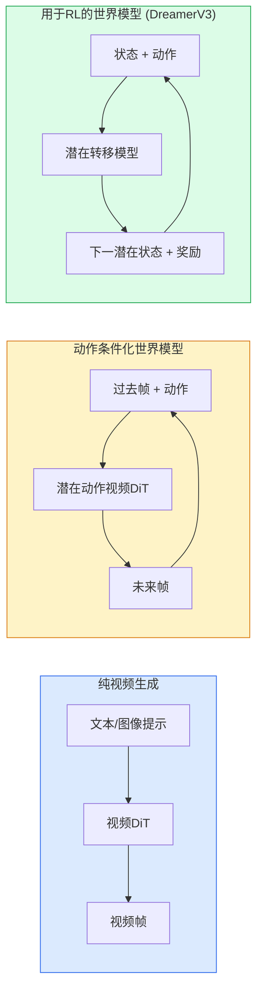

# 世界模型与视频扩散

> 一个预测场景未来几秒的视频模型就是一个世界模拟器。将这个预测条件化为动作，你就有了一个学习型游戏引擎。

**类型:** 学习 + 构建
**语言:** Python
**前置条件:** 第四阶段第10课（扩散），第四阶段第12课（视频理解），第四阶段第23课（DiT + 整流流）
**时间:** ~75分钟

## 学习目标

- 解释纯视频生成模型（Sora 2）和动作条件化世界模型（Genie 3、DreamerV3）之间的区别
- 描述视频DiT：时空patches、3D位置编码、跨(T, H, W) token的联合注意力
- 追溯世界模型如何接入机器人：VLM规划 → 视频模型模拟 → 逆动力学输出动作
- 为给定用例（创意视频、交互模拟、自动驾驶合成）在Sora 2、Genie 3、Runway GWM-1 Worlds、Wan-Video和HunyuanVideo之间选择

## 问题

视频生成和世界建模在2026年交汇。一个能够生成连贯一分钟视频的模型，在某种意义上，已经学会了世界如何运转：物体永存、重力、因果、风格。如果你将这个预测条件化为动作（向左走、开门），视频模型就成为一个可学习的模拟器，可以替代游戏引擎、驾驶模拟器或机器人环境。

赌注是具体的。Genie 3从单张图像生成可玩环境。Runway GWM-1 Worlds合成无限可探索场景。Sora 2产生带同步音频和建模物理的一分钟长视频。NVIDIA Cosmos-Drive、Wayve Gaia-2和Tesla DrivingWorld生成逼真的驾驶视频用于自动驾驶训练数据。世界模型范式正在悄悄接管机器人领域的sim-to-real。

本课是第四阶段的"大局"课。它将图像生成、视频理解和智能体推理连接到主流研究正在走向的架构模式中。

## 概念

### 三种世界建模家族



- **Sora 2**是纯视频生成，条件化为提示。没有动作接口。你无法在生成中途"操控"它。
- **Genie 3**、**GWM-1 Worlds**、**Mirage / Magica**是动作条件化世界模型。从观察到的视频推断潜在动作，然后将未来帧预测条件化为动作。可交互——你按键或移动相机，场景就响应。
- **DreamerV3**和经典的RL世界模型家族在潜在空间中预测，带有显式动作条件化，在奖励信号上训练。视觉上较少；对于样本高效的RL更有用。

### 视频DiT架构

```
视频潜在变量:          (C, T, H, W)
Patch化（空间）:    每帧的 P_h x P_w patches 网格
Patch化（时间）:    将 P_t 帧分组为一个时间patch
结果token:          (T / P_t) * (H / P_h) * (W / P_w) 个token
```

位置编码是3D的：每个(t, h, w)坐标的旋转或学习嵌入。注意力可以是：

- **全联合**——所有token关注所有token。N个token的O(N^2)。对长视频来说不可行。
- **分离式**——交替时间注意力（相同空间位置，跨时间: `(H*W) * T^2`）和空间注意力（相同时间步，跨空间: `T * (H*W)^2`）。TimeSformer和大多数视频DiT使用。
- **窗口式**——(t, h, w)中的局部窗口。Video Swin使用。

每个2026年视频扩散模型使用这三种模式之一，加上AdaLN条件化（第23课）和整流流。

### 动作条件化：潜在动作模型

Genie通过判别性地预测连续两帧之间的动作来为每帧学习一个**潜在动作**。模型的解码器然后条件化为推断的潜在动作——而非显式键盘按键。在推理时，用户可以指定一个潜在动作（或从新的先验中采样一个），模型生成与该动作一致的下一帧。

Sora完全跳过了动作接口。其解码器从过去时空token预测下一时空token。提示条件化起始；没有任何东西在生成中途操控它。

### 物理合理性

Sora 2的2026年发布明确宣传了**物理合理性**：重量、平衡、物体永存、因果。由团队通过手工评定的合理性分数来衡量；模型在掉落物体、角色碰撞和有意失败（一次未命中的跳跃）方面相比Sora 1有明显改进。

合理性仍然是主要失败模式。2024-2025年人们吃意大利面或喝水的视频揭示了模型缺乏持久物体表示。2026年模型（Sora 2、Runway Gen-5、HunyuanVideo）减少但未消除这些问题。

### 自动驾驶世界模型

驾驶世界模型生成条件化为轨迹、边界框或导航地图的逼真道路场景。用途：

- **Cosmos-Drive-Dreams**（NVIDIA）——生成数分钟的驾驶视频用于RL训练。
- **Gaia-2**（Wayve）——轨迹条件化场景合成用于策略评估。
- **DrivingWorld**（Tesla）——模拟变化天气、时间、交通条件。
- **Vista**（字节跳动）——响应式驾驶场景合成。

它们替代了昂贵的长尾场景真实数据收集——夜间行人乱穿马路、结冰路口、异常车辆类型——否则需要数百万英里的驾驶。

### 机器人技术栈：VLM + 视频模型 + 逆动力学

正在兴起的机器人三组件循环：

1. **VLM**解析目标（"拿起红色杯子"），规划高层动作序列。
2. **视频生成模型**模拟执行每个动作会是什么样子——预测N帧后的观察。
3. **逆动力学模型**提取会产生这些观察的具体电机命令。

这替代了奖励塑形和样本密集的RL。世界模型做想象力工作；逆动力学闭合驱动循环。Genie Envisioner是一个实例化；许多研究团队正在汇聚到这个结构上。

### 评估

- **视觉质量**——FVD（Fréchet视频距离）、用户研究。
- **提示对齐**——每帧CLIPScore、VQA风格评估。
- **物理合理性**——在基准套件上手工评定（Sora 2内部基准、VBench）。
- **可控性**（用于交互世界模型）——动作 → 观察一致性；能否回到之前的状态？

### 2026年模型概况

| 模型 | 用途 | 参数 | 输出 | 许可证 |
|-------|-----|------------|--------|---------|
| Sora 2 | 文本到视频、音频 | — | 1分钟1080p + 音频 | 仅API |
| Runway Gen-5 | 文本/图像到视频 | — | 10秒片段 | API |
| Runway GWM-1 Worlds | 交互世界 | — | 无限3D展开 | API |
| Genie 3 | 从图像到交互世界 | 11B+ | 可玩帧 | 研究预览 |
| Wan-Video 2.1 | 开源文本到视频 | 14B | 高质量片段 | 非商业 |
| HunyuanVideo | 开源文本到视频 | 13B | 10秒片段 | 宽松 |
| Cosmos / Cosmos-Drive | 自动驾驶仿真 | 7-14B | 驾驶场景 | NVIDIA开放 |
| Magica / Mirage 2 | AI原生游戏引擎 | — | 可修改世界 | 产品 |

## 构建部分

### 步骤1：视频的3D Patch化

```python
import torch
import torch.nn as nn


class VideoPatch3D(nn.Module):
    def __init__(self, in_channels=4, dim=64, patch_t=2, patch_h=2, patch_w=2):
        super().__init__()
        self.proj = nn.Conv3d(
            in_channels, dim,
            kernel_size=(patch_t, patch_h, patch_w),
            stride=(patch_t, patch_h, patch_w),
        )
        self.patch_t = patch_t
        self.patch_h = patch_h
        self.patch_w = patch_w

    def forward(self, x):
        # x: (N, C, T, H, W)
        x = self.proj(x)
        n, c, t, h, w = x.shape
        tokens = x.reshape(n, c, t * h * w).transpose(1, 2)
        return tokens, (t, h, w)
```

步长等于核大小的3D卷积充当时空patch化器。`(T, H, W) -> (T/2, H/2, W/2)`个token网格。

### 步骤2：3D旋转位置编码

沿`t`、`h`、`w`轴分别应用旋转位置嵌入（RoPE）：

```python
def rope_3d(tokens, t_dim, h_dim, w_dim, grid):
    """
    tokens: (N, T*H*W, D)
    grid: (T, H, W) 尺寸
    t_dim + h_dim + w_dim == D
    """
    T, H, W = grid
    n, seq, d = tokens.shape
    if t_dim + h_dim + w_dim != d:
        raise ValueError(f"t_dim+h_dim+w_dim ({t_dim}+{h_dim}+{w_dim}) 必须等于 D={d}")
    assert seq == T * H * W
    t_idx = torch.arange(T, device=tokens.device).repeat_interleave(H * W)
    h_idx = torch.arange(H, device=tokens.device).repeat_interleave(W).repeat(T)
    w_idx = torch.arange(W, device=tokens.device).repeat(T * H)
    # 简化：仅按频率缩放通道。真实RoPE旋转通道对。
    freqs_t = torch.exp(-torch.log(torch.tensor(10000.0)) * torch.arange(t_dim // 2, device=tokens.device) / (t_dim // 2))
    freqs_h = torch.exp(-torch.log(torch.tensor(10000.0)) * torch.arange(h_dim // 2, device=tokens.device) / (h_dim // 2))
    freqs_w = torch.exp(-torch.log(torch.tensor(10000.0)) * torch.arange(w_dim // 2, device=tokens.device) / (w_dim // 2))
    emb_t = torch.cat([torch.sin(t_idx[:, None] * freqs_t), torch.cos(t_idx[:, None] * freqs_t)], dim=-1)
    emb_h = torch.cat([torch.sin(h_idx[:, None] * freqs_h), torch.cos(h_idx[:, None] * freqs_h)], dim=-1)
    emb_w = torch.cat([torch.sin(w_idx[:, None] * freqs_w), torch.cos(w_idx[:, None] * freqs_w)], dim=-1)
    return tokens + torch.cat([emb_t, emb_h, emb_w], dim=-1)
```

简化的加法形式。真实RoPE以频率旋转通道对；位置信息相同。

### 步骤3：分离注意力块

```python
class DividedAttentionBlock(nn.Module):
    def __init__(self, dim=64, heads=2):
        super().__init__()
        self.time_attn = nn.MultiheadAttention(dim, heads, batch_first=True)
        self.space_attn = nn.MultiheadAttention(dim, heads, batch_first=True)
        self.ln1 = nn.LayerNorm(dim)
        self.ln2 = nn.LayerNorm(dim)
        self.ln3 = nn.LayerNorm(dim)
        self.mlp = nn.Sequential(nn.Linear(dim, 4 * dim), nn.GELU(), nn.Linear(4 * dim, dim))

    def forward(self, x, grid):
        T, H, W = grid
        n, seq, d = x.shape
        # 时间注意力：相同 (h, w)，跨 t
        xt = x.view(n, T, H * W, d).permute(0, 2, 1, 3).reshape(n * H * W, T, d)
        a, _ = self.time_attn(self.ln1(xt), self.ln1(xt), self.ln1(xt), need_weights=False)
        xt = (xt + a).reshape(n, H * W, T, d).permute(0, 2, 1, 3).reshape(n, seq, d)
        # 空间注意力：相同 t，跨 (h, w)
        xs = xt.view(n, T, H * W, d).reshape(n * T, H * W, d)
        a, _ = self.space_attn(self.ln2(xs), self.ln2(xs), self.ln2(xs), need_weights=False)
        xs = (xs + a).reshape(n, T, H * W, d).reshape(n, seq, d)
        xs = xs + self.mlp(self.ln3(xs))
        return xs
```

时间注意力在每个空间位置跨时间关注；空间注意力在每个帧内跨位置关注。两个O(T^2 + (HW)^2)操作，而非一个O((THW)^2)。这是TimeSformer和每个现代视频DiT的核心。

### 步骤4：组合一个微型视频DiT

```python
class TinyVideoDiT(nn.Module):
    def __init__(self, in_channels=4, dim=64, depth=2, heads=2):
        super().__init__()
        self.patch = VideoPatch3D(in_channels=in_channels, dim=dim, patch_t=2, patch_h=2, patch_w=2)
        self.blocks = nn.ModuleList([DividedAttentionBlock(dim, heads) for _ in range(depth)])
        self.out = nn.Linear(dim, in_channels * 2 * 2 * 2)

    def forward(self, x):
        tokens, grid = self.patch(x)
        for blk in self.blocks:
            tokens = blk(tokens, grid)
        return self.out(tokens), grid
```

不是一个可工作的视频生成器；一个结构演示，展示每个部件形状正确。

### 步骤5：检查形状

```python
vid = torch.randn(1, 4, 8, 16, 16)  # (N, C, T, H, W)
model = TinyVideoDiT()
out, grid = model(vid)
print(f"输入  {tuple(vid.shape)}")
print(f"token网格 {grid}")
print(f"输出 {tuple(out.shape)}")
```

期望`grid = (4, 8, 8)`，`out = (1, 256, 32)`在patch化之后；头部然后投影到逐token时空patch，准备反patch化回视频。

## 使用部分

2026年生产访问模式：

- **Sora 2 API**（OpenAI）——文本到视频，同步音频。高端定价。
- **Runway Gen-5 / GWM-1**（Runway）——图像到视频，交互世界。
- **Wan-Video 2.1 / HunyuanVideo**——开源自托管。
- **Cosmos / Cosmos-Drive**（NVIDIA）——驾驶仿真开放权重。
- **Genie 3**——研究预览，需请求访问。

对于构建交互世界模型演示：从Wan-Video开始保证质量，在其上叠加潜在动作适配器实现交互性。对于自动驾驶仿真：Cosmos-Drive是2026年开放参考。

对于机器人，实际使用中的技术栈：

1. 语言目标 -> VLM（Qwen3-VL）-> 高层计划。
2. 计划 -> 潜在动作视频模型 -> 想象的展开过程。
3. 展开 -> 逆动力学模型 -> 低层动作。
4. 执行动作 -> 观察反馈到第1步。

## 交付物

本课产生：

- `outputs/prompt-video-model-picker.md`——根据任务、许可证和延迟在Sora 2 / Runway / Wan / HunyuanVideo / Cosmos之间选择的提示词。
- `outputs/skill-physical-plausibility-checks.md`——定义自动化检查（物体永存、重力、连续性）的技能，在任何生成视频发布前运行。

## 练习

1. **（简单）** 计算5秒360p视频在patch-t=2, patch-h=8, patch-w=8时的token数量。推理此规模下注意力的内存消耗。
2. **（中等）** 将上述分离注意力块替换为全联合注意力块，测量形状和参数量。解释为什么分离注意力对于真实视频模型是必要的。
3. **（困难）** 构建一个最小潜在动作视频模型：取一个(frame_t, action_t, frame_{t+1})三元组数据集（任意简单2D游戏），训练一个条件化为动作嵌入的微型视频DiT，展示不同动作产生不同的下一帧。

## 关键术语

| 术语 | 人们怎么说 | 实际含义 |
|------|-----------|---------|
| 世界模型 | "学习型模拟器" | 一个给定状态和动作预测未来观察的模型 |
| 视频DiT | "时空Transformer" | 带有3D Patch化和分离注意力的扩散Transformer |
| 潜在动作 | "推断的控制" | 从帧对推断的离散或连续动作潜在变量；用于条件化下一帧生成 |
| 分离注意力 | "先时间后空间" | 每块两个注意力操作——跨时间然后跨空间——使O(N^2)可控 |
| 物体永存 | "物体保持真实" | 视频模型必须学习的场景属性；在食物、玻璃器皿上的经典失败模式 |
| FVD | "Fréchet视频距离" | FID的视频等价物；主要视觉质量指标 |
| 逆动力学模型 | "观察到动作" | 给定（状态，下一状态），输出连接它们的动作；闭合机器人循环 |
| Cosmos-Drive | "NVIDIA驾驶模拟" | 用于RL和评估的开放权重自动驾驶世界模型 |

## 进一步阅读

- [Sora技术报告 (OpenAI)](https://openai.com/index/video-generation-models-as-world-simulators/)
- [Genie: Generative Interactive Environments (Bruce et al., 2024)](https://arxiv.org/abs/2402.15391) — 潜在动作世界模型
- [TimeSformer (Bertasius et al., 2021)](https://arxiv.org/abs/2102.05095) — 视频Transformer的分离注意力
- [DreamerV3 (Hafner et al., 2023)](https://arxiv.org/abs/2301.04104) — 用于RL的世界模型
- [Cosmos-Drive-Dreams (NVIDIA, 2025)](https://research.nvidia.com/labs/toronto-ai/cosmos-drive-dreams/) — 驾驶世界模型
- [2026年十大视频生成模型 (DataCamp)](https://www.datacamp.com/blog/top-video-generation-models)
- [从视频生成到世界模型——综述仓库](https://github.com/ziqihuangg/Awesome-From-Video-Generation-to-World-Model/)