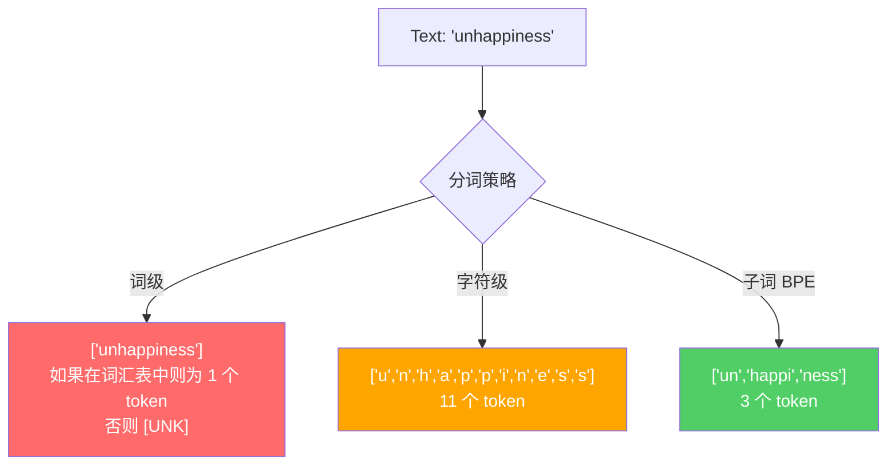
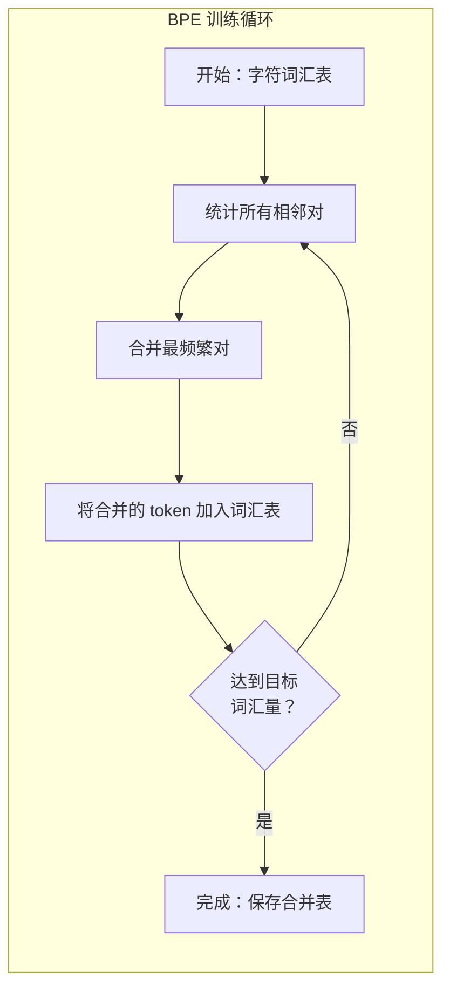

# 分词器：BPE、WordPiece、SentencePiece

> 你的 LLM 不读英语。它读整数。分词器决定这些整数是承载意义还是浪费它。

**类型：** 构建
**语言：** Python
**前置要求：** 第 5 阶段（NLP 基础）
**时间：** 约 90 分钟

## 学习目标

- 从零实现 BPE、WordPiece 和 Unigram 分词算法，并比较它们的合并策略
- 解释词汇量大小如何影响模型效率：太小产生长序列，太大浪费嵌入参数
- 分析跨语言和代码的分词伪影，识别特定分词器在哪崩溃
- 使用 tiktoken 和 sentencepiece 库对文本分词并检查生成的 token ID

## 问题

你的 LLM 不读英语。它不读任何语言。它读数字。

"Hello, world!" 与 [15496, 11, 995, 0] 之间的差距就是分词器。每个单词、每个空格、每个标点符号都必须转换为整数，模型才能处理。这种转换不是中性的。它将假设烘焙到模型中，之后无法撤销。

搞错了，你的模型会浪费容量用多个 token 编码常用词。"unfortunately" 变成四个 token 而非一个。你的 128K 上下文窗口对多音节词密集的文本缩水了 75%。搞对了，相同的上下文窗口容纳两倍的意义。"这个模型能处理好代码"和"这个模型在 Python 上噎住了"之间的区别通常归结为分词器是如何训练的。

你每次调用 GPT-4 或 Claude 的 API 都是按 token 计费的。你的模型生成的每个 token 都消耗计算。表示输出所需的 token 越少，端到端推理就越快。分词不是预处理。它是架构。

## 概念

### 三种失败的方法（和一种成功的方法）

将文本转换为数字有三种明显的方法。其中两种在规模上不工作。

**词级分词**按空格和标点分割。"The cat sat" 变成 ["The", "cat", "sat"]。简单。但 "tokenization" 呢？或者 "GPT-4o"？或者像 "Geschwindigkeitsbegrenzung" 这样的德语复合词呢？词级需要一个巨大的词汇表来覆盖每种语言中的每个单词。错过一个词，你就得到可怕的 `[UNK]` token——模型说"我不知道这是什么"的方式。仅英语就有超过一百万个词形。加上代码、URL、科学记法和 100 种其他语言，你需要一个无限词汇表。

**字符级分词**走另一个方向。"hello" 变成 ["h", "e", "l", "l", "o"]。词汇表很小（几百个字符）。永远不会出现未知 token。但序列变得极长。一个原本 10 个词级 token 的句子变成 50 个字符级 token。模型必须学习 "t"、"h"、"e" 一起意味着 "the"——在人类三岁就学会的事情上消耗注意力容量。

**子词分词**找到了最佳点。常用词保持完整："the" 是一个 token。罕见词分解为有意义的片段："unhappiness" 变成 ["un", "happi", "ness"]。词汇量保持可管理（30K 到 128K token）。序列保持短。未知 token 基本上消失，因为任何词都可以从子词片段构建。

每个现代 LLM 都使用子词分词。GPT-2、GPT-4、BERT、Llama 3、Claude——全部如此。问题在于哪种算法。



### BPE：字节对编码

BPE 是改用于分词的贪心压缩算法。这个想法简单到可以写在一张索引卡上。

从单个字符开始。在训练语料库中统计每个相邻对。将最频繁的对合并到一个新 token 中。重复直到达到目标词汇量。

以下是 BPE 在一个包含 "lower"、"lowest" 和 "newest" 的小型语料库上的运行：

```
语料库（带词频）：
  "lower"  x5
  "lowest" x2
  "newest" x6

步骤 0——从字符开始：
  l o w e r       (x5)
  l o w e s t     (x2)
  n e w e s t     (x6)

步骤 1——统计相邻对：
  (e,s): 8    (s,t): 8    (l,o): 7    (o,w): 7
  (w,e): 13   (e,r): 5    (n,e): 6    ...

步骤 2——合并最频繁对 (w,e) -> "we"：
  l o we r        (x5)
  l o we s t      (x2)
  n e we s t      (x6)

步骤 3——重新统计并合并，直到达到目标词汇量。
```

合并表就是分词器。要编码新文本，按学习到的顺序应用合并。训练语料库决定存在哪些合并，这一选择永久性地塑造了模型看到的内容。



### 字节级 BPE（GPT-2、GPT-3、GPT-4）

标准 BPE 操作 Unicode 字符。字节级 BPE 操作原始字节（0-255）。这给了你恰好 256 的基础词汇量，处理任何语言或编码，且永远不会产生未知 token。

GPT-2 引入了这种方法。基础词汇表覆盖每个可能的字节。BPE 合并在此基础上构建。OpenAI 的 tiktoken 库实现字节级 BPE，具有以下词汇量：

- GPT-2：50,257 个 token
- GPT-3.5/GPT-4：约 100,256 个 token（cl100k_base 编码）
- GPT-4o：200,019 个 token（o200k_base 编码）

### WordPiece（BERT）

WordPiece 看起来类似 BPE 但选择合并的方式不同。它不是原始频率，而是最大化训练数据的似然：

```
BPE 合并标准：      count(A, B)
WordPiece 合并标准：count(AB) / (count(A) * count(B))
```

BPE 问："哪一对出现得最多？" WordPiece 问："哪一对一起出现的频率比你随机预期的更多？" 这种微妙差异产生不同的词汇表。WordPiece 倾向其共现是令人意外而不仅仅是频繁的合并。

WordPiece 还使用 "##" 前缀表示延续子词：

```
"unhappiness" -> ["un", "##happi", "##ness"]
"embedding"   -> ["em", "##bed", "##ding"]
```

"##" 前缀告诉你这个片段延续了前一个 token。BERT 使用 WordPiece，词汇量为 30,522 个 token。

### SentencePiece（Llama、T5）

SentencePiece 将所有输入视为原始字节流。与在 Unicode 字符上运行 BPE 不同，SentencePiece 直接在 UTF-8 字节上操作。这意味着它从不需要显式的预分词——空白就被当作另一个字节。

SentencePiece 支持 BPE 和 Unigram 算法。Unigram 从一个大的词汇表开始，重复删除使训练语料库似然降低最少的 token。Mottainai（"不要浪费"）。

Unigram 方法产生一个概率上优美的分词模型：每个 token 都有一个概率，每个分词都有一个明确定义的似然。

### 分词伪影：你的模型停在哪里

每个分词器都有盲点。测试你自己的：

```python
"Hello world"      → GPT-4: [9906, 1917]     (2 tokens)
"HelloWorld"       → GPT-4: [9906, 8173, 57] (3 tokens — 大小写很重要)
"HelloWorld"       → GPT-4: [9906, 8594, 57] (2 tokens — 驼峰大小写)
"你好世界"          → GPT-4: [57668, 53901, 3068, 9916, 235, 120, 233]

# 代码：
"def main():"     → [4299, 2012, 7, 25]     (4 tokens)
"defmain():"      → [7637, 573, 89, 7, 25]  (5 tokens — 缺失空格)
```

空白是结构性的。一个标识符上的前导空格造成完全不同的分词。Python 与 Java 分词不同。中文每个字变成 2-3 个 token，使中文的上下文窗口有效长度比英语短。

每个 LLM 工程师都学到的教训：不要用空格和格式做花哨的事情。分词器就是不能很好地处理它。

## 构建

见 `code/main.py` 了解 BPE 的 Python 实现和 `code/bpe.py` 了解字节级变体。Rust 版本在 `code/bpe.rs` 中展示生产分词器如何获得 10-100x 速度提升。

## 交付

保存为 `outputs/skill-tokenizer.md`。

## 练习

1. **简单。** 在玩具语料库 ["low", "lower", "newest", "widest"] 上从零实现 BPE，词汇量限制为 10。显示中间合并步骤。
2. **中等。** 在相同语料库上比较 BPE 和 WordPiece 合并策略。在哪个合并它们首次产生分歧？为什么？
3. **困难。** 在英语、中文和代码文本的混合上训练 BPE 分词器，比较字节级与字符级基础词汇。测量每种方法的压缩比（原始字节 / token ID）。

## 关键术语

| 术语 | 含义 |
|------|------|
| BPE | 字节对编码：迭代合并最频繁的符号对。 |
| WordPiece | 基于似然的合并：合并 `count(AB) / (count(A) * count(B))` 最高的对。 |
| Unigram | 基于修剪：从所有 token 开始，删除最不重要的。 |
| 字节级 BPE | 基础词汇为 256 字节；无 `<unk>`；GPT-2/3/4 使用。 |
| 子词正则化 | SentencePiece Unigram 的训练时子词采样——一种正则化形式。 |
| tiktoken | OpenAI 的 Rust 分词库，Python 绑定；在字节级 BPE 上快速。 |
| 合并表 | 在训练时学习的一组有序合并规则；定义分词器。 |

## 扩展阅读

- [Sennrich et al. (2016). Neural Machine Translation of Rare Words with Subword Units](https://arxiv.org/abs/1508.07909)——原始 BPE 论文。
- [Kudo & Richardson (2018). SentencePiece: A simple and language independent subword tokenizer and detokenizer](https://arxiv.org/abs/1808.06226)——SentencePiece 论文。
- [Google. WordPiece tokenization](https://github.com/google/sentencepiece)——WordPiece 和 Unigram 分词。
- 本目录中的 `code/bpe.py` 和 `code/bpe.rs` ——在 Python 和 Rust 中实现了完整 BPE。