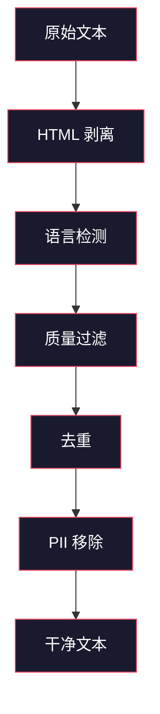
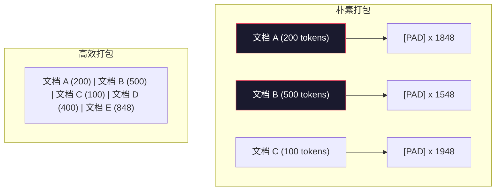

# 预训练数据管道

> 模型是一面镜子。它反映你喂给它的任何数据。喂给它垃圾，它就以完美的流畅度反映垃圾。

**类型：** 构建
**语言：** Python
**前置要求：** 第 10 阶段，第 01-02 课（分词器、构建分词器）
**时间：** 约 90 分钟

## 学习目标

- 构建一个流式数据管道，对 TB 级文本进行分词、分块、混洗和批次化，而不将其全部加载到内存中
- 实现真实预训练管道中使用的数据质量过滤器（去重、语言检测、内容过滤）
- 创建具有适当注意力掩码和文档边界处理的固定长度训练序列
- 分析管道吞吐量以确保数据加载器跟上 GPU 训练速度

## 问题

你有一个分词器。现在你需要数据。

不是一个数据集。不是一个 CSV 文件。TB 级的文本——清洗过、去重过、质量过滤过、分词成固定长度序列，并以随机化批次服务，快到你的 8 GPU 集群永远不等下一批。

大多数人认为训练 LLM 是关于模型架构的。不是的。Llama 3 使用了 15.6 万亿 token。GPT-3 使用了 3000 亿。DeepSeek-V2 使用了 8.1 万亿。三者之间的架构大致相同：带注意力和前馈层的堆叠 transformer 块。输出质量的差异压倒性地来自数据。

DeepMind 的 Chinchilla 论文将其精确化了。对于给定的计算预算，存在模型参数与训练 token 的最优比率。Chinchilla 显示 2022 年的大多数模型都严重训练不足——相对于它们看到的数据库，参数太多。一个在 1.4 万亿 token 上训练的 70B 参数模型（Chinchilla 最优）优于在 3000 亿 token 上训练的 280B 模型（Gopher）。

你的数据管道决定了你的模型学的是语言还是噪声。

## 概念

### 数据从哪来

每个大语言模型都在混源上训练。对大多数实验室而言确切的组成是严密保守的秘密，但我们足够了解来理解分类。

| 来源 | 大小 | 质量 | 使用者 |
|------|------|------|---------|
| Common Crawl | ~250 TB 原始 | 低（需要重度过滤） | GPT-3、Llama、大多数开放模型 |
| Wikipedia | ~20 GB | 高 | 每个主要 LLM |
| GitHub 代码 | ~1 TB+ | 中等（大量重复、死代码） | StarCoder、CodeLlama、DeepSeek-Coder |
| 书籍（BookCorpus、Pile） | ~100 GB | 高 | GPT-2、GPT-3、早期模型 |
| 学术论文（arXiv、S2ORC） | ~100 GB | 对 STEM 高 | Llama、Galactica |
| StackOverflow、Reddit | ~100 GB | 中等 | Llama、Falcon |
| 精选网络（C4、RefinedWeb） | ~5 TB | 中高（预过滤） | T5、Falcon |

Llama 3 披露了其数据混合：大约 50% 网络数据、25% 代码、13% 书籍和学术论文、8% 数学数据、4% 多语言网络数据。总计 15.6 万亿 token，来自超过 5 TB 的原始文本。

比例与总大小同样重要。太多网络数据，模型变成 Reddit 鹦鹉。太少代码，它无法编程。太少数学，它在推理上失败。搞清楚这个混合是训练 LLM 最难的部分之一，并且没有公式——它需要实验和评估。

### 数据清洗

原始网络数据是肮脏的。一个典型的 Common Crawl 转储包含：

- HTML 标签和 JavaScript
- 样板页头、页脚、导航菜单
- 重复页面（精确和近重复）
- 机器生成的垃圾
- 个人身份信息（PII）
- 低质量文本（关键词列表、SEO 垃圾）
- 被编码为文本的非文本内容

清洗这不是可选的。这是生成连贯段落和输出混杂产品列表的 HTML 标签的模型之间的区别。

每个步骤消除一类噪声：

**HTML 剥离：** 移除所有标记。只保留可见文本内容。像 `trafilatura` 或 `readability` 这样的库在丢弃导航、广告和样板时提取文章内容。

**语言检测：** 使用 fastText 的语言识别模型（lid.176.bin）对每个文档分类。过滤到你想要的语言。一个被分类为英语且置信度低于 0.8 的文档可能不是干净的英语。

**质量过滤：** 这变得有趣了。RefinedWeb（Falcon 背后的数据集）使用基于困惑度的过滤器：在 Wikipedia 上训练一个小语言模型，然后对每个文档评分。高困惑度意味着文档不像 Wikipedia——可能是垃圾、关键词列表或机器生成的内容。困惑度高于阈值的文档被移除。

**去重：** 最有影响力的清洗步骤。Common Crawl 包含大量重复页面——法律免责声明、cookie 通知、服务条款。在重复上训练浪费计算，并且可能导致模型逐字记忆和 regurgitate 特定段落。

**PII 移除：** 姓名、电子邮件地址、电话号码、社会安全号码。对结构化 PII 使用基于正则表达式的检测，对上下文中的姓名使用 NER 模型。

### 用 MinHash 去重

精确去重很简单：对每个文档哈希，移除重复。但近重复才是真正的问题。同一篇新闻文章的两份副本，围绕它的广告略有不同，就是近重复。内容 95% 相同，但逐字节不同。

MinHash + 局部敏感哈希（LSH）高效地解决了这个问题。

思路：

1. **Shingling：** 将每个文档转换为一组 n-gram。带 3 词 shingle 的 "the quick brown fox" 变成 {"the quick brown", "quick brown fox"}。

2. **MinHash：** 对每个文档的 shingle 集，计算 k 个哈希值。每个哈希值是所有 shingle 在不同哈希函数下的最小哈希。这创建一个近似任意两个文档之间 Jaccard 相似度的固定大小"签名"。

3. **LSH：** 根据其 MinHash 签名的带将文档分到桶中。同一桶中的文档是候选近重复。这避免比较每一对——只比较候选对。

4. **验证：** 对每个候选对，计算精确 Jaccard 相似度。如果相似度超过阈值（通常 0.8），移除一份副本。

Llama 团队报告通过去重移除了约 38% 的网络数据。这不是小数字。超过三分之一的 Common Crawl 是重复或近重复内容。

### 序列打包

你的模型期望固定长度输入序列。你的文档是可变长度的。有些 50 个 token。有些 50,000 个 token。

朴素方法：将每个文档填充到最大序列长度。这在毫无贡献学习的填充 token 上浪费大量计算。

更好方法：将多个文档打包到一个序列中，用序列结束 token 分隔。一个 2048 token 的序列可能包含三个短文，用 [EOS] token 连接。

**带有注意力掩码的交叉文档注意力。** 当文档被打包到一个序列中时，来自文档 A 的 token 不应关注文档 B 的 token。它们在语义上无关。解决方案：修改注意力掩码以阻止跨文档注意力，同时允许文档内注意力。

**带有预分词序列的全局混洗。** 训练前，将整个语料库预分词组为 2048 token 序列并全局混洗。这比先混洗文档再打包产生更均匀的数据分布。

**数据重复。** 对于小数据集（100K token），模型在第一个 epoch 记住数据之前你只能做几个 epoch。对于大数据集（万亿 token），你通常做 1-2 个 epoch——模型甚至看不到大多数据一次。

## 构建

在 `code/main.py` 中实现一个优化的流式数据管道，包括质量过滤、MinHash 去重、序列打包和预取。

## 交付

保存为 `outputs/prompt-data-quality-checker.md`。

## 练习

1. **简单。** 在包含重复的近重复文档数据集上实现 MinHash 去重。测量移除的文档百分比。
2. **中等。** 比较有交叉文档注意力掩码和无交叉文档注意力掩码的序列打包。测量在打包序列上训练的小型 LM 的困惑度。
3. **困难。** 配置文件数据管道吞吐量（token/s）。识别瓶颈并优化以匹配 8 GPU A100 节点的训练速度。

## 关键术语

| 术语 | 含义 |
|------|------|
| Common Crawl | 免费、开放的爬取网页数据集；大多数 LLM 的主要来源。 |
| Chinchilla | DeepMind 论文显示模型参数和训练 token 的最优比率。 |
| MinHash | 使用哈希函数近似集合相似度的技术。 |
| LSH | 局部敏感哈希：将相似项分组到同一桶中。 |
| 序列打包 | 将多个文档连接到单个固定长度序列中。 |
| 困惑度过滤 | 用 LM 得分移除低质量文本。 |
| PII | 个人身份信息：必须从训练数据中移除。 |

## 扩展阅读

- [Hoffmann et al. (2022). Training Compute-Optimal Large Language Models](https://arxiv.org/abs/2203.15556)——Chinchilla 缩放定律。
- [Touvron et al. (2023). Llama 2: Open Foundation and Fine-Tuned Chat Models](https://arxiv.org/abs/2307.09288)——数据混合披露。
- [Penedo et al. (2023). The RefinedWeb Dataset for Falcon LLM](https://arxiv.org/abs/2306.01116)——大规模数据过滤技术。
- [Lee et al. (2022). Deduplicating Training Data Makes Language Models Better](https://arxiv.org/abs/2107.06499)——去重对模型质量的影响。