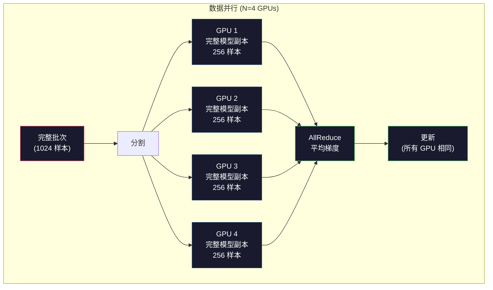

# 扩展：分布式训练、FSDP、DeepSpeed

> 你的 1.24 亿参数模型在一个 GPU 上训练。现在尝试 70 亿参数。模型装不进内存。数据在单台机器上需要数周。分布式训练在规模上不是可选的。这是唯一的前进道路。

**类型：** 构建
**语言：** Python
**前置要求：** 第 10 阶段，第 04 课（预训练迷你 GPT）
**时间：** 约 120 分钟

## 学习目标

- 解释三种并行类型（数据、张量、管道），以及基于模型和集群大小何时需要每种
- 使用跨多 GPU 的梯度同步实现 PyTorch DDP 数据并行训练
- 计算给定模型大小的内存预算（权重 + 优化器状态 + 梯度 + 激活）以确定最小硬件
- 配置 FSDP 或 DeepSpeed ZeRO 阶段以跨 GPU 分片模型状态，装进超过单 GPU 内存的模型

## 问题

一个 7B 参数模型在 FP16 中仅权重就需要 14GB。Adam 优化器为每个参数存储两个额外副本（一阶矩和二阶矩估计）。那又是 28GB。反向传播期间的梯度增加 14GB。在单个激活被存储之前你就到了 56GB。

NVIDIA A100 有 80GB 内存。

56GB 消耗了 80GB。剩下 24GB 给激活——在前向传播期间计算的中间值，必须保持存活以用于反向传播。对于具有 4096 维模型的 2048 token 序列，单层激活使用约 64MB。32 层，你需要每个样本 2GB。批次大小 8 需要 16GB。你有 24GB。批次大小 12 爆炸了。

现在尝试 700 亿参数。仅权重：FP16 中 140GB。装不进一个 GPU。你至少需要 2 个 A100（2 x 80GB = 160GB）仅用于存放权重。加上优化器状态和梯度，你需要更多：最少 3 个 GPU，实际情况取决于分片策略需要 8-16 个。

Llama 3 405B 是在 16,384 个 NVIDIA H100 GPU 上训练的。这次训练运行估计花费 1 亿美元计算费。DeepSeek V3 以大约 560 万美元训练了一个可比的模型，通过在架构（专家混合意味着每个 token 只有一小部分参数激活）和训练效率上的巧妙处理。

本课涵盖使大规模训练成为可能的四种策略：数据并行、张量并行、管道并行和全分片数据并行。你将在纯 Python 中模拟每种，以在接触分布式训练框架之前理解其机制。

## 概念

### 为什么需要分布式

以下是真实模型的内存数学。每个数字都是计算出来的，不是估计的。

| 模型 | 参数 | 权重 (FP16) | Adam 状态 | 梯度 (FP16) | 总计 (无激活) |
|------|------|-------------|-----------|-------------|----------------|
| GPT-2 Small | 124M | 248 MB | 992 MB | 248 MB | 1.5 GB |
| Llama 3 8B | 8B | 16 GB | 64 GB | 16 GB | 96 GB |
| Llama 3 70B | 70B | 140 GB | 560 GB | 140 GB | 840 GB |
| Llama 3 405B | 405B | 810 GB | 3,240 GB | 810 GB | 4,860 GB |

"Adam 状态"列是杀手。Adam 为*每个*参数存储运行均值 (m) 和运行方差 (v)，都在 FP32 中。对于 70B 模型，那是 70B x 4 字节 x 2 = 560GB。仅优化器就需要七个 A100。

单个 H100 有 80GB。Llama 3 405B 至少需要 61 个 H100 来存放权重、优化器和梯度。加上激活，数字进一步增长。Meta 使用了 16,384 个 GPU，不是因为他们想——而是必须。

### 数据并行

最简单的分布式策略。将整个模型复制到 N 个 GPU。将每个训练批次分成 N 个相等部分。每个 GPU 在其数据分片上运行前向和反向传播。反向传播后，跨所有 GPU 平均梯度。每个 GPU 以相同的平均梯度更新其权重副本，保持所有副本同步。

**好处：** 线性吞吐量扩展。N 个 GPU 每步处理 N 倍更多数据。通信限于梯度平均，与计算重叠。

**坏处：** 每个 GPU 持有模型的完整副本、优化器状态和梯度。对于 70B 模型，每个 GPU 需要 840GB。数据并行毫不减少每 GPU 内存。它只减少训练时间。

**数学：** 有效批次大小 = per_gpu_batch_size x N。对于 N=64 个 GPU，每个 GPU 批次 16，有效批次为 1,024。Llama 3 使用每步 1600 万 token 的有效批次大小。



### 张量并行

跨 GPU 分割单个层。一个单独的矩阵乘法被分配到 GPU 之间，每个计算结果的一部分。

考虑前馈层中形状为 (8192, 8192) 的权重矩阵。使用 4 路张量并行，每个 GPU 持有 (8192, 2048) 的分片。每个 GPU 将输入乘以其分片，产生部分结果。部分结果被组合（通过 all-reduce 或 all-gather）以产生完整输出。

**好处：** 减少模型权重的每 GPU 内存。跨 8 个 GPU 分割的 70B 模型意味着每个 GPU 持有约 8.75B 参数价值的权重。

**坏处：** 每层之后需要快速的 GPU 间通信。每次 matmul 后的 all-reduce 增加延迟。这在与 NVLink（同一节点 GPU 间 900 GB/s）配合时效果很好，但跨节点通过 InfiniBand（400 Gb/s，约 50 GB/s）连接时不好。张量并行几乎总是限于单个节点（8 个 GPU）内。

**实际使用：** Megatron-LM 开创了张量并行。Llama 3 405B 在每个节点内使用 8 路张量并行。

### 管道并行

按层分割模型。GPU 1 运行层 1-8。GPU 2 运行层 9-16。GPU 3 运行层 17-24。GPU 4 运行层 25-32。数据流经管道：GPU 1 计算其层并将激活发送到 GPU 2，GPU 2 计算其层并发送到 GPU 3，依此类推。

**好处：** GPU 间通信最少——只有层边界处的激活，相比于梯度或权重很小。跨节点工作，因为带宽需求低。

**坏处：** 管道气泡。当 GPU 4 正在微批次 1 上计算前向传播时，GPU 1、2 和 3 是空闲的（它们已经转发了自己的部分）。反向传播期间模式反转。使用朴素管道，GPU 利用率仅为 N 个管道阶段的 1/N。

**GPipe 和 PipeDream** 通过将批次分成微批次来解决气泡问题。GPU 1 一旦完成转发微批次 1 就立即开始微批次 2。这在管道阶段之间重叠计算。使用 M 个微批次和 N 个阶段，气泡比例降至 (N-1)/M。使用 M=16 个微批次和 N=4 个阶段，气泡是 3/16 = 18.75% 空闲时间。

### FSDP：全分片数据并行

FSDP 结合了数据并行的可扩展性和分片的内存效率。每个 GPU 不是持有模型的完整副本，而是只持有参数的 1/N、梯度的 1/N 和优化器状态的 1/N。

在层的前向传播之前，FSDP 运行 **all-gather** 将所有 GPU 的完整参数收集到每个 GPU 的内存中。前向传播后，每个 GPU 丢弃非本地参数。反向传播期间，all-gather 再次运行以重构参数用于梯度计算。反向传播后，**reduce-scatter** 分发梯度分片，使每个 GPU 只存储 1/N 的梯度。

**70B 模型在 8 个 GPU 上的数学：**

| 组件 | 无 FSDP | 有 FSDP |
|------|---------|---------|
| 权重 (FP16) | 每 GPU 140 GB | 每 GPU 17.5 GB |
| Adam 状态 (FP32) | 每 GPU 560 GB | 每 GPU 70 GB |
| 梯度 (FP16) | 每 GPU 140 GB | 每 GPU 17.5 GB |
| **总计** | **每 GPU 840 GB** | **每 GPU 105 GB** |

没有 FSDP，你无法将 70B 模型装入单个 80GB GPU。使用 8 个 GPU 上的 FSDP，每个 GPU 使用 105GB——等等，那还是装不下。你需要至少 16 个 GPU 才能达到每 GPU 80GB 以下，或者你将 FSDP 与激活检查点结合（在反向传播期间重新计算激活而不是存储它们）。

通信成本高于原始数据并行，因为在每层之前有 all-gather。但内存节省使以前不可能的训练运行成为可能。

```mermaid
graph TD
    subgraph FSDP["FSDP: 全分片数据并行 (4 GPUs)"]
        direction TB
        S["模型: 4 层, 分片"]

        subgraph GPU1["GPU 1"]
            G1S["分片: 1/4 参数\n1/4 优化器\n1/4 梯度"]
        end
        subgraph GPU2["GPU 2"]
            G2S["分片: 1/4 参数\n1/4 优化器\n1/4 梯度"]
        end
        subgraph GPU3["GPU 3"]
            G3S["分片: 1/4 参数\n1/4 优化器\n1/4 梯度"]
        end
        subgraph GPU4["GPU 4"]
            G4S["分片: 1/4 参数\n1/4 优化器\n1/4 梯度"]
        end

        AG["All-Gather\n(每层前重构完整参数)"]
        FW["前向传播\n(临时完整参数)"]
        RS["Reduce-Scatter\n(反向传播后分发梯度分片)"]

        S --> GPU1
        S --> GPU2
        S --> GPU3
        S --> GPU4
        GPU1 --> AG
```

### DeepSpeed ZeRO

DeepSpeed 实现了与 FSDP 相同的分片策略，但具有三个渐进的"ZeRO 阶段"：

- **ZeRO-1：** 仅分片优化器状态。梯度保持复制，权重保持复制。比 DDP 节省最多 4 倍内存。
- **ZeRO-2：** 分片优化器状态和梯度。权重保持复制。比 DDP 节省最多 8 倍。
- **ZeRO-3：** 分片所有东西——优化器状态、梯度和模型参数。等同于 FSDP。比 DDP 节省最多 N 倍（N = GPU 数）。

ZeRO-3 加上激活检查点（重新计算而非存储）和混合精度训练构成了 2026 年大规模训练的标准配方。

## 构建

`code/main.py` 模拟了在纯 Python 上对小型 MLP 的四种并行策略。没有网络。没有 PyTorch 分布式。只是跨伪 GPU 张量分片和重组的实际数学。

## 交付

保存为 `outputs/prompt-distributed-training-planner.md`。

## 练习

1. **简单。** 将模型权重手动分片到 N=4 个"虚拟 GPU"上。证明 all-gather 正确地重构了完整权重矩阵。
2. **中等。** 为 70B 模型在 8、16、32 个 GPU 上计算内存预算。FP16 权重 + FP32 优化器 + FP16 梯度 + 激活（作为权重百分比的估计）。每个配置需要多少 GPU 才能装入 80GB？
3. **困难。** 比较数据并行、FSDP 和 ZeRO-3 对 1B 模型在 4 个 GPU 上的通信量。测量 all-reduce、all-gather 和 reduce-scatter 调用中移动的字节数。

## 关键术语

| 术语 | 含义 |
|------|------|
| DDP | 分布式数据并行：跨 GPU 复制模型，平均梯度。 |
| FSDP | 全分片数据并行：跨 GPU 分片参数、梯度和优化器。 |
| ZeRO | DeepSpeed 的分片策略，分阶段 1-3。 |
| 张量并行 | 将矩阵乘法分割到 GPU 上。 |
| 管道并行 | 将模型层分割到 GPU 上。 |
| NVLink | 高速 GPU 到 GPU 互连（900 GB/s）。 |
| All-Gather | 从所有 GPU 收集分片以重构完整张量。 |
| Reduce-Scatter | 对梯度求和并分发分片回 GPU。 |
| 管道气泡 | 管道并行中 GPU 空闲时间的时段。 |
| 激活检查点 | 在反向传播期间重新计算激活而非存储它们。 |

## 扩展阅读

- [Rajbhandari et al. (2020). ZeRO: Memory Optimizations Toward Training Trillion Parameter Models](https://arxiv.org/abs/1910.02054)——DeepSpeed ZeRO 论文。
- [Zhao et al. (2023). PyTorch FSDP: Experiences on Scaling Fully Sharded Data Parallel](https://arxiv.org/abs/2304.11277)——FSDP 论文。
- [Shoeybi et al. (2019). Megatron-LM: Training Multi-Billion Parameter Language Models Using Model Parallelism](https://arxiv.org/abs/1909.08053)——张量和管道并行。
- [Narayanan et al. (2021). Efficient Large-Scale Language Model Training on GPU Clusters Using Megatron-LM](https://arxiv.org/abs/2104.04473)——大规模 3D 并行。