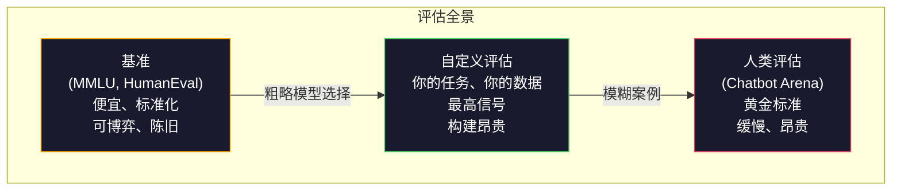

# 评估：基准测试、Evals、LM Harness

> 古德哈特定律：当一个度量成为目标时，它就不再是一个好的度量。每个前沿实验室都在博弈基准测试。MMLU 分数上升，而模型仍然不能可靠地数出 "strawberry" 中 R 的数量。唯一重要的评估是*你*的评估——在你的任务上，用你的数据。

**类型：** 构建
**语言：** Python
**前置要求：** 第 10 阶段，第 01-05 课（从零开始的 LLM）
**时间：** 约 90 分钟

## 学习目标

- 构建一个自定义评估框架，对语言模型运行多项选择和开放式基准测试
- 解释为什么标准基准（MMLU、HumanEval）会饱和且无法区分前沿模型
- 实现带有适当指标的任务特定评估：精确匹配、F1、BLEU 和 LLM-as-judge 评分
- 设计针对你特定用例的自定义评估套件，而非仅仅依赖公共排行榜

## 问题

MMLU 于 2020 年发布，包含跨越 57 个学科的 15,908 个问题。三年之内，前沿模型就饱和了它。GPT-4 得分 86.4%。Claude 3 Opus 得分 86.8%。Llama 3 405B 得分 88.6%。排行榜压缩到一个 3 分范围内，差异只是统计噪声，而非真实能力差距。

与此同时，这些相同的模型在 10 岁孩子不假思索就能处理的任务上失败。Claude 3.5 Sonnet 在 MMLU 上得分 88.7%，最初却无法数出 "strawberry" 中的字母——一个需要零世界知识和零推理的任务，只需要字符级迭代。HumanEval 用 164 个问题测试代码生成。模型在其上得分 90% 以上，同时仍然产生在任何初级开发人员都能捕获的边缘情况下崩溃的代码。

基准性能与现实世界可靠性之间的差距是 LLM 评估的核心问题。基准告诉你模型在基准上的表现如何。它们几乎不能告诉你该模型在你的特定任务上、用你的特定数据、在你的特定失败模式下会如何表现。如果你正在构建客户支持机器人，MMLU 是无关的。如果你正在构建代码助手，HumanEval 仅涵盖函数级生成——对于调试、重构或解释跨文件代码完全没有提及。

你需要自定义评估。不是因为基准没有用——它们对于粗略的模型选择是有用的——而是因为最终评估必须完全匹配你的部署条件。

## 概念

### 评估全景

评估有三个类别，每个有不同的成本和信号质量。

**基准**是标准化测试套件。MMLU、HumanEval、SWE-bench、MATH、ARC、HellaSwag。你对基准运行一个模型并得到一个分数。优势：所有人都使用相同的测试，所以你可以比较模型。劣势：模型和训练数据越来越多地污染这些基准。实验室在包含基准问题的数据上训练。分数上升。能力可能没有。

**自定义评估**是你为自己的特定用例构建的测试套件。你定义输入、预期输出和评分函数。法律文档摘要器在法律文档上评估。SQL 生成器在你的数据库模式上评估。这些创建起来昂贵，但它们是预测生产性能的唯一评估方式。

**人类评估**使用付费标注者根据有用性、正确性、流畅性和安全性等标准判断模型输出。对于自动评分失败的开放式任务，是黄金标准。Chatbot Arena 在 100 多个模型上收集了超过 200 万个人类偏好投票。劣势：成本（每次判断 $0.10-$2.00）和速度（数小时到数天）。



### 为什么基准失效

三种机制导致基准分数不再反映真实能力。

**数据污染。** 训练语料库爬取互联网。基准问题存在于互联网上。模型在训练期间看到答案。在传统意义上这不是作弊——实验室不故意包含基准数据。但网络规模的爬取使其几乎不可能排除。

**应试教育。** 实验室优化训练混合以追求基准性能。如果 5% 的训练混合是 MMLU 风格的多项选择，模型就学会了格式和答案分布。MMLU 是 4 路多项选择。模型学会答案分布在 A/B/C/D 之间大致均匀，即使模型不知道答案这也有帮助。

**饱和。** 当每个前沿模型在基准上得分 85-90% 时，基准停止区分。剩下的 10-15% 问题可能是模糊的、标记错误的或需要晦涩的领域知识。在 MMLU 上从 87% 提高到 89% 可能意味着模型记忆了两个更晦涩的问题，而不是变得更聪明。

### 困惑度：快速健康检查

困惑度衡量模型对 token 序列有多惊讶。形式化地，它是指数化的平均负对数似然：

```
PPL = exp(-1/N * sum(log P(token_i | context)))
```

困惑度为 10 意味着模型平均在每个 token 位置像在 10 个选项中均匀选择一样不确定。越低越好。GPT-2 在 WikiText-103 上得约 30 的困惑度。GPT-3 得约 20。Llama 3 8B 得约 7。

困惑度对于在同一测试集上比较模型是有用的，但它有盲点。一个模型可以通过擅长预测常见模式而获得低困惑度，同时在罕见但重要的模式上非常差。它也不能说明指令遵循、推理或事实准确性。将其用作健全性检查，而非最终裁决。

### LLM-as-Judge

使用强模型评估较弱模型的输出。思路很简单：让 GPT-4o 或 Claude Sonnet 以 1-5 分制给响应的正确性、有用性和安全性评分。这使用 GPT-4o-mini 每次判断花费约 $0.01，并与人类判断惊人地相关——在大多数任务上大约 80% 的一致性。

评分提示比模型更重要。模糊的提示（"给这个响应评分"）产生噪声分数。带有评分标准的结构化提示（"如果答案事实正确并引用来源评 5 分，正确但未引用来源评 4 分，部分正确评 3 分……"）产生一致、可重现的分数。

失败模式：评判模型表现出位置偏见（在成对比较中偏好第一个响应）、冗长偏见（偏好更长的响应）和自我偏好（GPT-4 给 GPT-4 的输出评分高于等效的 Claude 输出）。缓解措施：随机化顺序，对长度归一化，使用与被评估模型不同的评判者。

### 来自成对比较的 ELO 评分

Chatbot Arena 的方法。展示来自不同模型的同一提示的两个响应。一个人类（或 LLM 评判者）选择更好的那个。从数千个这样的比较中，计算每个模型的 ELO 评分——与国际象棋中使用的系统相同。

ELO 优势：相对排名比绝对评分更可靠，优雅地处理平局，并且比独立评分每个输出以更少的比较收敛。截至 2026 年初，Chatbot Arena 排名显示 GPT-4o、Claude 3.5 Sonnet 和 Gemini 1.5 Pro 在顶端彼此相差在 20 ELO 分以内。

### 构建自定义评估

一个好评估的解剖：

1. **输入生成：** 来自你的分布（客户票据、法律合同、支持对话）的任务，或者来自目标人群的合成任务。
2. **模型输出：** 原始生成，严格用你的对话模板格式化，在匹配部署的精确条件下。
3. **评分函数：** 自动指标（精确匹配、F1、pass@k）和/或 LLM-as-judge 有定义明确的标准。
4. **聚合：** 跨切片的平均分数（按任务难度、语言、领域），而不只是整体平均。

目标不是"这个模型在 MMLU 上得了 90%"。而是"这个模型在我们的支持票据上产生了 87% 的可部署答案，带 <3% 的幻觉率。"

## 构建

`code/main.py` 实现了一个带有精确匹配和 LLM-as-judge 得分函数的评估框架。

## 交付

保存为 `outputs/skill-llm-evaluation.md`。

## 练习

1. **简单。** 对你微调的模型在 20 个你写的指令上运行评估。比较基础模型、SFT 模型和 DPO 模型的得分。哪个改进最大？
2. **中等。** 在 50 个成对比较上计算 ELO 排名。验证评分者间一致性是否超过随机基线。
3. **困难。** 能否构建一个指标来捕获真实可靠性而非基准性能？在微调后运行三个模型并评分——你是否观察到不一致？

## 关键术语

| 术语 | 含义 |
|------|------|
| MMLU | 大规模多任务语言理解：57 个学科的多项选择基准。 |
| HumanEval | 带有单元测试的 164 个 Python 编程问题。 |
| 困惑度 | 指数化平均负对数似然；衡量模型惊讶程度。 |
| LLM-as-Judge | 使用强 LLM 为较弱 LLM 的输出质量评分。 |
| ELO | 来自成对比较的相对排名系统（来自国际象棋）。 |
| pass@k | 在 k 个生成样本中至少一次通过测试的概率。 |
| 数据污染 | 基准问题出现在训练数据中，虚高分数。 |

## 扩展阅读

- [Hendrycks et al. (2020). Measuring Massive Multitask Language Understanding](https://arxiv.org/abs/2009.03300)——MMLU 基准论文。
- [Chen et al. (2021). Evaluating Large Language Models Trained on Code](https://arxiv.org/abs/2107.03374)——HumanEval 基准。
- [Zheng et al. (2023). Judging LLM-as-a-Judge with MT-Bench and Chatbot Arena](https://arxiv.org/abs/2306.05685)——LLM 评判方法的验证。
- [Chiang et al. (2024). Chatbot Arena: An Open Platform for Evaluating LLMs by Human Preference](https://arxiv.org/abs/2403.04132)——ELO 排名和人类偏好评估。