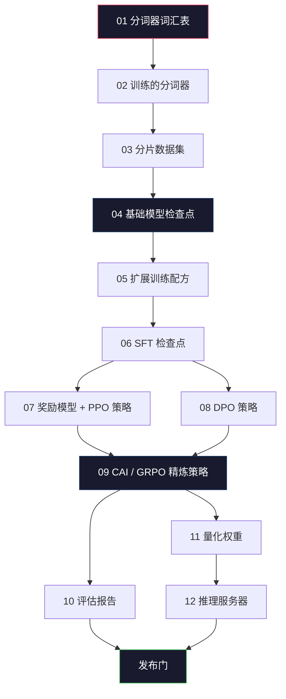

# 构建完整的 LLM 管道

> 第 01 到 12 课中的每个内容都是一个管道的一个阶段。本课是将这些阶段变成一个单独的端到端运行的脚手架：分词、预训练、扩展、SFT、对齐、评估、量化、服务。你不会在笔记本上训练一个 70B 模型。但你会产生编排层、清单、评估门和回滚计划——2026 年前沿团队用来决定什么被发布的工具。这是顶点课程。

**类型：** 构建
**语言：** Python（标准库）
**前置要求：** 所有第 10 阶段第 01-12 课
**时间：** 约 120 分钟

## 学习目标

- 将前面十一节课（分词器、数据、预训练、扩展、SFT、RLHF、DPO、CAI、评估、量化、推理）组合成一个可复现的管道规范
- 定义阶段之间的产物契约：每个阶段消费什么、产生什么，以及下一阶段如何验证输入
- 构建一个编排器，跟踪实验、哈希产物，并根据评估阈值决定发布
- 设计回滚计划：哪些产物重新运行成本低，哪些昂贵，以及一个损坏的检查点代价是什么

## 问题

前面的每一课都能独立工作。分词器训练好了。迷你 GPT 预训练了。SFT 数据集组装了。奖励模型训练了。DPO 运行了。评估测量了。量化权重导出了。推理服务器启动了。每一个都是一个笔记本。每一个都有自己的约定、自己的输出路径、自己的种子。

前沿训练运行不是一个笔记本。Llama 3 405B 用了约 3000 万 H100 小时，横跨大约 54 天。DeepSeek-V3 用了约 280 万 H800 小时。在这期间，一个损坏的检查点、一个数据污染、一个评估退化可能让团队损失一周的实际时间和一个月的 GPU 预算。团队通过管道卫生生存下来的方式：每个阶段都有一个确定性输入、一个确定性输出、一个清单、一个哈希和一个门。

这是顶点课程。你不会在笔记本上从头到尾运行管道。你将编写协调各阶段的编排器、描述运行的清单、决定发布的验证器、以及让第三方从单个文件重新运行你工作的回放计划。代码很小；纪律很大。

这个模式从 100M 到 1T 参数不变地扩展。相同的四个组件——清单、编排器、评估门、产物存储——运行 Llama 3，也运行你的业余 GPT。区别在于每个阶段配置内部数字的大小，而不是管道的形状。

## 概念

### 十二个阶段

每个第 10 阶段的课都是一个阶段。以下是完整的依赖图。



阶段 07 和 08 可以并行运行。其他所有都是硬依赖。阶段 02（分词器）的改变会使所有下游产物失效。阶段 10（评估）的改变只影响发布决策。

### 清单

清单是一个单独的文件，足够完整地描述一次运行，以便回放它。管道产生的任何东西都不应依赖于不在清单中的状态。字段是无聊且必需的。

```
pipeline_version: 1.2.3
seed: 42
git_commit: a1b2c3d4
stages:
  01_tokenizer:
    recipe: bpe_32k
    input_hash: sha256:...
    output_hash: sha256:...
    wall_clock_sec: 3600
    cost_usd: 12
```

阶段 N 的输出哈希是阶段 N+1 的输入哈希。任何偏差管道都会停止。这就是你早期捕获数据损坏的方式。这也是另一个大洲的队友验证他们的回放是否产生了与你相同的产物的方式。

在实践中，团队使用一个小型 YAML 模式加上一个清单检查器，与上一次成功运行做差异比较。任何超出预期字段（成本、实际时间）的差异都是红旗。

### 产物类型化

每个阶段的输出是一个类型化产物。不是一个目录 blob，不是一个 pickle，而是一个具有已知模式的命名类型。

| 阶段 | 产物类型 | 关键字段 |
|------|---------|----------|
| 01-02 | 分词器 | vocab.json, merges.txt, config.json, hash |
| 03 | 数据集 | shards[], row count, token count, dedup stats |
| 04-05 | 检查点 | weights.safetensors, config.json, optimizer state, step count |
| 06 | SFT 模型 | checkpoint + SFT recipe + data mix |
| 07 | 奖励模型 | RM checkpoint + preference data hash |
| 08-09 | 策略 | checkpoint + reference hash + beta + KL budget consumed |
| 10 | 评估报告 | benchmark scores + regression diffs + eval data hash |
| 11 | 量化模型 | quantized weights + calibration data + accuracy delta vs FP16 |
| 12 | 服务器规范 | endpoint + model hash + config + observability hooks |

类型化防止了最常见的失败模式：将阶段 08 的输出用作阶段 06 的输入，通过 SFT 路径发布 DPO 训练的模型。类型化产物和类型化阶段签名使这些错误成为编译时失败，而非第五天才发现的失败。

### 评估门

发布不是"训练完成"。发布是"训练完成且评估门通过"。门在运行开始前就定义了。

示例门：

- 所有基准得分 ≥ 先前版本
- 没有基准退化 > 1 个标准差
- 安全评级（毒性、拒绝）≥ 阈值
- 延迟 p99 在目标约束内

如果门未通过，管道停止。没有例外。在训练后纠正失败的诱惑是巨大的（"只是一个小退化，我们稍后可以修复"）。这种诱惑正是管道最初存在的原因。

### 回滚计划

并非所有阶段重新运行成本相同。分词器训练需要分钟，成本几美元。预训练运行需要数天，成本数千。回滚计划对每个阶段进行分类：

- **廉价：** 阶段 01-03、10、12。分钟到小时。合适日常实验。失败变更后可以安全回滚。
- **昂贵：** 阶段 04-05。数天，数千美元。回滚这些意味着重新运行大部分管道。
- **可变：** 阶段 06-09。小时到天。成本取决于 SFT/RL 数据大小和策略。

策略：从不修改昂贵阶段的上游内容。如果你触摸分词器（阶段 01），你承诺重新运行一切。如果你想实验 SFT（阶段 06），基础模型（阶段 04）保持不变——只重新运行 06-12。

## 构建

`code/main.py` 实现了编排器、清单系统和验证门作为 Python 类。

## 交付

保存为 `outputs/skill-llm-pipeline-reviewer.md`。

## 练习

1. **简单。** 设计一个 YAML 清单格式，覆盖 12 个阶段的输入、输出和哈希。验证它捕获损坏的检查点。
2. **中等。** 实现一个管道模拟器，运行阶段 01-05，在阶段 03 后注入数据损坏，并显示门适当地拒绝运行。
3. **困难。** 估算 70B 模型的端到端管道成本（分词、预训练、SFT、DPO、评估、量化、推理设置）。哪些阶段主导成本？你将如何优先考虑每个阶段的实验预算？

## 关键术语

| 术语 | 含义 |
|------|------|
| 清单 | 完全描述一次运行的回放文档。 |
| 产物 | 阶段的类型化输出：检查点、报告、配置。 |
| 评估门 | 阻止发布除非满足预定义标准的条件检查。 |
| 回滚 | 恢复先前管道的产物状态。 |
| 编排器 | 按依赖顺序运行阶段并处理失败的程序。 |

## 扩展阅读

- 阶段特定的论文和文档贯穿整个第 10 阶段。
- [MosaicML (2023). Composer: A PyTorch Library for Efficient Neural Network Training](https://github.com/mosaicml/composer)——训练管道编排。
- [Kubeflow Pipelines](https://www.kubeflow.org/docs/components/pipelines/)——Kubernetes 原生 ML 管道。