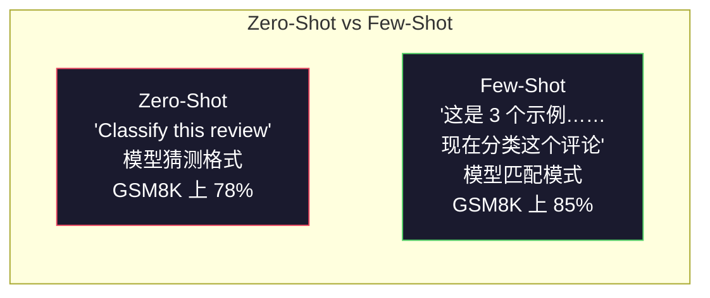
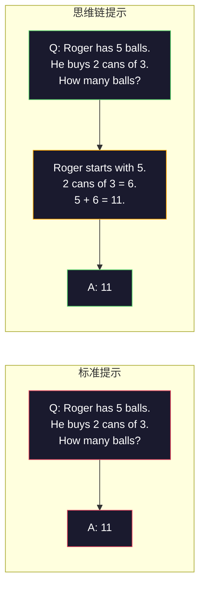
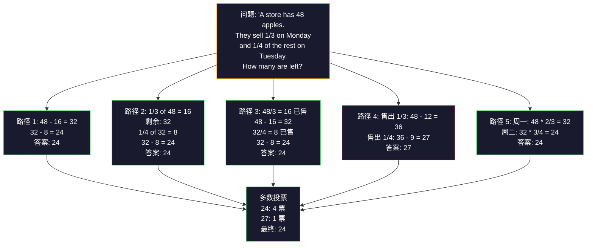
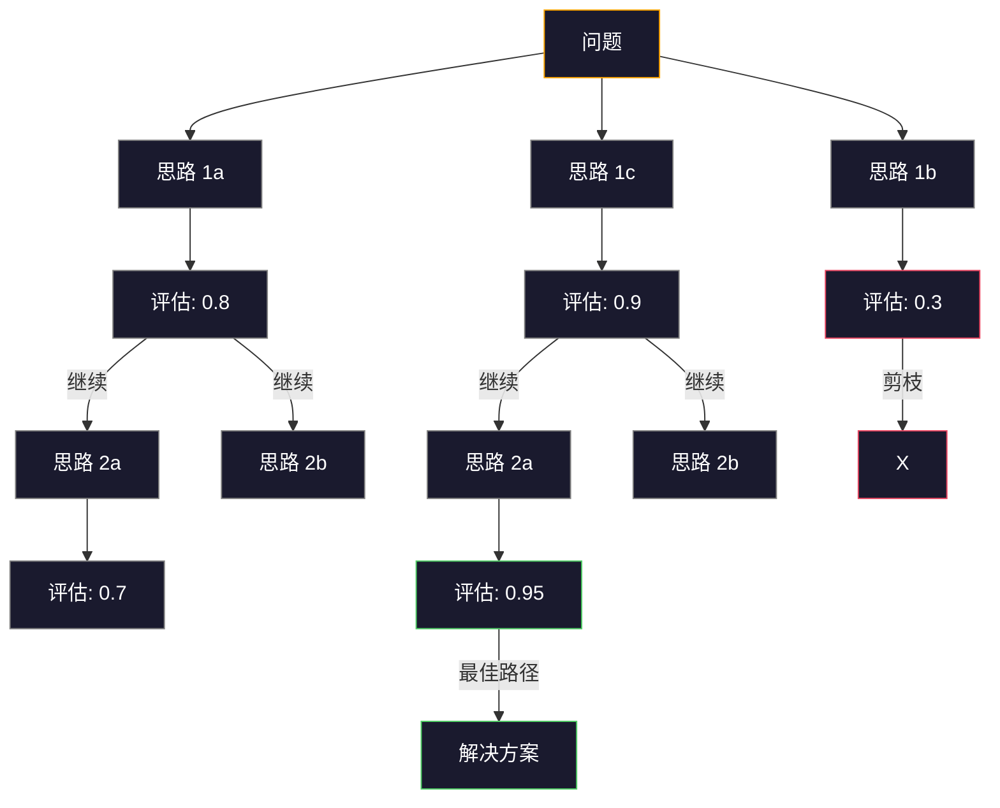

# Few-Shot、思维链、思维树

> 告诉模型做什么是提示词。展示给模型如何思考才是工程。同一个模型、同一个任务、同样的数据，78% 和 91% 准确率之间的差距，不是更好的模型，而是更好的推理策略。

**类型：** 构建
**语言：** Python
**先修要求：** Lesson 11.01（提示词工程）
**时间：** 约 45 分钟

## 学习目标

- 通过选择和格式化示例演示来实现 few-shot 提示（Few-Shot Prompting），最大化任务准确率
- 应用思维链（Chain-of-Thought，CoT）推理来提高多步骤问题（如数学文字题）的准确率
- 构建思维树（Tree-of-Thought，ToT）提示词，探索多条推理路径并选择最佳路径
- 在标准基准上衡量从 zero-shot 到 few-shot 到 CoT 的准确率提升

## 问题

你构建了一个数学辅导应用。你的提示词是：「Solve this word problem.」GPT-5 在 GSM8K（标准小学数学基准测试）上的正确率达到 94%。你以为已经到顶了。并没有——思维链仍然能加 3-4 个点。

加上五个词——「Let's think step by step」——准确率跃升到 91%。加几个已解答的示例，达到 95%。同样的模型，同样的温度，同样的 API 成本。唯一的区别是你给了模型草稿纸。

这不是取巧。这是推理的工作方式。人类不会在一次思维跳跃中解决多步骤问题。Transformer 也一样。当你强制模型生成中间 token 时，那些 token 会成为下一个 token 的上下文。每个推理步骤都喂给下一个。模型确实是一步步计算出答案的。

但「think step by step」只是开始，不是终点。如果你采样五条推理路径并取多数票呢？如果你让模型探索一个可能性的树，评估并修剪分支呢？如果你将推理与工具使用交织在一起呢？这些不是假设。它们是有测量改进的已发表技术，你将在本课中全部构建。

## 概念

### Zero-Shot vs Few-Shot：当示例胜过指令

Zero-shot 提示只给模型任务，不给别的。Few-shot 提示先给它示例。

Wei 等人（2022）在 8 个基准上测量了这一点。对于简单任务（如情感分类），zero-shot 和 few-shot 相差在 2% 以内。对于复杂任务（如多步算术和符号推理），few-shot 将准确率提高了 10-25%。

直觉：示例是压缩的指令。与其描述输出格式，不如展示它。与其解释推理过程，不如演示它。模型对示例的模式匹配比它对抽象指令的解读更可靠。



**Few-shot 胜出的场景：** 对格式敏感的任务、分类、结构化提取、领域特定术语、任何需要模型匹配特定模式的任务。

**Zero-shot 胜出的场景：** 简单的事实性问题、示例会限制创造力的创意任务、找好示例比写好指令更难的任务。

### 示例选择：相似的胜过随机的

并非所有示例都一样。选择与目标输入相似的示例比随机选择在分类任务上高出 5-15%（Liu 等，2022）。三个原则：

1. **语义相似性**：挑选在嵌入空间中与输入最近的示例
2. **标签多样性**：在示例中覆盖所有输出类别
3. **难度匹配**：匹配目标问题的复杂度水平

大多数任务的最佳示例数量是 3-5 个。少于 3 个，模型没有足够的信号来提取模式。超过 5 个，你会遇到收益递减并浪费上下文窗口 token。对于有许多标签的分类，每个标签使用一个示例。

### 思维链（Chain-of-Thought）：给模型草稿纸

思维链提示由 Google Brain 的 Wei 等人（2022）提出。想法很简单：不要只要求模型给出答案，而是要求它先展示推理步骤。



这在机制上为什么有效？Transformer 生成的每个 token 都成为下一个 token 的上下文。没有 CoT 时，模型必须将所有推理压缩到单次前向传播的隐藏状态中。有了 CoT，模型将中间计算外部化为 token。每个推理 token 扩展了有效的计算深度。

**GSM8K 基准（Grade-School Math，小学数学，8.5K 道题）：**

| 模型 | Zero-Shot | Zero-Shot CoT | Few-Shot CoT |
|-------|-----------|---------------|--------------|
| GPT-4o | 78% | 91% | 95% |
| GPT-5 | 94% | 97% | 98% |
| o4-mini（推理模型） | 97% | — | — |
| Claude Opus 4.7 | 93% | 97% | 98% |
| Gemini 3 Pro | 92% | 96% | 98% |
| Llama 4 70B | 80% | 89% | 94% |
| DeepSeek-V3.1 | 89% | 94% | 96% |

**关于推理模型的说明。** OpenAI 的 o 系列模型（o3、o4-mini）和 DeepSeek-R1 在输出答案之前内部运行思维链。对推理模型添加「Let's think step by step」是多余的，有时甚至适得其反——它们已经做过了。

CoT 的两种形式：

**Zero-Shot CoT**：在提示词末尾加「Let's think step by step」。不需要示例。Kojima 等人（2022）表明，这一句话就能在算术、常识和符号推理任务上提高准确率。

**Few-Shot CoT**：提供包含推理步骤的示例。比 Zero-Shot CoT 更有效，因为模型看到了你期望的确切推理格式。

**CoT 不起作用的情况**：简单的事实回忆（「法国的首都是什么？」）、单步分类、速度比准确性更重要的任务。CoT 每次查询会增加 50-200 token 的推理开销。对于高吞吐量、低复杂度的任务，这是浪费的成本。

### 自一致性（Self-Consistency）：多次采样，一次投票

Wang 等人（2023）引入了自一致性。核心洞察：单条 CoT 路径可能包含推理错误。但如果你采样 N 条独立的推理路径（使用 temperature > 0）并对最终答案进行多数投票，错误会相互抵消。



自一致性在原始 PaLM 540B 实验中将 GSM8K 准确率从 56.5%（单条 CoT）提高到 74.4%（N=40）。在 GPT-5 上提升很小（97% 到 98%），因为基础准确率已经饱和。该技术在基础 CoT 准确率在 60-85% 之间的模型上效果最好——这是单路径错误频繁但非系统性的最佳区间。对于推理模型（o 系列、R1），自一致性被内置的内部采样所包含。

权衡：N 个采样意味着 N 倍的 API 成本和延迟。实践中，N=5 能捕获大部分收益。N=3 是有意义投票的最低要求。N > 10 对大多数任务收益递减。

### 思维树（Tree-of-Thought）：分支探索

Yao 等人（2023）引入了思维树。CoT 遵循一条线性推理路径，而 ToT 探索多条分支并评估哪些最有前景再继续。



ToT 有三个组件：

1. **思路生成（Thought Generation）**：生成多个候选的下一步
2. **状态评估（State Evaluation）**：对每个候选评分（可以用 LLM 本身作为评估器）
3. **搜索算法（Search Algorithm）**：在树中进行 BFS 或 DFS，剪去低分分支

在「24 点游戏」任务（用 4 个数字通过算术组合得到 24）中，GPT-4 标准提示解决 7.3% 的问题，CoT 解决 4.0%（CoT 在这里反而有害，因为搜索空间很广），而 ToT 解决 74%。

ToT 成本很高。树中的每个节点都需要一次 LLM 调用。一个分支因子为 3、深度为 3 的树最多需要 39 次 LLM 调用。只在搜索空间大但可评估的问题上使用——规划、谜题求解、有约束的创意问题解决。

### ReAct：思考 + 行动

Yao 等人（2022）将推理轨迹与行动结合起来。模型在思考（生成推理）和行动（调用工具、搜索、计算）之间交替。


ReAct 在知识密集型任务上优于纯 CoT，因为它可以将推理建立在真实数据之上。在 HotpotQA（多跳问答）上，使用 GPT-4 的 ReAct 达到 35.1% 的精确匹配，而纯 CoT 仅为 29.4%。真正的威力在于推理错误可以被观察结果纠正——模型可以在执行过程中更新计划。

ReAct 是现代 AI Agent 的基础。每个 Agent 框架（LangChain、CrewAI、AutoGen）都实现了 Thought-Action-Observation 循环的某种变体。你将在 Phase 14 中构建完整的 Agent。本课仅涵盖提示词模式。

### 结构化提示：XML 标签、分隔符、标题

随着提示词变得复杂，结构化能防止模型混淆不同部分。三种方法：

**XML 标签**（Claude 效果最好，各种模型都可用）：
```
<context>
You are reviewing a pull request.
The codebase uses TypeScript and React.
</context>

<task>
Review the following diff for bugs, security issues, and style violations.
</task>

<diff>
{diff_content}
</diff>

<output_format>
List each issue with: file, line, severity (critical/warning/info), description.
</output_format>
```

**Markdown 标题**（通用）：
```
## Role
Senior security engineer at a fintech company.

## Task
Analyze this API endpoint for vulnerabilities.

## Input
{api_code}

## Rules
- Focus on OWASP Top 10
- Rate each finding: critical, high, medium, low
- Include remediation steps
```

**分隔符**（最简但有效）：
```
---INPUT---
{user_text}
---END INPUT---

---INSTRUCTIONS---
Summarize the above in 3 bullet points.
---END INSTRUCTIONS---
```

### 提示链（Prompt Chaining）：顺序分解

有些任务对于一个提示词来说太复杂了。提示链将它们分解成步骤，一个提示词的输出成为下一个的输入。


链式优于单提示词的三个原因：

1. **每个步骤更简单**：模型处理一个聚焦的任务，而非同时应对一切
2. **中间输出可检查**：你可以在步骤之间验证和纠正
3. **不同步骤可以使用不同模型**：用便宜的模型做提取，用昂贵的模型做推理

### 性能对比

| 技术 | 最适合 | GSM8K 准确率 (GPT-5) | API 调用次数 | Token 开销 | 复杂度 |
|-----------|----------|------------------------|-----------|----------------|------------|
| Zero-Shot | 简单任务 | 94% | 1 | 无 | 微不足道 |
| Few-Shot | 格式匹配 | 96% | 1 | 200-500 tokens | 低 |
| Zero-Shot CoT | 快速推理提升 | 97% | 1 | 50-200 tokens | 微不足道 |
| Few-Shot CoT | 最大单次调用准确率 | 98% | 1 | 300-600 tokens | 低 |
| 自一致性 (N=5) | 高利害推理 | 98.5% | 5 | 5x token 成本 | 中 |
| 推理模型 (o4-mini) | 直接替代 CoT | 97% | 1 | 隐藏（内部 2-10x） | 微不足道 |
| 思维树 | 搜索/规划问题 | 不适用（24 点游戏 74%） | 10-40+ | 10-40x token 成本 | 高 |
| ReAct | 基于知识的推理 | 不适用（HotpotQA 35.1%） | 3-10+ | 可变 | 高 |
| 提示链 | 复杂多步骤任务 | 96%（管道） | 2-5 | 2-5x token 成本 | 中 |

正确的技术取决于三个因素：准确率要求、延迟预算和成本容忍度。对于大多数生产系统，few-shot CoT 配合 3 采样的自一致性回退覆盖了 90% 的使用场景。

## 构建

我们将构建一个数学问题求解器，将 few-shot 提示、思维链推理和自一致性投票组合成一个管道。然后为难题添加思维树。

完整实现在 `code/advanced_prompting.py` 中。以下是关键组件。

### 步骤 1：Few-Shot 示例存储

第一个组件管理 few-shot 示例，并为给定问题选择最相关的示例。

```python
GSM8K_EXAMPLES = [
    {
        "question": "Janet's ducks lay 16 eggs per day. She eats three for breakfast every morning and bakes muffins for her friends every day with four. She sells every egg at the farmers' market for $2. How much does she make every day at the farmers' market?",
        "reasoning": "Janet's ducks lay 16 eggs per day. She eats 3 and bakes 4, using 3 + 4 = 7 eggs. So she has 16 - 7 = 9 eggs left. She sells each for $2, so she makes 9 * 2 = $18 per day.",
        "answer": "18"
    },
    ...
]
```

每个示例有三部分：问题、推理链和最终答案。推理链是将普通 few-shot 示例转化为 CoT few-shot 示例的关键。

### 步骤 2：思维链提示词构建器

提示词构建器将系统消息、带推理链的 few-shot 示例和目标问题组合成一个提示词。

```python
def build_cot_prompt(question, examples, num_examples=3):
    system = (
        "You are a math problem solver. "
        "For each problem, show your step-by-step reasoning, "
        "then give the final numerical answer on the last line "
        "in the format: 'The answer is [number]'."
    )

    example_text = ""
    for ex in examples[:num_examples]:
        example_text += f"Q: {ex['question']}\n"
        example_text += f"A: {ex['reasoning']} The answer is {ex['answer']}.\n\n"

    user = f"{example_text}Q: {question}\nA:"
    return system, user
```

格式约束（「The answer is [number]」）至关重要。没有它，自一致性无法在采样之间提取和比较答案。

### 步骤 3：自一致性投票

采样 N 条推理路径并取多数答案。

```python
def self_consistency_solve(question, examples, client, model, n_samples=5):
    system, user = build_cot_prompt(question, examples)

    answers = []
    reasonings = []
    for _ in range(n_samples):
        response = client.chat.completions.create(
            model=model,
            messages=[
                {"role": "system", "content": system},
                {"role": "user", "content": user}
            ],
            temperature=0.7
        )
        text = response.choices[0].message.content
        reasonings.append(text)
        answer = extract_answer(text)
        if answer is not None:
            answers.append(answer)

    vote_counts = Counter(answers)
    best_answer = vote_counts.most_common(1)[0][0] if vote_counts else None
    confidence = vote_counts[best_answer] / len(answers) if best_answer else 0

    return best_answer, confidence, reasonings, vote_counts
```

Temperature 0.7 很重要。在 temperature 0.0 下，所有 N 个采样都相同，那就失去了意义。你需要足够的随机性来产生多样化的推理路径，但又不能太多以至于模型生成乱码。

### 步骤 4：思维树求解器

对于线性推理失败的难题，ToT 探索多种方法并评估哪个方向最有前景。

```python
def tree_of_thought_solve(question, client, model, breadth=3, depth=3):
    thoughts = generate_initial_thoughts(question, client, model, breadth)
    scored = [(t, evaluate_thought(t, question, client, model)) for t in thoughts]
    scored.sort(key=lambda x: x[1], reverse=True)

    for current_depth in range(1, depth):
        next_thoughts = []
        for thought, score in scored[:2]:
            extensions = extend_thought(thought, question, client, model, breadth)
            for ext in extensions:
                ext_score = evaluate_thought(ext, question, client, model)
                next_thoughts.append((ext, ext_score))
        scored = sorted(next_thoughts, key=lambda x: x[1], reverse=True)

    best_thought = scored[0][0] if scored else None
    final_answer = synthesize_answer(best_thought, question, client, model)
    return final_answer
```

评估函数是系统中最关键的部分。你必须告诉 LLM 通过明确评分每条思路来充当自己的评估器：

```python
def evaluate_thought(thought, question, client, model):
    eval_prompt = (
        f"Problem: {question}\n"
        f"Proposed reasoning step: {thought}\n\n"
        f"On a scale of 1-10, how promising is this step for solving the problem?\n"
        f"Score (1-10):"
    )
    response = client.chat.completions.create(
        model=model, messages=[{"role": "user", "content": eval_prompt}], temperature=0
    )
    score_text = response.choices[0].message.content.strip()
    return int(score_text) if score_text.isdigit() else 5
```

### 步骤 5：ReAct 循环

结合推理与工具使用（例如搜索或计算器）：

```python
def react_loop(question, client, model, max_steps=5):
    prompt = build_react_prompt(question)
    conversation = [{"role": "user", "content": prompt}]

    for _ in range(max_steps):
        response = client.chat.completions.create(
            model=model, messages=conversation, temperature=0
        )
        text = response.choices[0].message.content

        if "Final Answer:" in text:
            return extract_final_answer(text)

        action = parse_action(text)
        if action["type"] == "search":
            observation = search_tool(action["query"])
        elif action["type"] == "calculate":
            observation = calculate_tool(action["expression"])

        conversation.append({"role": "assistant", "content": text})
        conversation.append({"role": "user", "content": f"Observation: {observation}"})

    return None
```

## 使用

### LangChain：ReAct Agent

LangChain 内置实现了 ReAct Agent：

```python
from langchain.agents import create_react_agent
from langchain.tools import tool

@tool
def calculator(expression: str) -> str:
    """Evaluate a mathematical expression."""
    return str(eval(expression))

agent = create_react_agent(llm, [calculator])
result = agent.invoke({"input": "What is (45 + 32) * 2?"})
```

### DSPy：思维链模块

DSPy 将 CoT 视为可优化模块：

```python
import dspy
dspy.configure(lm=dspy.LM("openai/gpt-4o", temperature=0.7))

class MathSolver(dspy.Module):
    def __init__(self):
        self.solve = dspy.ChainOfThought("question -> answer")

    def forward(self, question):
        return self.solve(question=question)

solver = MathSolver()
result = solver(question="Janet's ducks lay 16 eggs per day...")
```

DSPy 的 `ChainOfThought` 自动添加推理轨迹。`dspy.majority` 实现自一致性：

```python
result = dspy.majority(
    [solver(question=q) for _ in range(5)],
    field="answer"
)
```

### 比较：从零构建 vs 框架

| 特性 | 从零构建（本课） | LangChain | DSPy |
|---------|--------------------------|-----------|------|
| 对提示词格式的控制 | 完全 | 基于模板 | 自动 |
| 自一致性 | 手动投票 | 手动 | 内置 (`dspy.majority`) |
| 示例选择 | 自定义逻辑 | `ExampleSelector` | `dspy.BootstrapFewShot` |
| 思维树 | 自定义树搜索 | 社区链 | 未内置 |
| 提示词优化 | 手动迭代 | 手动 | 自动编译 |
| 最适合 | 学习、自定义管道 | 标准工作流 | 研究、优化 |

## 交付

本课产出两个制品。

**1. 推理链提示词**（`outputs/prompt-reasoning-chain.md`）：一个用于 few-shot CoT 配合自一致性的生产级提示词模板。插入你的示例和问题领域。

**2. CoT 模式选择技能**（`outputs/skill-cot-patterns.md`）：一个决策框架，根据任务类型、准确率要求和成本约束选择合适的推理技术。

## 练习

1. **衡量差距**：取 10 道 GSM8K 问题。分别用 zero-shot、few-shot、zero-shot CoT 和 few-shot CoT 求解。记录每种技术的准确率。哪种技术在你的模型上提升最大？

2. **示例选择实验**：对相同的 10 道题，比较随机示例选择 vs 手工挑选的相似示例。衡量准确率差异。示例质量在什么时候比示例数量更重要？

3. **自一致性成本曲线**：对 20 道 GSM8K 问题，分别用 N=1, 3, 5, 7, 10 运行自一致性。绘制准确率 vs 成本（总 token）的图表。你模型的曲线拐点在哪里？

4. **构建 ReAct 循环**：用计算器工具扩展管道。当模型生成数学表达式时，用 Python 的 `eval()`（在沙箱中）执行并将结果反馈回去。衡量基于工具的推理是否优于纯 CoT。

5. **创意任务的 ToT**：将思维树求解器适配为创意写作任务：「Write a 6-word story that is both funny and sad.」用 LLM 作为评估器。分支探索是否比单次生成产生更好的创意输出？

## 关键术语

| 术语 | 人们怎么说 | 实际含义 |
|------|----------------|----------------------|
| Few-shot prompting | 「给它几个例子」 | 在提示词中包含输入-输出示例，以锚定模型的输出格式和行为 |
| Chain-of-Thought | 「让它一步步思考」 | 在生成最终答案前，引导出扩展模型有效计算的中间推理 token |
| Self-Consistency | 「多次运行它」 | 在 temperature > 0 下采样 N 条不同的推理路径，通过多数投票选择最常见的最终答案 |
| Tree-of-Thought | 「让它探索选项」 | 在推理分支上进行结构化搜索，评估每个部分解决方案并只扩展有前景的路径 |
| ReAct | 「推理 + 工具使用」 | 在 Thought-Action-Observation 循环中将推理轨迹与外部行动（搜索、计算、API 调用）交织 |
| Prompt chaining | 「分解成步骤」 | 将复杂任务分解为顺序提示词，每个输出作为下一个输入 |
| Zero-shot CoT | 「只需加'think step by step'」 | 在没有任何示例的情况下将推理触发短语附加到提示词，依赖模型的潜在推理能力 |

## 扩展阅读

- [Chain-of-Thought Prompting Elicits Reasoning in Large Language Models](https://arxiv.org/abs/2201.11903) -- Wei 等，2022。Google Brain 的原始 CoT 论文。阅读第 2-3 节了解核心结果。
- [Self-Consistency Improves Chain of Thought Reasoning in Language Models](https://arxiv.org/abs/2203.11171) -- Wang 等，2023。自一致性论文。表 1 包含了你需要的所有数字。
- [Tree of Thoughts: Deliberate Problem Solving with Large Language Models](https://arxiv.org/abs/2305.10601) -- Yao 等，2023。ToT 论文。第 4 节的 24 点游戏结果是亮点。
- [ReAct: Synergizing Reasoning and Acting in Language Models](https://arxiv.org/abs/2210.03629) -- Yao 等，2022。现代 AI Agent 的基础。第 3 节解释了 Thought-Action-Observation 循环。
- [Large Language Models are Zero-Shot Reasoners](https://arxiv.org/abs/2205.11916) -- Kojima 等，2022。「Let's think step by step」论文。如此简单却出奇有效。
- [DSPy: Compiling Declarative Language Model Calls into Self-Improving Pipelines](https://arxiv.org/abs/2310.03714) -- Khattab 等，2023。将提示词视为编译问题。如果你想超越手动提示词工程，值得一读。
- [OpenAI — 推理模型指南](https://platform.openai.com/docs/guides/reasoning) -- 官方关于思维链何时成为内建、按 token 计费的「推理」模式而非提示词层面技巧的指导。
- [Lightman 等, "Let's Verify Step by Step" (2023)](https://arxiv.org/abs/2305.20050) -- 过程奖励模型（Process Reward Model，PRM），对链中的每一步进行评分；超越仅评估结果的推理监督信号。
- [Snell 等, "Scaling LLM Test-Time Compute Optimally" (2024)](https://arxiv.org/abs/2408.03314) -- 系统研究 CoT 长度、自一致性采样和 MCTS；当准确率比延迟更重要时，「think step by step」如何演进。