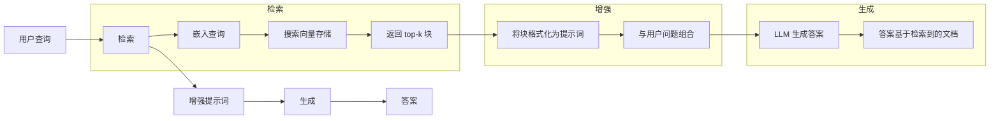
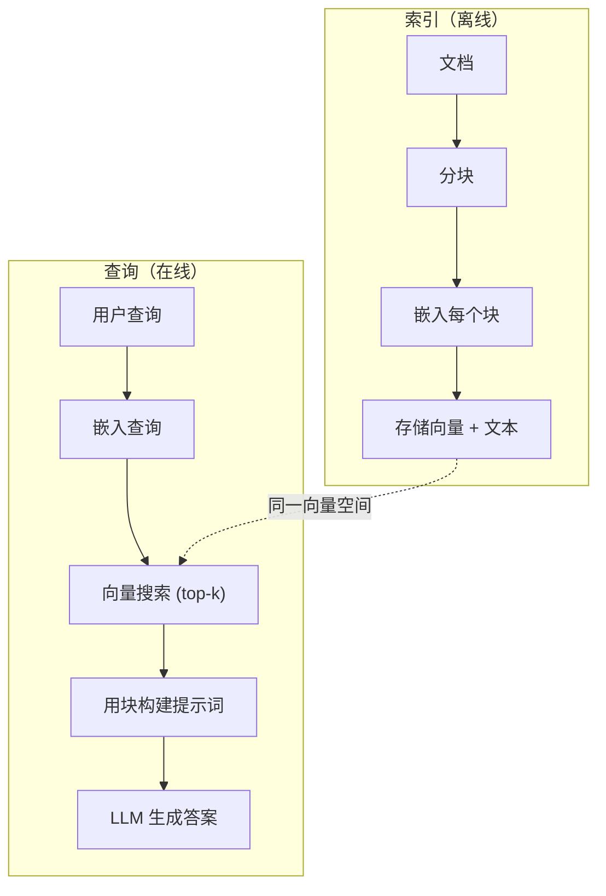

# RAG（检索增强生成）

> 你的 LLM 知道训练截止日期前的一切。但它对你的公司文档、代码库或上周会议记录一无所知。RAG 通过检索相关文档并将其填入提示词来解决这个问题。它是生产级 AI 中部署最广泛的模式。如果你从这个课程中只构建一样东西，那就构建一个 RAG 管道。

**类型：** 构建
**语言：** Python
**先修要求：** Phase 10（从零实现 LLM），Phase 11 Lesson 01-05
**时间：** 约 90 分钟
**相关：** Phase 5 · 23（RAG 分块策略）了解六种分块算法及其适用场景。Phase 5 · 22（嵌入模型深度解析）了解如何选择嵌入器。Phase 11 · 07（高级 RAG）了解混合搜索、重排序和查询转换。

## 学习目标

- 构建完整的 RAG 管道：文档加载、分块、嵌入、向量存储、检索和生成
- 使用向量数据库（ChromaDB、FAISS 或 Pinecone）实现语义搜索并进行正确的索引
- 解释为什么 RAG 优于微调用于知识密集型应用（成本、时效性、可归因性）
- 使用检索指标（精确率、召回率）和生成指标（忠实度、相关性）评估 RAG 质量

## 问题

你为你的公司构建了一个聊天机器人。客户问「企业版套餐的退款政策是什么？」LLM 回复了一个关于典型 SaaS 退款政策的通用答案。实际政策被埋在 200 页的内部维基中，规定企业客户有 60 天窗口期并可按比例退款。LLM 从未见过这份文档。它无法知道未经训练的知识。

微调是一个解决方案。取 LLM，用内部文档训练它，然后部署更新后的模型。这可行但有严重问题。微调需要数千美元的计算成本。模型在文档变更的那一刻就过时了。你无法知道模型从哪个来源获取信息。如果公司下个月收购了另一个产品线，你又得重新微调。

RAG 是另一个解决方案。保持模型不变。当问题出现时，在文档存储中搜索相关段落，将它们粘贴到提示词中的问题之前，让模型使用这些段落作为上下文来回答。文档存储可以在几分钟内更新。你可以准确看到哪些文档被检索。模型本身从不改变。这就是 RAG 在生产中占主导地位的原因：它更便宜、更新鲜、更可审计，并且适用于任何 LLM。

## 概念

### RAG 模式

整个模式归纳为四个步骤：



查询 -> 检索 -> 增强提示词 -> 生成。每个 RAG 系统都遵循此模式。生产级 RAG 系统之间的差异在于每个步骤的细节：如何分块、如何嵌入、如何搜索以及如何构造提示词。

### 为什么 RAG 优于微调

| 关注点 | 微调 | RAG |
|---------|------------|-----|
| 成本 | 每次训练运行 $1,000-$100,000+ | 每次查询 $0.01-$0.10（嵌入 + LLM） |
| 时效性 | 直到重新训练都会过时 | 通过重新索引文档在几分钟内更新 |
| 可审计性 | 无法追踪答案到来源 | 可以显示确切检索到的段落 |
| 幻觉 | 仍然自由产生幻觉 | 基于检索到的文档 |
| 数据隐私 | 训练数据固化到权重中 | 文档保留在你的向量存储中 |

微调永久改变模型的权重。RAG 临时改变模型的上下文。对于大多数应用，临时上下文正是你想要的。

微调获胜的唯一情况：当你需要模型采用特定的风格、语调或推理模式，仅通过提示词无法实现时。对于事实知识检索，RAG 每次都赢。

### 嵌入模型

嵌入模型将文本转换为稠密向量。相似文本在此高维空间中产生相近的向量。「How do I reset my password?」和「I need to change my password」产生几乎完全相同的向量，尽管共享的词汇很少。「The cat sat on the mat」产生完全不同的向量。

常见嵌入模型（2026 年阵容——完整分析见 Phase 5 · 22）：

| 模型 | 维度 | 提供商 | 说明 |
|-------|-----------|----------|-------|
| text-embedding-3-small | 1536 (Matryoshka) | OpenAI | 大多数用例的最佳性价比 |
| text-embedding-3-large | 3072 (Matryoshka) | OpenAI | 更高准确率，可截断到 256/512/1024 |
| Gemini Embedding 2 | 3072 (Matryoshka) | Google | MTEB 检索最高分；8K 上下文 |
| voyage-4 | 1024/2048 (Matryoshka) | Voyage AI | 领域变体（代码、金融、法律） |
| Cohere embed-v4 | 1024 (Matryoshka) | Cohere | 强大的多语言，128K 上下文 |
| BGE-M3 | 1024 (稠密 + 稀疏 + ColBERT) | BAAI（开源权重） | 一个模型三种视图 |
| Qwen3-Embedding | 4096 (Matryoshka) | 阿里（开源权重） | 开源权重最高检索分数 |
| all-MiniLM-L6-v2 | 384 | 开源权重（Sentence Transformers） | 原型基准 |

本课我们使用 TF-IDF 构建自己的简单嵌入。不是因为 TF-IDF 是生产系统使用的，而是因为它让概念具象化：文本输入，向量输出，相似文本产生相似向量。

### 向量相似度

给定两个向量，如何衡量相似度？三种选择：

**余弦相似度（Cosine similarity）**：两个向量之间夹角的余弦。范围从 -1（相反）到 1（完全相同）。忽略大小，只关心方向。这是 RAG 的默认选择。

```
cosine_sim(a, b) = dot(a, b) / (||a|| * ||b||)
```

**点积（Dot product）**：原始内积。更大的向量获得更高分数。当大小携带信息时有用（更长的文档可能更相关）。

```
dot(a, b) = sum(a_i * b_i)
```

**L2（欧氏）距离**：向量空间中的直线距离。更小距离 = 更相似。对大小差异敏感。

```
L2(a, b) = sqrt(sum((a_i - b_i)^2))
```

余弦相似度是标准选择。它优雅地处理不同长度的文档，因为它通过大小进行归一化。当有人说「向量搜索」时，他们几乎总是指余弦相似度。

### 分块策略

文档太长，无法作为单个向量嵌入。一份 50 页的 PDF 可能产生很差的嵌入，因为它包含几十个主题。相反，你将文档分成块并分别嵌入每个块。

**固定大小分块**：每 N 个 token 分割。简单且可预测。512 token 块，50 token 重叠意味着块 1 是 token 0-511，块 2 是 token 462-973，依此类推。重叠确保你不会在不幸的边界处切断句子。

**语义分块**：在自然边界分割。段落、章节或 markdown 标题。每个块是连贯的意义单元。实现更复杂但产生更好的检索效果。

**递归分块**：尝试先在最大边界分割（章节标题）。如果一节仍然太大，在段落边界分割。如果一段仍然太大，在句子边界分割。这是 LangChain 的 RecursiveCharacterTextSplitter 方法，在实践中效果很好。

块大小比人们认为的更重要：

- 太小（64-128 tokens）：每个块缺乏上下文。「与上季度相比增长了 15%」在不知道「它」指什么的情况下毫无意义。
- 太大（2048+ tokens）：每个块涵盖多个主题，稀释了相关性。当你搜索收入数据时，得到一个 10% 关于收入、90% 关于员工人数的块。
- 最佳点（256-512 tokens）：足够的上下文使其自包含，足够聚焦使其相关。

大多数生产级 RAG 系统使用 256-512 token 块，50 token 重叠。Anthropic 的 RAG 指南推荐这个范围。

### 向量数据库

一旦有了嵌入，你需要某处来存储和搜索它们。选项：

| 数据库 | 类型 | 最适合 |
|----------|------|----------|
| FAISS | 库（进程内） | 原型开发，小到中型数据集 |
| Chroma | 轻量数据库 | 本地开发，小型部署 |
| Pinecone | 托管服务 | 无需运维的生产环境 |
| Weaviate | 开源数据库 | 自托管生产 |
| pgvector | Postgres 扩展 | 已在使用 Postgres |
| Qdrant | 开源数据库 | 高性能自托管 |

本课我们构建一个简单的内存向量存储。它将向量存储在列表中并进行暴力余弦相似度搜索。这等同于带 flat index 的 FAISS。它可以扩展到约 100,000 个向量，之后会变慢。生产系统使用近似最近邻（Approximate Nearest Neighbor，ANN）算法如 HNSW，在毫秒内搜索数百万向量。

### 完整管道



索引阶段每个文档运行一次（或当文档更新时）。查询阶段在每个用户请求时运行。在生产中，索引可能处理数百万文档，耗时数小时。查询必须在不到一秒内响应。

### 实际数字

大多数生产级 RAG 系统使用以下参数：

- **k = 5 到 10** 个每次查询检索的块
- **块大小 = 256 到 512 tokens**，50 token 重叠
- **上下文预算**：每次查询 2,500-5,000 tokens 的检索内容
- **总提示词**：约 8,000-16,000 tokens（系统提示词 + 检索块 + 对话历史 + 用户查询）
- **嵌入维度**：384-3072，取决于模型
- **索引吞吐量**：使用 API 嵌入每秒 100-1,000 个文档
- **查询延迟**：检索 50-200ms，生成 500-3000ms

## 构建

### 步骤 1：文档分块

```python
def chunk_text(text, chunk_size=200, overlap=50):
    words = text.split()
    chunks = []
    start = 0
    while start < len(words):
        end = start + chunk_size
        chunk = " ".join(words[start:end])
        chunks.append(chunk)
        start += chunk_size - overlap
    return chunks
```

### 步骤 2：TF-IDF 嵌入

我们构建一个简单的嵌入函数。TF-IDF（词频-逆文档频率，Term Frequency-Inverse Document Frequency）不是神经嵌入，但它以捕捉词重要性的方式将文本转换为向量。文档中频繁出现的词获得更高的 TF。在整个语料库中稀有的词获得更高的 IDF。乘积给出一个向量，其中重要、独特的词具有高值。

```python
import math
from collections import Counter

def build_vocabulary(documents):
    vocab = set()
    for doc in documents:
        vocab.update(doc.lower().split())
    return sorted(vocab)

def compute_tf(text, vocab):
    words = text.lower().split()
    count = Counter(words)
    total = len(words)
    return [count.get(word, 0) / total for word in vocab]

def compute_idf(documents, vocab):
    n = len(documents)
    idf = []
    for word in vocab:
        doc_count = sum(1 for doc in documents if word in doc.lower().split())
        idf.append(math.log((n + 1) / (doc_count + 1)) + 1)
    return idf

def tfidf_embed(text, vocab, idf):
    tf = compute_tf(text, vocab)
    return [t * i for t, i in zip(tf, idf)]
```

### 步骤 3：余弦相似度搜索

```python
def cosine_similarity(a, b):
    dot = sum(x * y for x, y in zip(a, b))
    norm_a = math.sqrt(sum(x * x for x in a))
    norm_b = math.sqrt(sum(x * x for x in b))
    if norm_a == 0 or norm_b == 0:
        return 0.0
    return dot / (norm_a * norm_b)

def search(query_embedding, stored_embeddings, top_k=5):
    scores = []
    for i, emb in enumerate(stored_embeddings):
        sim = cosine_similarity(query_embedding, emb)
        scores.append((i, sim))
    scores.sort(key=lambda x: x[1], reverse=True)
    return scores[:top_k]
```

### 步骤 4：提示词构造

这是 RAG 中「增强」（Augmented）发生的环节。取检索到的块，将它们格式化为提示词，并要求 LLM 基于提供的上下文回答。

```python
def build_rag_prompt(query, retrieved_chunks):
    context = "\n\n---\n\n".join(
        f"[来源 {i+1}]\n{chunk}"
        for i, chunk in enumerate(retrieved_chunks)
    )
    return f"""仅基于以下上下文回答问题。
如果上下文不包含足够的信息，请说"我没有足够的信息来回答这个问题。"

上下文:
{context}

问题: {query}

答案:"""
```

### 步骤 5：完整 RAG 管道

```python
class RAGPipeline:
    def __init__(self):
        self.chunks = []
        self.embeddings = []
        self.vocab = []
        self.idf = []

    def index(self, documents):
        all_chunks = []
        for doc in documents:
            all_chunks.extend(chunk_text(doc))
        self.chunks = all_chunks
        self.vocab = build_vocabulary(all_chunks)
        self.idf = compute_idf(all_chunks, self.vocab)
        self.embeddings = [
            tfidf_embed(chunk, self.vocab, self.idf)
            for chunk in all_chunks
        ]

    def query(self, question, top_k=5):
        query_emb = tfidf_embed(question, self.vocab, self.idf)
        results = search(query_emb, self.embeddings, top_k)
        retrieved = [(self.chunks[i], score) for i, score in results]
        prompt = build_rag_prompt(
            question, [chunk for chunk, _ in retrieved]
        )
        return prompt, retrieved
```

### 步骤 6：生成（模拟）

在生产中，这是你调用 LLM API 的地方。本课我们通过从检索上下文中提取最相关的句子来模拟生成。

```python
def simple_generate(prompt, retrieved_chunks):
    query_words = set(prompt.lower().split("question:")[-1].split())
    best_sentence = ""
    best_score = 0
    for chunk in retrieved_chunks:
        for sentence in chunk.split("."):
            sentence = sentence.strip()
            if not sentence:
                continue
            words = set(sentence.lower().split())
            overlap = len(query_words & words)
            if overlap > best_score:
                best_score = overlap
                best_sentence = sentence
    return best_sentence if best_sentence else "我没有足够的信息。"
```

## 实际使用

使用真实的嵌入模型和 LLM，代码几乎不变：

```python
from openai import OpenAI

client = OpenAI()

def embed(text):
    response = client.embeddings.create(
        model="text-embedding-3-small",
        input=text
    )
    return response.data[0].embedding

def generate(prompt):
    response = client.chat.completions.create(
        model="gpt-4o-mini",
        messages=[{"role": "user", "content": prompt}],
        temperature=0
    )
    return response.choices[0].message.content
```

或使用 Anthropic：

```python
import anthropic

client = anthropic.Anthropic()

def generate(prompt):
    response = client.messages.create(
        model="claude-sonnet-4-20250514",
        max_tokens=1024,
        messages=[{"role": "user", "content": prompt}]
    )
    return response.content[0].text
```

管道是相同的。替换嵌入函数。替换生成函数。检索逻辑、分块、提示词构造——无论使用哪种模型都完全相同。

对于大规模向量存储，用适当的向量数据库替换暴力搜索：

```python
import chromadb

client = chromadb.Client()
collection = client.create_collection("my_docs")

collection.add(
    documents=chunks,
    ids=[f"chunk_{i}" for i in range(len(chunks))]
)

results = collection.query(
    query_texts=["退款政策是什么？"],
    n_results=5
)
```

Chroma 内部处理嵌入（默认使用 all-MiniLM-L6-v2）并将向量存储在本地数据库中。同样的模式，不同的底层实现。

## 交付

本课产出：
- `outputs/prompt-rag-architect.md`——为特定用例设计 RAG 系统的提示词
- `outputs/skill-rag-pipeline.md`——教 agent 如何构建和调试 RAG 管道的技能

## 练习

1. 将 TF-IDF 嵌入替换为简单的词袋方法（二值：词存在为 1，不存在为 0）。在示例文档上比较检索质量。TF-IDF 应该表现更好，因为它赋予稀有词更高权重。

2. 在相同文档集上实验块大小：尝试 50、100、200 和 500 词。对于每种大小，运行相同的 5 个查询，计算 top-3 中返回相关块的比例。找到检索质量达到峰值的甜点。

3. 为每个块添加元数据（来源文档名称、块位置）。修改提示词模板以包含来源归因，使 LLM 能够引用其来源。

4. 实现简单的评估：给定 10 个问答对，通过 RAG 管道运行每个问题，衡量检索到的块中包含答案的百分比。这是 k 处的检索召回率。

5. 构建一个对话感知的 RAG 管道：维护最近 3 次交换的历史，并将其与检索到的块一起包含在提示词中。在询问定价后测试后续问题，如「企业版呢？」

## 关键术语

| 术语 | 人们怎么说 | 实际含义 |
|------|----------------|----------------------|
| RAG | 「能读取你文档的 AI」 | 检索相关文档，粘贴到提示词中，并生成基于这些文档的答案 |
| 嵌入 | 「将文本转换为数字」 | 文本的稠密向量表示，相似含义产生相似向量 |
| 向量数据库 | 「AI 的搜索引擎」 | 优化用于存储向量并按相似度查找最近邻的数据存储 |
| 分块 | 「将文档分成片段」 | 将文档分成更小的片段（通常 256-512 tokens），使每个片段可以独立嵌入和检索 |
| 余弦相似度 | 「两个向量有多相似」 | 两个向量之间夹角的余弦；1 = 相同方向，0 = 正交，-1 = 相反 |
| Top-k 检索 | 「获取 k 个最佳匹配」 | 从向量存储中返回与查询最相似的 k 个块 |
| 上下文窗口 | 「LLM 能看到多少文本」 | LLM 在单次请求中可以处理的最大 token 数；检索到的块必须适合这个窗口 |
| 增强生成 | 「使用给定上下文回答」 | 使用检索到的文档作为上下文生成响应，而非仅依赖训练知识 |
| TF-IDF | 「词重要性评分」 | 词频乘逆文档频率；按词在语料库中的独特性加权 |
| 索引 | 「准备文档以供搜索」 | 离线过程：分块、嵌入和存储文档，使其可以在查询时被搜索 |

## 扩展阅读

- Lewis 等, "Retrieval-Augmented Generation for Knowledge-Intensive NLP Tasks" (2020) -- 来自 Facebook AI Research 的原始 RAG 论文，形式化了检索-然后-生成的模式
- Anthropic 的 RAG 文档 (docs.anthropic.com) -- 关于块大小、提示词构造和评估的实用指南
- Pinecone 学习中心, "What is RAG?" -- 关于 RAG 管道的清晰可视化解释，包含生产考量
- Sentence-BERT: Reimers & Gurevych (2019) -- all-MiniLM 嵌入模型背后的论文，展示如何训练双编码器用于语义相似度
- [Karpukhin 等, "Dense Passage Retrieval for Open-Domain Question Answering" (EMNLP 2020)](https://arxiv.org/abs/2004.04906) -- DPR 论文，证明稠密双编码器检索在开放域问答上优于 BM25，并设定了现代 RAG 检索器的模式。
- [LangChain RAG 教程](https://python.langchain.com/docs/tutorials/rag/) -- 相反风格的编排器；从可运行链的角度看相同的检索-然后-生成模式。