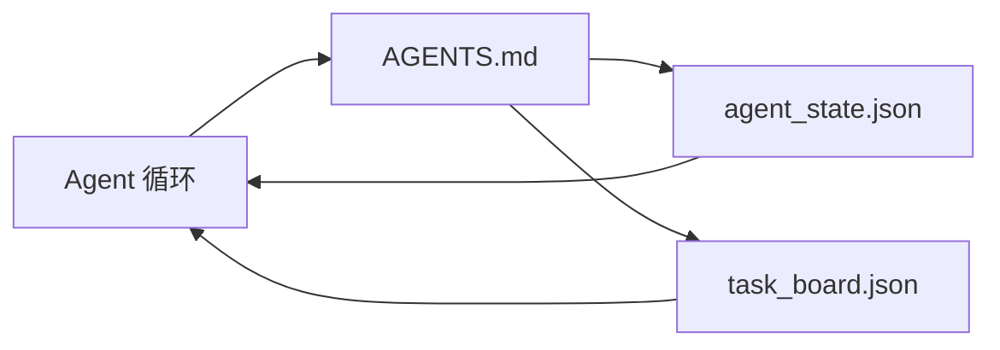

# 最小化代理工作台

> 最小的有用工作台是三个文件：一个根指令路由器（Root Instructions Router）、一个状态文件（State File）和一个任务看板（Task Board）。其他一切都是在此之上分层构建的。如果一个仓库无法承载这三个文件，任何模型都救不了它。

**类型：** 构建
**语言：** Python（标准库）
**前置条件：** Phase 14 · 31（为什么有能力的模型仍然失败）
**时间：** ~45 分钟

## 学习目标

- 定义构成最小可行工作台的三个文件。
- 解释为什么短根路由器胜过长的单一 `AGENTS.md`。
- 构建一个代理每轮都可以读取并在结束时写入的状态文件。
- 构建一个在没有聊天历史的情况下能经受多会话工作的任务看板。

## 问题

大多数团队通过编写一个 3000 行的 `AGENTS.md` 并称之为完成来伸手拿工作台。模型加载它，忽略无法总结的部分，仍然在它一直失败的相同表面上失败。

你需要相反的做法。一个小的根文件，只在相关时将代理路由到更深层文件。持久的代理在行动前读取、行动后写入的状态。一个任务看板，说明什么在进行中、什么被阻塞、什么在下一个。

三个文件。每个都有一份工作。每个都足够机器可读，以便以后演变为真实系统。

## 概念



### AGENTS.md 是路由器，不是手册

一个好的 `AGENTS.md` 是短的。它将代理指向：

- 状态文件（你在哪里）。
- 任务看板（还有什么没做完）。
- 更深层的规则（在 `docs/agent-rules.md` 下）。
- 验证命令（如何知道它能正常工作）。

任何更长的内容放在更深层的文档中，仅在需要时加载。长手册被忽略。短路由器被遵循。

### agent_state.json 是记录系统

状态携带：活跃任务 ID、触碰的文件、做出的假设、阻塞项和下一个操作。代理每轮都读取它。下一个会话读取它而不是重放聊天。

状态存在于文件中，因为聊天历史不可靠。会话死亡。对话被裁剪。文件不会。

### task_board.json 是队列

任务看板携带每个任务，状态为 `todo | in_progress | done | blocked`。它是代理在状态为空时从中拉取的队列，也是你想知道代理是否在正轨上时读取的队列。

看板上的任务有一个 ID、一个目标、一个所有者（`builder`、`reviewer` 或 `human`）以及验收标准。看板有意保持小规模：当它增长超过一屏时，你有一个规划问题，而不是看板问题。

### 三个文件是地板，不是天花板

后续课程添加范围契约、反馈运行器、验证门控、审查者检查清单和交接包。这里的三个文件是所有一切的基础假设。

## 构建

`code/main.py` 将最小工作台写入一个空仓库，并演示一个单代理轮次：

1. 读取 `agent_state.json`。
2. 如果状态为空，从 `task_board.json` 拉取下一个任务。
3. 在范围内触碰单个文件。
4. 写回更新后的状态。

运行方式：

```
python3 code/main.py
```

脚本在自己的旁边创建 `workdir/`，放下三个文件，运行一个轮次，并打印差异。重新运行它，看看第二个轮次如何从第一个停止的地方接续。

## 使用场景

在生产代理产品内部，同样的三个文件以不同的名字出现：

- **Claude Code：** `AGENTS.md` 或 `CLAUDE.md` 用于路由器，`.claude/state.json` 风格存储用于状态，钩子用于看板。
- **Codex / Cursor：** 工作区规则用于路由器，会话记忆用于状态，聊天侧边栏中的排队任务用于看板。
- **自定义 Python 代理：** 你刚写的那些文件。

名称在变。形状不变。

## 现实世界中的生产模式

当与实际单仓接触时，最小工作台在三种模式的分层下存活下来。它们是独立的；选择你的仓库实际需要的。

**带最近优先优先级的嵌套 `AGENTS.md`。** OpenAI 在其主仓库中发布了 88 个 `AGENTS.md` 文件，每个子组件一个。Codex、Cursor、Claude Code 和 Copilot 都从工作文件向仓库根目录遍历，连接沿途找到的每个 `AGENTS.md`。子目录文件扩展根文件。Codex 添加 `AGENTS.override.md` 来替换而非扩展；覆盖机制是 Codex 特定的，跨工具工作时避免使用。Augment Code 的测量是关键指标：最好的 `AGENTS.md` 文件给予相当于从 Haiku 升级到 Opus 的质量提升；最差的文件使输出比完全没有文件更糟。

**应拒绝的反模式，即使它们看起来像覆盖。** 冲突的指令会悄悄将代理从交互模式降级到贪婪模式（ICLR 2026 AMBIG-SWE：48.8% → 28% 解决率）；按数字优先级排序而非扁平堆叠。无可执行命令的不可验证风格规则（"遵循 Google Python Style Guide"）让代理自行创造合规性；将每个风格规则与精确的 lint 命令配对。以风格而非命令开头会掩盖验证路径；命令优先，风格最后。为人类而非代理写作浪费上下文预算；简洁是一种特性。

**跨工具符号链接。** 一个带有符号链接的根文件（`ln -s AGENTS.md CLAUDE.md`，`ln -s AGENTS.md .github/copilot-instructions.md`，`ln -s AGENTS.md .cursorrules`）让每个编码代理保持在同一个真相源上。Nx 的 `nx ai-setup` 从单个配置自动化这一点，跨 Claude Code、Cursor、Copilot、Gemini、Codex 和 OpenCode。

## 部署

`outputs/skill-minimal-workbench.md` 为任何新仓库生成三文件工作台：一个针对项目调优的 `AGENTS.md` 路由器，一个带正确字段的 `agent_state.json`，以及一个用当前待办项填充的 `task_board.json`。

## 练习

1. 为 `agent_state.json` 添加 `last_run` 时间戳。如果文件超过 24 小时未更新且操作员未确认，则拒绝运行。
2. 为任务看板添加 `priority` 字段，并更改拉取器始终选择最高优先级的 `todo`。
3. 将 `task_board.json` 迁移到 JSON Lines，使每个任务为一行，在版本控制中差异干净。
4. 编写一个 `lint_workbench.py`，如果 `AGENTS.md` 超过 80 行或引用不存在的文件则失败。
5. 决定丢失哪个文件会最痛苦。辩护你的选择。

## 关键术语

| 术语 | 人们常说的 | 实际含义 |
|------|-----------|---------|
| 路由器（Router） | `AGENTS.md` | 将代理指向更深层文档和文件的短根文件 |
| 状态文件（State File） | "笔记" | 记录代理位置的机器可读文件，每轮写入 |
| 任务看板（Task Board） | "待办列表" | 带有状态、所有者、验收的 JSON 工作队列 |
| 记录系统（System of Record） | "真相源" | 聊天消失时工作台视为权威的文件 |

## 进一步阅读

- [agents.md — 开放规范](https://agents.md/) — 被 Cursor、Codex、Claude Code、Copilot、Gemini、OpenCode 采用
- [Augment Code，A good AGENTS.md is a model upgrade. A bad one is worse than no docs at all](https://www.augmentcode.com/blog/how-to-write-good-agents-dot-md-files) — 测量到的质量跳跃
- [Blake Crosley，AGENTS.md Patterns: What Actually Changes Agent Behavior](https://blakecrosley.com/blog/agents-md-patterns) — 经验上什么有效，什么无效
- [Datadog Frontend，Steering AI Agents in Monorepos with AGENTS.md](https://dev.to/datadog-frontend-dev/steering-ai-agents-in-monorepos-with-agentsmd-13g0) — 实践中的嵌套优先级
- [Nx Blog，Teach Your AI Agent How to Work in a Monorepo](https://nx.dev/blog/nx-ai-agent-skills) — 跨六个工具的单源生成
- [The Prompt Shelf，AGENTS.md Best Practices: Structure, Scope, and Real Examples](https://thepromptshelf.dev/blog/agents-md-best-practices/) — 在审核中存活的章节排序
- [Anthropic，Claude Code subagents and session store](https://docs.anthropic.com/en/docs/agents-and-tools/claude-code/sub-agents)
- Phase 14 · 31 — 此最小结构吸收的失败模式
- Phase 14 · 34 — 本课预览的持久状态 Schema

---

## 相关知识

- [[14-agent-engineering/31_agent-workbench-why-models-fail]]
