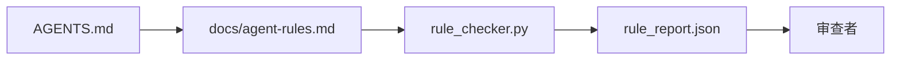

# 代理指令作为可执行约束

> 以散文形式编写的指令是愿望。以约束形式编写的指令是测试。工作台（Workbench）将每条规则转化为代理可以在运行时检查的内容，以及审查者可以在事后验证的内容。

**类型：** 构建
**语言：** Python（标准库）
**前置条件：** Phase 14 · 32（最小工作台）
**时间：** ~50 分钟

## 学习目标

- 将路由散文与操作规则分离。
- 将启动规则、禁止操作、完成的定义、不确定性处理和审批边界表达为机器可检查的约束。
- 实现一个规则检查器（Rule Checker），对运行过程按规则集打分。
- 使规则集便于差异比较（diff-friendly），让审查能看到变化。

## 问题

一个典型的 `AGENTS.md` 读起来像入职文档。它告诉代理"小心行事""充分测试""不确定就问"。三天后，代理交付了一个没有测试的变更，写入了一个禁止的目录，并且从未询问因为它从未知道界限在哪里。

指令在操作化时很有力，在理想化时很弱。修复方法是写工作台可以解释且审查者可以评分的规则。

## 概念

规则放在 `docs/agent-rules.md` 中，远离简短的根路由器。每条规则有一个名称、一个类别和一个检查。



### 覆盖大多数规则的五种类别

| 类别 | 规则回答的问题 | 示例 |
|------|--------------|------|
| 启动（Startup） | 开始工作前必须满足什么？ | "状态文件存在且最新" |
| 禁止（Forbidden） | 什么绝对不能发生？ | "不要编辑 `scripts/release.sh`" |
| 完成的定义（Definition of Done） | 什么证明了任务完成？ | "pytest 退出 0 且验收行通过" |
| 不确定性（Uncertainty） | 代理不确定时做什么？ | "打开一个问题记录而不是猜测" |
| 审批（Approval） | 什么需要人类审批？ | "任何新依赖，任何生产写入" |

不适合这五个之一的规则通常想成为两条规则。强制拆分。

### 规则是机器可读的

每条规则有一个 slug、一个类别、一行描述和一个 `check` 字段，引用 `rule_checker.py` 中的一个函数。添加规则意味着添加一个检查；检查器随工作台一起增长。

### 规则便于差异比较

规则在单个 markdown 文件中按每条一个标题排列。重命名在差异中可见。新规则放在其类别顶部。过时规则被删除而不是注释掉，因为工作台是真相源（Source of Truth），而不是团队上个季度感受的聊天记录。

### 规则 vs 框架护栏

框架护栏（OpenAI Agents SDK 护栏、LangGraph 中断）在运行时层面执行规则。本课中的规则集是那些护栏实现的人类可读的、可审查的契约。你两者都需要：运行时在回合期间捕获违规，规则集证明运行时在做正确的事。

## 构建

`code/main.py` 提供：

- `agent-rules.md` 解析器，将规则加载到数据类。
- `rule_checker.py` 风格的检查函数，每个 `check` 引用一个。
- 一个违反两条规则的演示代理运行，以及一个捕获它们的检查通过。

运行方式：

```
python3 code/main.py
```

输出：解析后的规则集、运行追踪、每条规则的通过/失败，以及脚本旁边保存的 `rule_report.json`。

## 现实世界中的生产模式

三种模式区分了一个能持久的规则集和一个一周内腐烂的规则集。

**写入时的严重性标记。** 每条规则带有 `severity`：`block`、`warn` 或 `info`。检查器报告全部三种；运行时仅在 `block` 时拒绝。大多数团队早期高估严重性，然后在最后期限压力下悄悄弱化它；写入时标记强制前期的校准。配合验证门控（Phase 14 · 38），它将任何 `block` 规则的覆盖签名到 `overrides.jsonl` 审计日志中。

**规则过期作为强制函数。** 每条规则带有一个 `expires_at` 日期（默认从撰写起 90 天）。当未过期规则连续 60 天零违规时，检查器发出警告；下次季度审查要么证明保留它，弱化到 `info`，要么删除它。Cloudflare 的生产 AI 代码审查数据（2026 年 4 月，30 天内 5,169 个仓库的 131,246 次审查运行）显示，带有显式过期的规则集每个仓库保持在 30 条规则以下；没有过期的增长到 80+ 条，大多数从未触发。

**Markdown 作为源，JSON 作为缓存。** `agent-rules.md` 是编写的文件；`agent-rules.lock.json` 是检查器在热路径中读取的缓存。锁由 pre-commit 钩子重新生成。Markdown 差异可审查；JSON 解析不出现在每一轮。与 `package.json` / `package-lock.json` 和 `Cargo.toml` / `Cargo.lock` 形状相同。

## 使用场景

在生产中：

- Claude Code、Codex、Cursor 在会话开始时读取规则，并在拒绝操作时引用它们。检查器在 CI 中重新运行它们以捕获静默偏移。
- OpenAI Agents SDK 护栏将相同的检查注册为输入和输出护栏。Markdown 是文档表面；SDK 是运行时表面。
- LangGraph 中断在飞行中节点违反规则时触发。中断处理程序读取规则，询问人类，然后恢复。

规则集可跨三者移植，因为它只是 markdown 加函数名。

## 部署

`outputs/skill-rule-set-builder.md` 采访项目所有者，将其现有的散文指令分类到五个类别中，并发出一个带版本的 `agent-rules.md` 和一个检查器桩。

## 练习

1. 如果你的产品真正需要第六个类别，添加一个。辩护为什么它不能归入五个之一。
2. 扩展检查器，使规则可以携带严重性（`block`、`warn`、`info`），报告相应聚合。
3. 将检查器接入 CI：如果最新代理运行上 block 严重性规则失败，使构建失败。
4. 为每条规则添加一个"过期"字段。90 天后无检查失败，规则需要审查。
5. 找一个真实的 `AGENTS.md` 并以五类规则重写。其行中有多少是操作性的？多少是理想性的？

## 关键术语

| 术语 | 人们常说的 | 实际含义 |
|------|-----------|---------|
| 操作规则（Operational Rule） | "一个真正的指令" | 工作台可以在运行时检查的规则 |
| 理想规则（Aspirational Rule） | "小心行事" | 没有检查的规则；要么删除要么升级 |
| 完成的定义（Definition of Done） | "验收" | 任务完成的客观的、文件支持的证明 |
| Block 严重性 | "硬规则" | 违规停止运行；无操作员不可静默 |
| 规则过期（Rule Expiry） | "过时规则清理" | N 天内无失败的规则需要退役 |

## 进一步阅读

- [OpenAI Agents SDK 护栏](https://platform.openai.com/docs/guides/agents-sdk/guardrails)
- [LangGraph 中断](https://langchain-ai.github.io/langgraph/how-tos/human_in_the_loop/breakpoints/)
- [Anthropic，构建有效代理](https://www.anthropic.com/research/building-effective-agents)
- [Rick Hightower，Agent RuleZ：一个确定性策略引擎](https://medium.com/@richardhightower/agent-rulez-a-deterministic-policy-engine-for-ai-coding-agents-9489e0561edf) — 生产中的 block/warn/info 严重性
- [Cloudflare，大规模编排 AI 代码审查](https://blog.cloudflare.com/ai-code-review/) — 131k 次审查运行，规则组合经验
- [microservices.io，GenAI 开发平台——第 1 部分：护栏](https://microservices.io/post/architecture/2026/03/09/genai-development-platform-part-1-development-guardrails.html) — 规则与 CI 之间的纵深防御
- [类型检查合规性：确定性护栏（arXiv 2604.01483）](https://arxiv.org/pdf/2604.01483) — Lean 4 作为规则即检查的上限
- [logi-cmd/agent-guardrails](https://github.com/logi-cmd/agent-guardrails) — 合并门控实现：范围、变异测试、违规预算
- Phase 14 · 32 — 此规则集插入的最小工作台
- Phase 14 · 38 — 消费规则报告的验证门控
- Phase 14 · 39 — 评分规则合规性的审查者代理

---

## 相关知识

- [[14-agent-engineering/32_minimal-agent-workbench]]
