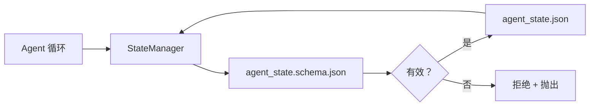

# 仓库记忆与持久状态

> 聊天历史是易失的。仓库是持久的。工作台（Workbench）将代理状态存储在版本化的文件中，以便下一个会话、下一个代理和下一个审查者都从同一个真相源读取。

**类型：** 构建
**语言：** Python（标准库 + `jsonschema` 可选）
**前置条件：** Phase 14 · 32（最小工作台）
**时间：** ~60 分钟

## 学习目标

- 定义什么属于仓库记忆（Repo Memory）以及什么属于聊天历史。
- 为 `agent_state.json` 和 `task_board.json` 编写 JSON Schema。
- 构建一个状态管理器（State Manager），以原子方式加载、验证、变更和持久化状态。
- 使用 Schema 在数据损坏工作台之前拒绝错误的写入。

## 问题

代理完成一个会话。聊天关闭。下一个会话打开并询问从哪里开始。模型说"让我检查文件"，读取过时的笔记，并重新完成已经完成的工作。或者更糟，它重写了已完成的文件，因为没有人告诉它文件已完成。

工作台的修复是仓库记忆：状态以 JSON 文件形式存在于仓库中，按 Schema 编写，以原子方式持久化，在代码审查中便于差异比较。聊天是瞬时供给；仓库是记录系统（System of Record）。

## 概念



### 什么属于仓库记忆

| 属于 | 不属于 |
|------|--------|
| 活跃任务 ID | 原始聊天记录 |
| 本会话触碰的文件 | Token 级推理追踪 |
| 代理做出的假设 | "用户似乎很沮丧" |
| 未解决的阻塞项 | 采样的补全结果 |
| 下一个操作 | 供应商特定的模型 ID |

测试是持久性：三个月后在 CI 重跑中这会有用吗？如果有用，仓库。如果没用，遥测。

### Schema 优先的状态

JSON Schema 是契约。没有它，每个代理发明新字段，每个审查者学习新形状，每个 CI 脚本都必须特殊处理过去的版本。有了它，错误的写入就是被拒绝的写入。

Schema 覆盖：

- 必需的键。
- 允许的 `status` 值。
- 禁止的值（例如数组的 `null`）。
- 模式约束（任务 ID 匹配 `T-\d{3,}`）。
- 用于迁移的版本字段。

### 原子写入

状态写入需要承受部分失败：写入临时文件，fsync，重命名覆盖目标。状态文件是真相源；半写入的文件比没有文件更糟。

### 迁移

当 Schema 更改时，在 Schema 版本升级旁边发布迁移脚本。状态文件携带 `schema_version` 字段；管理器拒绝加载无法迁移的文件版本。

## 构建

`code/main.py` 实现：

- `agent_state.schema.json` 和 `task_board.schema.json`。
- 一个纯标准库验证器（JSON Schema 的子集：required、type、enum、pattern、items）。
- `StateManager.load`、`StateManager.update`、`StateManager.commit`，使用原子临时文件重命名写入。
- 一个演示，变更状态、持久化、重新加载并证明往返正确。

运行方式：

```
python3 code/main.py
```

脚本写入 `workdir/agent_state.json` 和 `workdir/task_board.json`，在两次回合中变更它们，并在每一步打印验证后的状态。

## 现实世界中的生产模式

四种模式将本课的最小实现转变为多代理单仓可以承受的东西。

**原子临时文件重命名不是可选的。** 2026 年 3 月的一个 Hive 项目 Bug 报告清晰地记录了失败模式：`state.json` 通过 `write_text()` 写入，异常被捕获并静默。部分写入导致会话在损坏的状态上无信号恢复。修复始终是：`tempfile.mkstemp` 在目标同一目录下，写入，`fsync`，`os.replace`（POSIX 和 Windows 上的原子重命名）。本课的 `atomic_write` 正是这样做的。

**在每个非幂等工具调用上使用幂等键（Idempotency Key）。** 如果代理在调用工具后但在检查点之前崩溃，恢复会重试工具调用。对于读取安全；对于邮件、数据库插入、文件上传危险。模式：在执行前将每个工具调用 ID 记录到 `pending_calls.jsonl`。重试时检查 ID；如果存在，跳过调用并使用缓存的结果。Anthropic 和 LangChain 在 2026 年指南中都提到了这一点；LangGraph 的检查点器出于同样原因持久化待处理写入。

**将大型产物与状态分离。** 不要在 `agent_state.json` 中存储 CSV、长记录或生成的文件。将产物保存为单独文件（或上传到对象存储），仅在状态中保留路径。检查点保持小且快；产物独立增长。

**事件溯源（Event Sourcing）用于审计，快照用于恢复。** 在每次变更时将事件追加到事件日志（`state.events.jsonl`）；定期快照到 `state.json`。恢复读取快照，然后重放快照时间戳之后的任何事件。这消耗更多磁盘但允许你逐字重放代理决策——在调试长周期运行时至关重要。与 Postgres 内部 WAL 使用的形状相同。

**Schema 迁移或拒绝加载。** `schema_version` 整数是契约。当管理器加载未知版本的文件时，拒绝读取。在 Schema 升级旁边发布迁移脚本；`tools/migrate_state.py` 在每次启动时幂等运行。

## 使用场景

在生产中：

- **LangGraph 检查点器。** 相同的思想，不同的存储。检查点器将图状态持久化到 SQLite、Postgres 或自定义后端。本课教授的 Schema 是当检查点器挂掉且你需要手动读取状态时使用的。
- **Letta 记忆块。** 带结构化 Schema 的持久块（Phase 14 · 08）。相同的学科，范围限定于长时间运行的角色。
- **OpenAI Agents SDK 会话存储。** 可插拔后端，Schema 感知。本课的状态文件是本地文件后端。

## 部署

`outputs/skill-state-schema.md` 生成项目特定的 JSON Schema 对（状态 + 看板），一个连接到原子写入的 Python `StateManager`，以及一个迁移脚手架，使下次 Schema 升级不会破坏工作台。

## 练习

1. 添加一个 `last_human_touch` 时间戳。在人类编辑后五秒内拒绝任何代理写入。
2. 扩展验证器以支持 `oneOf`，使任务可以是构建任务或审查任务，具有不同的必需字段。
3. 添加 `schema_version` 字段并编写从 v1 到 v2 的迁移（将 `blockers` 重命名为 `risks`）。
4. 将存储后端从本地文件迁移到 SQLite。保持 `StateManager` API 不变。
5. 在同一个状态文件上以 50 毫秒写入竞争运行两个代理。出现了什么错误，原子重命名如何拯救你？

## 关键术语

| 术语 | 人们常说的 | 实际含义 |
|------|-----------|---------|
| 仓库记忆（Repo Memory） | "笔记文件" | 在仓库中按 Schema 存储在追踪文件中的状态 |
| Schema 优先（Schema-First） | "验证输入" | 在写入前定义契约，拒绝偏移 |
| 原子写入（Atomic Write） | "只是重命名" | 写入临时文件、fsync、重命名，使部分失败不会损坏 |
| 迁移（Migration） | "Schema 升级" | 将 vN 状态转换为 v(N+1) 状态的脚本 |
| 记录系统（System of Record） | "真相源" | 工作台视为权威的产物 |

## 进一步阅读

- [JSON Schema 规范](https://json-schema.org/specification.html)
- [LangGraph 检查点器](https://langchain-ai.github.io/langgraph/concepts/persistence/)
- [Letta 记忆块](https://docs.letta.com/concepts/memory)
- [Fast.io，AI Agent 状态检查点：实用指南](https://fast.io/resources/ai-agent-state-checkpointing/) — Schema 优先检查点与幂等性
- [Fast.io，AI Agent 工作流状态持久化：2026 年最佳实践](https://fast.io/resources/ai-agent-workflow-state-persistence/) — 并发控制、TTL、事件溯源
- [Hive Issue #6263 — 非原子 state.json 写入被静默忽略](https://github.com/aden-hive/hive/issues/6263) — 真实项目中的失败模式
- [eunomia，Checkpoint/Restore 系统：进化、技术、应用](https://eunomia.dev/blog/2025/05/11/checkpointrestore-systems-evolution-techniques-and-applications-in-ai-agents/) — 从操作系统历史应用于代理的 CR 原语
- [Indium，2026 年长时间运行 AI Agent 的 7 种状态持久化策略](https://www.indium.tech/blog/7-state-persistence-strategies-ai-agents-2026/)
- [Microsoft Agent Framework，压缩](https://learn.microsoft.com/en-us/agent-framework/agents/conversations/compaction) — 供应商检查点管理器
- Phase 14 · 08 — 记忆块与休眠计算
- Phase 14 · 32 — 本课 Schema 化的三文件最小实现
- Phase 14 · 40 — 从同一 Schema 读取的交接包

---

## 相关知识

- [[14-agent-engineering/32_minimal-agent-workbench]]
