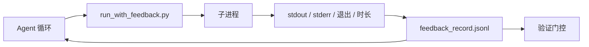

# 运行时反馈循环

> 看不到真实命令输出的代理会猜测。反馈运行器将 stdout、stderr、退出码和计时捕获到结构化的记录中，供下一轮读取。然后代理基于事实而非自己对事实的预测来做出反应。

**类型：** 构建
**语言：** Python（标准库）
**前置条件：** Phase 14 · 32（最小工作台），Phase 14 · 35（初始化脚本）
**时间：** ~50 分钟

## 学习目标

- 区分运行时反馈与可观测性遥测。
- 构建一个反馈运行器（Feedback Runner），包装 Shell 命令并持久化结构化记录。
- 确定性截断大输出，使循环保持在 Token 预算内。
- 在反馈缺失时拒绝推进循环。

## 问题

代理说"正在运行测试"。下一条消息说"所有测试通过"。现实是没有测试运行过。代理想象了输出，或者它运行了命令但从未读取结果，或者它读取了结果但静默截断了失败行。

反馈运行器消除了这一差距。每个命令都经过运行器。每条记录携带命令、捕获的 stdout 和 stderr、退出码、挂钟时长和一行代理注释。代理在下一轮读取记录。验证门控在任务结束时读取记录。

## 概念



### 反馈记录包含什么

| 字段 | 为什么重要 |
|------|-----------|
| `command` | 精确的 argv，无 shell 展开意外 |
| `stdout_tail` | 最后 N 行，确定性截断 |
| `stderr_tail` | 最后 N 行，与 stdout 分离 |
| `exit_code` | 明确的成功信号 |
| `duration_ms` | 揭示慢探测和失控进程 |
| `started_at` | 用于回放的时间戳 |
| `agent_note` | 代理写的关于它期望什么的一行 |

### 截断是确定性的

50 MB 的日志会摧毁循环。运行器用 `...截断了 N 行...` 标记截断头部和尾部，确定性使相同输出始终产生相同记录。不采样；代理需要看到的部分（最终错误、最终总结）在尾部。

### 反馈 vs 遥测

遥测（Phase 14 · 23，OTel GenAI 约定）是为人类操作员跨时间审查运行。反馈是为本运行的下一个回合。它们共享字段，但存在不同文件中，有不同的保留策略。

### 无反馈时拒绝推进

如果运行器在捕获退出前出错，记录携带 `exit_code: null` 和 `error: <原因>`。代理循环必须在 `null` 退出时拒绝声明成功。无退出，无进展。

## 构建

`code/main.py` 实现：

- `run_with_feedback(command, agent_note)` 包装 `subprocess.run`，捕获 stdout/stderr/exit/duration，确定性截断，追加到 `feedback_record.jsonl`。
- 一个小型加载器，将 JSONL 流式加载到 Python 列表。
- 一个运行三个命令（成功、失败、慢速）的演示，并打印每个命令的最后一条记录。

运行方式：

```
python3 code/main.py
```

输出：三条反馈记录追加到 `feedback_record.jsonl`，每条最后一条内联打印。跨重跑 tail 文件可以看到循环累积。

## 现实世界中的生产模式

三种模式硬化运行器使其足够可交付。

**在写入时脱敏，而非读取时。** 任何接触 stdout 或 stderr 的记录都可能泄露密钥。运行器在 JSONL 追加前执行脱敏处理：剥离匹配 `^Bearer `、`password=`、`api[_-]?key=`、`AKIA[0-9A-Z]{16}`（AWS）、`xox[baprs]-`（Slack）的行。读取时脱敏是一个陷阱；磁盘上的文件是攻击者触及的东西。每季度根据生产运行时观察到的密钥格式审计脱敏模式。

**轮换策略，而非单一文件。** 将 `feedback_record.jsonl` 限制为每个文件 1 MB；溢出时轮换到 `.1`、`.2`，丢弃 `.5`。代理循环只读取当前文件，因此运行时成本有界。CI 产物存储获取完整的轮换集。没有轮换，文件会变成每个加载器调用的瓶颈。

**用于重试链的父命令 ID。** 每条记录获得 `command_id`；重试携带 `parent_command_id` 指向上一次尝试。审查者的"失败尝试"列表（Phase 14 · 40）和验证门控的审计都遵循此链。没有此链接，重试看起来像独立的成功，审计会隐藏失败历史。

## 使用场景

生产模式：

- **Claude Code Bash 工具。** 该工具已经捕获 stdout、stderr、退出和时长。本课的运行器是任何代理产品的框架无关等价物。
- **LangGraph 节点。** 将任何 Shell 节点包装在运行器中，使记录在图状态之外持久化。
- **CI 日志。** 将 JSONL 管道传输到你的 CI 产物存储；审查者可以重放任何命令而无需重新运行会话。

运行器是一个薄包装器，在每次框架迁移中都能存活，因为它拥有记录的形状。

## 部署

`outputs/skill-feedback-runner.md` 生成一个项目特定的 `run_with_feedback.py`，带有正确的截断预算、一个连接到工作台的 JSONL 写入器，以及代理每轮读取的加载器。

## 练习

1. 为每条记录添加 `cwd` 字段，使从不同目录运行的相同命令可区分。
2. 添加一个 `redaction` 步骤，剥离匹配 `^Bearer ` 或 `password=` 的行。在夹具记录上测试。
3. 通过轮换到 `.1`、`.2` 文件将总 `feedback_record.jsonl` 大小限制为 1 MB。辩护轮换策略。
4. 添加 `parent_command_id` 使重试链可见：哪个命令产生了下一个命令消费的输入。
5. 将 JSONL 管道传输到一个小型 TUI，高亮最新非零退出。TUI 必须显示的八个关键特性以在审查中有用。

## 关键术语

| 术语 | 人们常说的 | 实际含义 |
|------|-----------|---------|
| 反馈记录（Feedback Record） | "运行日志" | 结构化的 JSONL 条目，包含命令、输出、退出、时长 |
| 尾部截断（Tail Truncation） | "修剪日志" | 确定性头尾捕获，使记录适应 Token 预算 |
| 拒绝空退出（Refuse-on-Null） | "在缺失数据时阻塞" | `exit_code` 为 null 时循环不能推进 |
| 代理注释（Agent Note） | "期望标签" | 代理在读取结果前写的一行预测 |
| 遥测分离（Telemetry Split） | "两个日志文件" | 反馈用于下一回合，遥测用于操作员 |

## 进一步阅读

- [OpenTelemetry GenAI 语义约定](https://opentelemetry.io/docs/specs/semconv/gen-ai/)
- [Anthropic，长时间运行代理的有效工具链](https://www.anthropic.com/engineering/effective-harnesses-for-long-running-agents)
- [Guardrails AI x MLflow — 确定性安全、PII、质量验证器](https://guardrailsai.com/blog/guardrails-mlflow) — 脱敏模式作为回归测试
- [Aport.io，2026 年最佳 AI Agent 护栏：预操作授权对比](https://aport.io/blog/best-ai-agent-guardrails-2026-pre-action-authorization-compared/) — 工具前/后捕获
- [Andrii Furmanets，2026 年 AI Agent：工具、记忆、评估、护栏的实用架构](https://andriifurmanets.com/blogs/ai-agents-2026-practical-architecture-tools-memory-evals-guardrails) — 可观测性表面
- Phase 14 · 23 — 遥测侧的 OTel GenAI 约定
- Phase 14 · 24 — 代理可观测性平台（Langfuse、Phoenix、Opik）
- Phase 14 · 33 — 要求反馈才能声明完成的规则
- Phase 14 · 38 — 读取 JSONL 的验证门控

---

## 相关知识

- [[14-agent-engineering/32_minimal-agent-workbench]]
- [[14-agent-engineering/35_initialization-scripts]]
