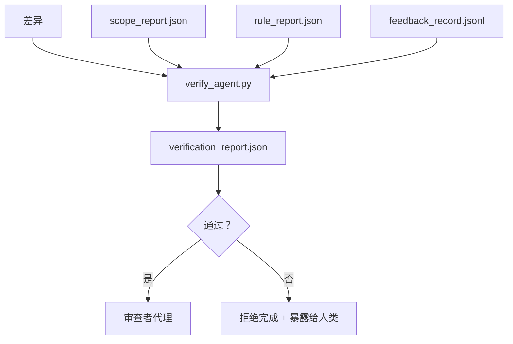

# 验证门控

> 代理不能给自己的作品打分。验证门控（Verification Gate）读取范围契约、反馈日志、规则报告和差异，回答一个单一问题：这个任务真的完成了吗？如果门控说不，任务就没有完成，无论聊天记录怎么说。

**类型：** 构建
**语言：** Python（标准库）
**前置条件：** Phase 14 · 33（规则），Phase 14 · 36（范围），Phase 14 · 37（反馈）
**时间：** ~55 分钟

## 学习目标

- 将验证门控定义为对工作台产物的确定性函数。
- 将规则报告、范围报告、反馈记录和差异组合成一个单一裁决。
- 生成审查者代理和 CI 都能读取的 `verification_report.json`。
- 在出现任何 block 严重性失败时拒绝推进任务，没有例外。

## 问题

代理太容易声明成功了。三种失败模式占主导：

- "看起来不错。" 模型读取自己的差异并判定正确。
- "测试通过了。" 自信地说出。没有测试实际运行的记录。
- "验收满足。" 验收标准被宽松解释为"任何类似完成的东西"。

工作台的修复是单一的验证门控，读取代理已经生成的产物并做出判断。门控是确定性的。门控在版本控制中。门控接入 CI。代理不能贿赂它。

## 概念



### 门控检查什么

| 检查 | 来源产物 | 严重性 |
|------|---------|--------|
| 所有验收命令都运行了 | `feedback_record.jsonl` | block |
| 所有验收命令零退出 | `feedback_record.jsonl` | block |
| 范围检查无禁止写入 | `scope_report.json` | block |
| 范围检查无范围外写入 | `scope_report.json` | block 或 warn |
| 所有 block 严重性规则通过 | `rule_report.json` | block |
| 反馈中无 `null` 退出码 | `feedback_record.jsonl` | block |
| 触碰文件匹配 `scope.allowed_files` | 两者 | warn |

`warn` 发现注释裁决；`block` 发现阻止 `passed: true`。

### 确定性，而非概率性

门控必须在相同产物集上每次产生相同裁决。不使用 LLM 评判者。LLM 评判者属于审查者侧（Phase 14 · 39），其目标是定性评估而非状态。

### 一个报告，一个路径

门控在每次任务关闭时生成一个 `verification_report.json`，写在 `outputs/verification/<task_id>.json` 下。CI 消费同一路径。多个门控使用不同路径会分叉真相源。

### 无例外拒绝

Block 严重性的发现不能被代理覆盖。只能由人类覆盖，带有记录的 `override_reason` 和 `overridden_by` 用户 ID。覆盖是有签名的变更，而非代理决策。

## 构建

`code/main.py` 实现：

- 每个输入产物的加载器，全部在本课内本地桩化，使课程自包含。
- 一个纯函数 `verify(task_id, artifacts) -> VerdictReport`。
- 一个打印机，显示每个检查的结果和最终通过/失败。
- 一个演示，包含三种任务场景：干净通过、范围蔓延、缺失验收。

运行方式：

```
python3 code/main.py
```

输出：三个裁决报告，每个保存在脚本旁边。

## 现实世界中的生产模式

四种模式将门控从"另一个 lint 作业"提升为"决定性边界"。

**纵深防御，而非单一门控。** Pre-commit 钩子 → CI 状态检查 → 工具前授权钩子 → 合并前门控。每一层都是确定性的，使一层失败被下一层捕获。microservices.io 的 2026 年 3 月手册明确说明：pre-commit 钩子不可绕过，因为与模型侧技能不同，它不依赖代理遵循指令。验证门控位于 CI / 合并前层。

**用确定性检查防御，模型评判者仅用于细微之处。** Anthropic 的 2026 年混合规范（Hybrid Norm）配对：可验证的奖励（单元测试、Schema 检查、退出码）回答"代码是否解决了问题？"——LLM 评分标准回答"代码是否可读、安全、符合风格？"门控运行第一类；审查者（Phase 14 · 39）运行第二类。混合两者会折叠信号。

**有签名的覆盖日志，而非 Slack 讨论串。** 每次覆盖在 `outputs/verification/overrides.jsonl` 中生成一行：时间戳、发现代码、原因、签名用户、当前 HEAD 提交。运行时拒绝任何缺少签名的覆盖；审计追踪是 git 追踪的。这是覆盖策略与覆盖表面文章之间的界限。

**覆盖率底线作为一等检查。** `coverage_report.json` 馈入 `coverage_floor`（默认 80%）检查。如果测量覆盖率低于底线或低于上次合并的底线超过 1 个百分点，门控失败。没有此检查，代理会静默删除失败的测试，验证报告保持绿色。

**`--strict` 模式将 warn 提升为 block。** 对于发布分支、阻碍交付的 PR 或事后分类，`--strict` 使每个警告变为硬失败。该标志按分支选择性启用；不是全局默认，因为对所有东西严格会侵蚀日常工作流。

## 使用场景

生产模式：

- **CI 步骤。** 一个 `verify_agent` 作业对代理的最终产物运行门控。合并保护拒绝没有 `passed: true` 的情况。
- **预交接钩子。** 代理运行时在生成交接文档之前调用门控。没有绿色裁决，没有交接。
- **手动分类。** 操作员在代理声明成功且人类怀疑时阅读报告。

门控是工作台流程中的决定性边界。其他每个表面都在其上游。

## 部署

`outputs/skill-verification-gate.md` 将门控接入特定项目：哪些验收命令馈入它，哪些规则是 block 严重性，哪些范围外写入被容忍，覆盖审计日志如何存储。

## 练习

1. 添加一个 `coverage_floor` 检查：测试命令必须产生至少 80% 的覆盖率报告。决定哪个产物携带底线。
2. 支持 `--strict` 模式，将每个 `warn` 提升为 `block`。记录 strict 模式是正确的默认值的场景。
3. 使门控除 JSON 外还生成 Markdown 总结。辩护哪些字段属于总结。
4. 添加 `time_since_last_human_touch` 检查：在人类按键后 60 秒内编辑的任何文件豁免范围外标记。
5. 对你产品的真实代理差异运行门控。多少发现是真实的，多少是噪音？门控需要在何处增长？

## 关键术语

| 术语 | 人们常说的 | 实际含义 |
|------|-----------|---------|
| 验证门控（Verification Gate） | "阻止东西的检查" | 对工作台产物产生通过/失败裁决的确定性函数 |
| Block 严重性 | "硬失败" | 阻止 `passed: true` 且需要签名覆盖的发现 |
| 覆盖日志（Override Log） | "为什么我们让它通过" | 带有原因和用户 ID 的已签名条目，由审查审计 |
| 验收命令（Acceptance Command） | "证明" | 零退出即表示 `完成` 的 Shell 命令 |
| 单一报告路径 | "真相源" | `outputs/verification/<task_id>.json`，被 CI 和人类一致消费 |

## 进一步阅读

- [Anthropic，长时间运行应用开发的工具链设计](https://www.anthropic.com/engineering/harness-design-long-running-apps)
- [OpenAI Agents SDK 护栏](https://platform.openai.com/docs/guides/agents-sdk/guardrails)
- [microservices.io，GenAI 开发平台：护栏](https://microservices.io/post/architecture/2026/03/09/genai-development-platform-part-1-development-guardrails.html) — pre-commit 与 CI 之间的纵深防御
- [ICMD，2026 年代理 AI 运维手册](https://icmd.app/article/the-2026-playbook-for-agentic-ai-ops-guardrails-costs-and-reliability-at-scale-1776661990431) — 审批门控阶梯（草稿→审批→阈值下自动）
- [类型检查合规性：确定性护栏（arXiv 2604.01483）](https://arxiv.org/pdf/2604.01483) — Lean 4 作为确定性门控的上限
- [logi-cmd/agent-guardrails — 合并门控规范](https://github.com/logi-cmd/agent-guardrails) — 范围 + 变异测试门控
- [Guardrails AI x MLflow](https://guardrailsai.com/blog/guardrails-mlflow) — 确定性验证器作为 CI 评分器
- [Akira，代理系统的实时护栏](https://www.akira.ai/blog/real-time-guardrails-agentic-systems) — 工具前/后门控
- Phase 14 · 27 — 提示注入防御（门控的对抗配对）
- Phase 14 · 36 — 此门控执行的范围契约
- Phase 14 · 37 — 此门控评分的反馈日志
- Phase 14 · 39 — 门控交接给的审查者代理

---

## 相关知识

- [[14-agent-engineering/33_instructions-as-executable-constraints]]
- [[14-agent-engineering/36_scope-contracts]]
- [[14-agent-engineering/37_runtime-feedback-loops]]
