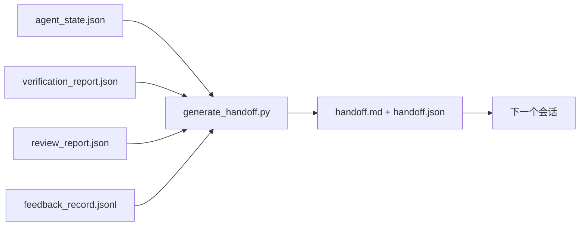

# 多会话交接

> 会话即将结束。工作还没有。交接包（Handoff Packet）是将"代理工作了一个小时"转变为"下一个会话在第一分钟就高效"的产物。有目的地构建它，而非事后才想起。

**类型：** 构建
**语言：** Python（标准库）
**前置条件：** Phase 14 · 34（仓库记忆），Phase 14 · 38（验证），Phase 14 · 39（审查者）
**时间：** ~50 分钟

## 学习目标

- 识别每个交接包需要的七个字段。
- 从工作台产物生成交接，无需手写散文。
- 将大型反馈日志修剪为交接大小的摘要。
- 使下一个会话的第一个操作确定。

## 问题

会话结束。代理说"很好，我们取得了进展。"下一个会话打开。下一个代理问"我们上次停在哪里？"第一个代理的答案消失了。下一个代理重新发现、重新运行相同的命令、重新向人类问相同的问题，并花三十分钟恢复上一个会话的最后三十秒。

糟糕交接的成本在任务的整个生命周期中每次会话都要支付。修复方法是会话结束时自动生成的包：改变了什么、为什么、尝试了什么、失败了什么、还剩什么、下次首先做什么。

## 概念



### 每个交接携带的七个字段

| 字段 | 它回答的问题 |
|------|------------|
| `summary` | 一段话描述完成了什么 |
| `changed_files` | 差异一览 |
| `commands_run` | 实际执行了什么 |
| `failed_attempts` | 尝试了什么以及为什么没成功 |
| `open_risks` | 什么可能在下个会话咬人，带严重性 |
| `next_action` | 下一个会话采取的第一个具体步骤 |
| `verdict_pointer` | 指向验证 + 审查报告的路径 |

`next_action` 字段是承重的。一个除了 `next_action` 之外什么都有的交接是状态报告，不是交接。

### 交接是生成的，而非书写的

手写的交接是在难熬的日子里会被跳过的交接。生成器读取工作台产物并生成包。代理的工作是将工作台留在生成器可以总结的状态，而非撰写总结。

### 两种形式：人类可读和机器可读

`handoff.md` 是人类阅读的内容。`handoff.json` 是下一个代理加载的内容。两者来自相同的源产物。如果它们分歧，JSON 胜出。

### 反馈日志修剪

完整的 `feedback_record.jsonl` 可能有数百条。交接仅携带最后 K 条加上每个非零退出的条目。下一个会话在需要时加载完整日志，但包保持小。

## 构建

`code/main.py` 实现：

- 一个加载器，将状态、裁决、审查和反馈汇聚到单个 `WorkbenchSnapshot`。
- 一个 `generate_handoff(snapshot) -> (markdown, payload)` 函数。
- 一个过滤器，选择最后 K 条反馈条目加上所有非零退出。
- 一个演示运行，在脚本旁边写入 `handoff.md` 和 `handoff.json`。

运行方式：

```
python3 code/main.py
```

输出：打印的交接正文，以及磁盘上的两个文件。

## 现实世界中的生产模式

Codex CLI、Claude Code 和 OpenCode 各自提供了不同的压缩（Compaction）故事；结构化的交接包位于这三者之上。

**压缩策略各异；包 Schema 不变。** Codex CLI 的 POST /v1/responses/compact 是服务器端不透明的 AES 二进制块（OpenAI 模型的快速路径）；回退是追加为 `_summary` 用户角色消息的本地"交接摘要"。Claude Code 在上下文的 95% 处运行五阶段渐进式压缩。OpenCode 进行基于时间戳的消息隐藏加上 5 标题 LLM 摘要。三种不同机制，相同的需求：将压缩后幸存的内容序列化为可移植的产物。包就是那个产物。

**新鲜会话交接不是压缩。** 压缩扩展一个会话；交接干净地关闭一个并在新上下文中开始下一个。Hermes Issue #20372 的框架（2026 年 4 月）是正确的：当原地压缩开始退化时，代理应写入紧凑的交接，结束会话，在新上下文中恢复。包是使该转换便宜的东西。错误是一直压缩到质量崩溃；修复是预算一个早期、干净的交接。

**每个分支和主题一个活跃交接。** 多代理协调在过时交接上比在糟糕模型输出上更容易崩溃。始终包含 `branch`、`last_known_good_commit` 和 `status` 为 `active | superseded | archived`。过时交接归档；只有活跃的交接触动下一个会话。这是交接作为笔记和交接作为状态之间的区别。

**在 50-75% 上下文处收尾，而非在墙壁处。** 手写模式手册（CLAUDE.md + HANDOVER.md）报告当会话在 50-75% 上下文预算内结束时结果最佳，而非 95%。包生成器在压缩产物污染源状态之前干净运行。上下文完整时写入便宜；当模型已经丢失位置时昂贵。

## 使用场景

生产模式：

- **会话结束钩子。** 运行时在用户关闭聊天时触发生成器。包进入 `outputs/handoff/<session_id>/`。
- **PR 模板。** 生成器的 markdown 也是 PR 正文。审查者无需打开其他五个文件即可阅读。
- **跨代理交接。** 用一个产品（Claude Code）构建，用另一个（Codex）继续。包是通用语言（Lingua Franca）。

包是小的、规则的、便宜生成的。成本节省随着每次会话复利。

## 部署

`outputs/skill-handoff-generator.md` 生成一个调整到项目产物路径的生成器、运行它的会话结束钩子，以及下一个代理在启动时读取的 `handoff.json` Schema。

## 练习

1. 添加一个 `assumptions_to_validate` 字段，暴露构建者记录但审查者评分不超过 1 的每个假设。
2. 对失败的运行与通过的运行以不同方式修剪反馈摘要。辩护这种不对称。
3. 包含"向人类提问"列表。问题进入包而非聊天消息的阈值是什么？
4. 使生成器幂等：运行两次产生相同的包。需要什么是稳定的才能保持这点？
5. 添加"下一个会话前置条件"部分，列出下一个会话在操作前必须加载的确切产物。

## 关键术语

| 术语 | 人们常说的 | 实际含义 |
|------|-----------|---------|
| 交接包（Handoff Packet） | "会话摘要" | 携带七个字段的生成产物，markdown 和 JSON 两种形式 |
| 下一个操作（Next Action） | "首先做什么" | 启动下一个会话的一个具体步骤 |
| 反馈修剪（Feedback Trim） | "日志摘要" | 最后 K 条记录加上每个非零退出 |
| 状态报告（Status Report） | "我们做了什么" | 缺少 `next_action` 的文档；有用但不是交接 |
| 裁决指针（Verdict Pointer） | "收据" | 指向验证 + 审查报告的路径，用于可追溯性 |

## 进一步阅读

- [Anthropic，长时间运行代理的有效工具链](https://www.anthropic.com/engineering/effective-harnesses-for-long-running-agents)
- [OpenAI Agents SDK 交接](https://platform.openai.com/docs/guides/agents-sdk/handoffs)
- [Codex Blog，Codex CLI 上下文压缩：架构、配置、管理长会话](https://codex.danielvaughan.com/2026/03/31/codex-cli-context-compaction-architecture/) — POST /v1/responses/compact 和本地回退
- [Justin3go，卸下沉重记忆：Codex、Claude Code、OpenCode 中的上下文压缩](https://justin3go.com/en/posts/2026/04/09-context-compaction-in-codex-claude-code-and-opencode) — 三个供应商压缩对比
- [JD Hodges，Claude 交接提示：如何跨会话保持上下文（2026）](https://www.jdhodges.com/blog/ai-session-handoffs-keep-context-across-conversations/) — CLAUDE.md + HANDOVER.md，50-75% 上下文预算
- [Mervin Praison，管理多代理编码会话中的交接：不丢失连续性的新鲜上下文](https://mer.vin/2026/04/managing-handoffs-in-multi-agent-coding-sessions-fresh-context-without-losing-continuity/) — 分布式系统框架
- [Hermes Issue #20372 — 当压缩变得有风险时自动新鲜会话交接](https://github.com/NousResearch/hermes-agent/issues/20372)
- [Hermes Issue #499 — 上下文压缩质量改造](https://github.com/NousResearch/hermes-agent/issues/499) — Codex CLI 中面向交接的提示
- [Microsoft Agent Framework，压缩](https://learn.microsoft.com/en-us/agent-framework/agents/conversations/compaction)
- [OpenCode，上下文管理与压缩](https://deepwiki.com/sst/opencode/2.4-context-management-and-compaction)
- [LangChain，代理的上下文工程](https://www.langchain.com/blog/context-engineering-for-agents)
- Phase 14 · 34 — 生成器读取的状态文件
- Phase 14 · 38 — 包指向的验证裁决
- Phase 14 · 39 — 打包到包中的审查者报告

---

## 相关知识

- [[14-agent-engineering/34_repo-memory-and-state]]
- [[14-agent-engineering/38_verification-gates]]
- [[14-agent-engineering/39_reviewer-agent]]
