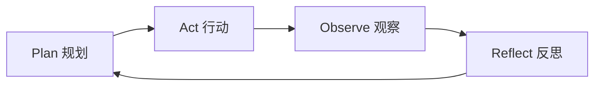

# AI Agent

## 知识库中的位置

AI Agent 是本知识库最丰富的主题（阶段 14 共 42 篇），是 AI 工程的高级形态：

### Agent 工程核心（阶段 14）
- [[../14-agent-engineering/01_what-is-an-ai-agent]] — AI Agent 定义
- [[../14-agent-engineering/02_agent-loop]] — Agent 循环：Plan → Act → Observe → Reflect
- [[../14-agent-engineering/03_agent-planning]] — 规划：ReAct、Plan-and-Solve、Tree-of-Thought
- [[../14-agent-engineering/04_agent-memory-systems]] — 记忆系统：短期、长期、情景、语义
- [[../14-agent-engineering/05_tools-and-function-calling]] — 工具使用与函数调用
- [[../14-agent-engineering/06_grounding-with-apis]] — API 接地
- [[../14-agent-engineering/08_rag-and-agents]] — RAG + Agent 融合
- [[../14-agent-engineering/09_orchestration-frameworks]] — 编排框架
- [[../14-agent-engineering/14_debugging-and-observability]] — Agent 可观测性
- [[../14-agent-engineering/15_evals-testing-and-humaneval]] — Agent 评估
- [[../14-agent-engineering/30_production-agent-runtimes]] — 生产级 Agent 运行时

### 自主系统（阶段 15）
- [[../15-autonomous-systems/01_web-agents-browser-use]] — Web Agent
- [[../15-autonomous-systems/02_os-agents-computer-use]] — OS Agent
- [[../15-autonomous-systems/07_code-agents-devin-claude-code]] — 代码 Agent
- [[../15-autonomous-systems/13_robotics-agents-vla]] — 机器人 Agent

### 多 Agent 系统（阶段 16）
- [[../16-multi-agent-and-swarms/07_magentic-one]] — Microsoft Magentic-One
- [[../16-multi-agent-and-swarms/08_agent-organization-patterns]] — Agent 组织模式
- [[../16-multi-agent-and-swarms/17_agent-debate-frameworks]] — Agent 辩论框架

## Agent 核心循环

## Agent 能力栈

| 层级 | 能力 | 知识库阶段 |
|------|------|------------|
| 推理 | LLM 推理引擎 | 阶段 10-11 |
| 记忆 | 短期/长期/工作记忆 | 阶段 14 |
| 工具 | Function Calling, MCP, API | 阶段 13-14 |
| 规划 | ReAct, ToT, 分层规划 | 阶段 14 |
| 反思 | Self-Reflection, Self-Correction | 阶段 14 |
| 协作 | 多 Agent 协调, 辩论 | 阶段 16 |
| 安全 | Guardrails, 对齐, 可观测 | 阶段 17-18 |

## 从 LLM 到 Agent 的演进

1. **LLM**：单轮对话，无记忆，无工具
2. **Chatbot**：多轮对话 + 上下文记忆
3. **Tool-LLM**：Function Calling + API
4. **Agent**：自主规划 + 多步执行 + 记忆 + 反思
5. **Multi-Agent**：多 Agent 协作 + 分工
6. **Autonomous System**：长期自主运行 + 环境交互

## 跨阶段关联

- Agent 以 [[concepts/大语言模型LLM]] 为核心推理引擎
- [[concepts/RAG检索增强生成]] 是 Agent 的知识来源
- MCP/A2A 协议定义 Agent 间通信（[[../13-tools-and-protocols/]]）
- Agent 的评估不同于模型评估（[[../14-agent-engineering/15_evals-testing-and-humaneval]]）
- Agent 安全是独特挑战（[[../18-ethics-safety-alignment/]]）