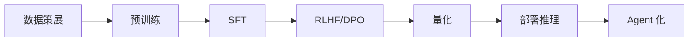

# 大语言模型 (LLM)

## 知识库中的位置

LLM 是本知识库的支柱主题，覆盖从零构建、工程实践到 Agent 化：

### 从零构建 LLM（阶段 10）
- [[../10-llms-from-scratch/01_llm-landscape-and-history]] — LLM 全景与历史
- [[../10-llms-from-scratch/02_data-curation]] — 数据策展：预训练数据的质量
- [[../10-llms-from-scratch/03_tokenizer-from-scratch]] — 从零实现 Tokenizer
- [[../10-llms-from-scratch/04_pre-training-architecture]] — 预训练架构设计
- [[../10-llms-from-scratch/05_distributed-training-math]] — 分布式训练的数学
- [[../10-llms-from-scratch/06_sft-supervised-fine-tuning]] — SFT 监督微调
- [[../10-llms-from-scratch/07_rlhf-from-scratch]] — 从零实现 RLHF
- [[../10-llms-from-scratch/08_direct-preference-optimization]] — DPO 直接偏好优化
- [[../10-llms-from-scratch/09_rlhf-vs-dpo-which-when]] — RLHF vs DPO 对比
- [[../10-llms-from-scratch/10_simple-rlhf]] — Simple RLHF
- [[../10-llms-from-scratch/11_llm-training-capstone]] — LLM 训练综合实践
- [[../10-llms-from-scratch/12_quantization]] — 量化：GGUF、GPTQ、AWQ
- [[../10-llms-from-scratch/13_knowledge-distillation-v2]] — 知识蒸馏
- [[../10-llms-from-scratch/14_speculative-decoding-v2]] — 推测解码
- [[../10-llms-from-scratch/15_llm-reasoning-distillation]] — LLM 推理蒸馏
- [[../10-llms-from-scratch/18_inference-time-scaling-reasoning-v2]] — 推理时扩展
- [[../10-llms-from-scratch/19_long-context-and-retrieval-techniques]] — 长上下文与检索技术
- [[../10-llms-from-scratch/20_reinforcement-learning-for-llms]] — LLM 的强化学习
- [[../10-llms-from-scratch/21_sub-quadratic-architectures]] — 次二次方架构
- [[../10-llms-from-scratch/22_llm-evaluation-benchmarks]] — LLM 评估基准
- [[../10-llms-from-scratch/23_llm-application-openai-api]] — LLM 应用开发
- [[../10-llms-from-scratch/24_llm-capstone-end-to-end]] — LLM 端到端综合项目

### LLM 工程实践（阶段 11）
- [[../11-llm-engineering/01_prompt-engineering]] — Prompt Engineering
- [[../11-llm-engineering/02_structured-outputs-json-mode]] — 结构化输出
- [[../11-llm-engineering/03_context-length-and-memory]] — 上下文与记忆
- [[../11-llm-engineering/04_rag-from-scratch]] — 从零实现 RAG
- [[../11-llm-engineering/06_rag-evaluation]] — RAG 评估
- [[../11-llm-engineering/08_advanced-rag]] — 高级 RAG：Agentic RAG、Graph RAG
- [[../11-llm-engineering/09_function-calling-and-tools]] — 函数调用与工具
- [[../11-llm-engineering/12_resistant-ai-guardrails]] — AI 护栏

## 技术架构图

## 训练三阶段

1. **预训练 (Pre-training)**：海量文本 → 基座模型（理解语言统计规律）
2. **监督微调 (SFT)**：指令数据 → 遵循指令的助手
3. **对齐 (RLHF/DPO)**：偏好数据 → 符合人类价值观

## 跨阶段关联

- LLM 基于 [[concepts/Transformer架构]] 的 Decoder-only 架构
- [[concepts/注意力机制]] 使长上下文成为可能
- [[concepts/RAG检索增强生成]] 让 LLM 连接外部知识
- 量化 + KV Cache 是 [[concepts/推理优化]] 的核心
- [[concepts/AI-Agent]] 让 LLM 从对话系统升级为自主智能体