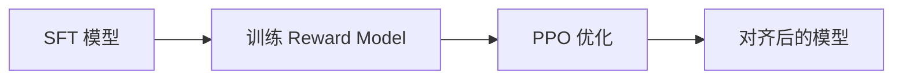

# 强化学习 (RL)

## 知识库中的位置

强化学习是 AI 的三大范式之一，在现代 LLM 对齐中至关重要：

### 传统 RL（阶段 09）
- [[../09-reinforcement-learning/01_rl-foundations]] — RL 基础：MDP、Policy、Value
- [[../09-reinforcement-learning/02_tabular-rl]] — 表格型 RL
- [[../09-reinforcement-learning/03_dqn-extensions]] — DQN 及其扩展
- [[../09-reinforcement-learning/04_policy-gradient]] — 策略梯度
- [[../09-reinforcement-learning/05_actor-critic-methods]] — Actor-Critic 方法
- [[../09-reinforcement-learning/06_ppo]] — PPO
- [[../09-reinforcement-learning/07_grpo-and-variants]] — GRPO
- [[../09-reinforcement-learning/08_multi-arm-bandits]] — 多臂老虎机
- [[../09-reinforcement-learning/09_exploration-strategies]] — 探索策略
- [[../09-reinforcement-learning/10_offline-rl]] — 离线 RL
- [[../09-reinforcement-learning/11_model-based-rl]] — 基于模型的 RL
- [[../09-reinforcement-learning/12_rl-capstone]] — RL 综合实践

### RL 在 LLM 中的应用（阶段 10）
- [[../10-llms-from-scratch/07_rlhf-from-scratch]] — 从零实现 RLHF
- [[../10-llms-from-scratch/08_direct-preference-optimization]] — DPO
- [[../10-llms-from-scratch/09_rlhf-vs-dpo-which-when]] — RLHF vs DPO
- [[../10-llms-from-scratch/10_simple-rlhf]] — Simple RLHF
- [[../10-llms-from-scratch/20_reinforcement-learning-for-llms]] — LLM 的 RL

## 核心概念

### MDP (Markov Decision Process)
$$
\mathcal{M} = (\mathcal{S}, \mathcal{A}, \mathcal{P}, \mathcal{R}, \gamma)
$$

### 价值函数
$$
V^\pi(s) = \mathbb{E}\left[\sum_{t=0}^{\infty} \gamma^t R(s_t, a_t) \mid s_0 = s, \pi\right]
$$

### PPO（Proximal Policy Optimization）
- 当前最主流的 RL 算法
- 核心创新：Clipped Surrogate Objective
- RLHF 中的 PPO 用于优化 reward model 指导下的策略

### RLHF（Reinforcement Learning from Human Feedback）

1. 收集人类偏好数据
2. 训练 Reward Model
3. 用 PPO 优化策略以最大化奖励

### DPO（Direct Preference Optimization）
- 不需要显式训练 Reward Model
- 直接在偏好数据上优化策略
- 更简单、更稳定，效果与 RLHF 可媲美

## 从游戏到语言：RL 的进化

| 时代 | 代表性工作 | 特点 |
|------|-----------|------|
| 2013-2015 | DQN (Atari) | 深度 RL 元年 |
| 2016 | AlphaGo | MCTS + RL + SL |
| 2017 | PPO | 稳定策略优化 |
| 2019 | OpenAI Five / AlphaStar | 复杂环境 RL |
| 2022 | RLHF (InstructGPT) | RL 进入 NLP 主流 |
| 2023 | DPO | 简化 RLHF |
| 2024 | GRPO (DeepSeek) | 无需 Critic 的 RL |
| 2025 | RL for Reasoning | RL 增强推理能力 |

## 跨阶段关联

- RL 是 [[concepts/大语言模型LLM]] 对齐的关键技术
- PPO 是 RLHF 的核心算法（[[../10-llms-from-scratch/07_rlhf-from-scratch]]）
- DPO 提供了更简单的替代方案
- RL 也是 [[concepts/AI-Agent]] 自主学习和优化的基础