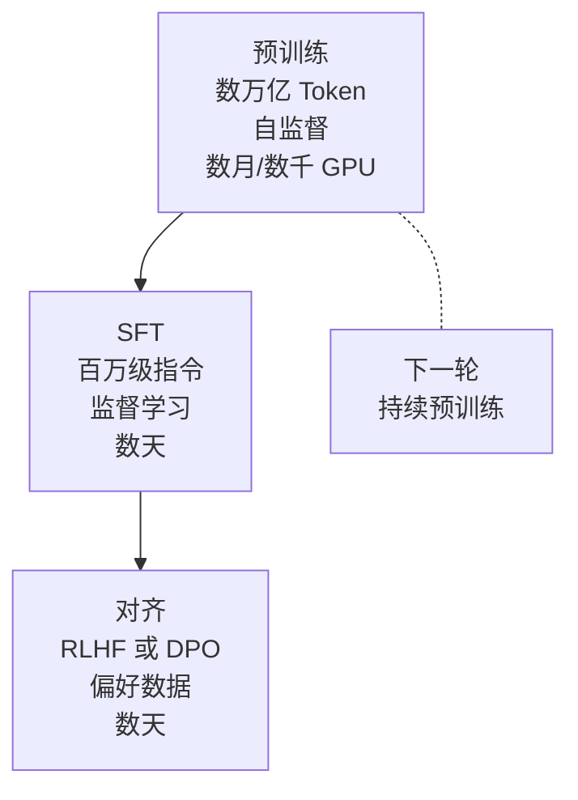

# 模型训练范式

## 知识库中的位置

从传统 ML 训练到 LLM 训练，范式经历了根本性变化：

### 传统 ML 训练（阶段 02-03）
- [[../02-ml-fundamentals/02_linear-regression]] — 从梯度下降开始的训练
- [[../02-ml-fundamentals/12_hyperparameter-tuning]] — 超参数调优
- [[../03-deep-learning-core/03_backpropagation]] — 反向传播算法
- [[../03-deep-learning-core/06_optimizers]] — 优化器演进

### LLM 训练（阶段 10）
- [[../10-llms-from-scratch/04_pre-training-architecture]] — 预训练架构
- [[../10-llms-from-scratch/05_distributed-training-math]] — 分布式训练数学
- [[../10-llms-from-scratch/06_sft-supervised-fine-tuning]] — SFT
- [[../10-llms-from-scratch/07_rlhf-from-scratch]] — RLHF
- [[../10-llms-from-scratch/08_direct-preference-optimization]] — DPO
- [[../10-llms-from-scratch/09_rlhf-vs-dpo-which-when]] — RLHF vs DPO

## 训练范式对比

| 范式 | 数据需求 | 计算需求 | 典型应用 |
|------|----------|----------|----------|
| 监督学习 | 标注数据 | 中 | 分类、回归 |
| 无监督学习 | 无标注 | 中 | 聚类、降维 |
| 自监督学习 | 大量无标注 | 极高 | LLM 预训练 |
| 强化学习 | 环境交互 | 高 | 游戏、机器人 |
| RLHF | 偏好数据 | 高 | LLM 对齐 |
| DPO | 偏好数据 | 中 | LLM 对齐（简化版） |
| 迁移学习 | 预训练模型 | 低 | 领域适应 |

## LLM 训练三阶段

## 分布式训练关键技术

- **数据并行 (DP)**：每 GPU 复制模型，不同 batch
- **张量并行 (TP)**：模型层内切分
- **流水线并行 (PP)**：模型层间切分
- **ZeRO (Zero Redundancy Optimizer)**：优化器状态分片
- **3D 并行 = DP + TP + PP**
- **FSDP (Fully Sharded Data Parallel)**：PyTorch 原生方案
- **序列并行**：长序列切分

## 跨阶段关联

- 训练需要 [[concepts/推理优化]] 中的量化和蒸馏来降低成本
- 训练基础设施见 [[../17-infrastructure-and-production/]]
- 训练数据策展见 [[../10-llms-from-scratch/02_data-curation]]
- Scaling Laws 指导训练规模（[[../07-transformers-deep-dive/13_scaling-laws]]）