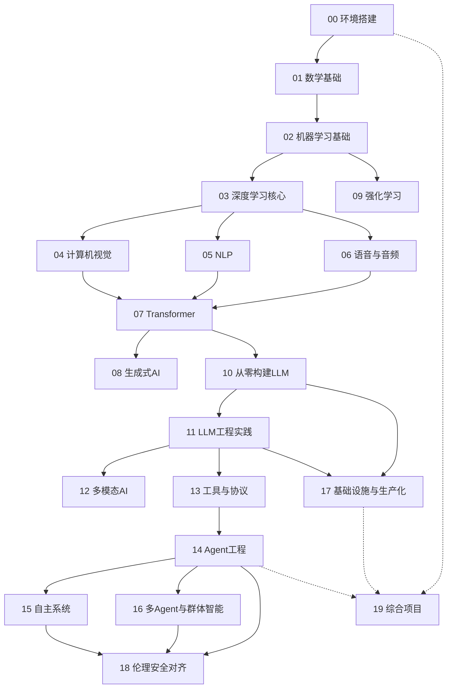

# AI 工程从基础到精通 — 知识库总览

> 本知识库基于 [AI Engineering from Scratch](https://github.com/patil-suraj/ai-engineering-from-scratch) 的中文翻译构建，按照 Karpathy LLM Wiki 模式组织，共 20 个阶段、431 篇文档。

---

## 知识地图

## 四层学习路线

### 第一层：地基（阶段 00-02）
从开发环境到数学基础和经典 ML 算法，建立 AI 工程的基础知识体系。
- 00 环境搭建与工具链（12 篇）—— Git、Docker、GPU、Linux、Python 环境
- 01 数学基础（22 篇）—— 线性代数、概率论、微积分、优化、信息论
- 02 机器学习基础（18 篇）—— 回归、分类、决策树、SVM、评估、特征工程

### 第二层：核心（阶段 03-09）
深度学习的理论核心和三大感知领域。
- 03 深度学习核心（13 篇）—— 感知机、反向传播、优化器、正则化、框架
- 04 计算机视觉（28 篇）—— CNN → ResNet → YOLO → U-Net → ViT → Sora
- 05 NLP（29 篇）—— Word2Vec → Seq2Seq → Attention → BERT → GPT
- 06 语音与音频（17 篇）—— 频谱 → ASR → Whisper → TTS → 音乐生成
- 07 Transformer 深度解析（16 篇）—— Self-Attention → KV Cache → MoE → Scaling Laws
- 08 生成式 AI（15 篇）—— GAN → VAE → Diffusion → Stable Diffusion → Flow Matching
- 09 强化学习（12 篇）—— MDP → Q-Learning → DQN → PPO → RLHF

### 第三层：LLM 工程（阶段 10-13）
从零构建到工程化落地大语言模型。
- 10 从零构建 LLM（24 篇）—— Tokenizer → Pre-training → SFT → RLHF → DPO → 量化 → 推理优化
- 11 LLM 工程实践（17 篇）—— Prompt Engineering → RAG → Fine-tuning → Guardrails → MCP
- 12 多模态 AI（25 篇）—— CLIP → VLM → 视频理解 → 3D → 世界模型
- 13 工具与协议（23 篇）—— MCP、A2A、OpenAI API、LangChain、LlamaIndex、向量数据库

### 第四层：Agent 与生产化（阶段 14-19）
从单体 LLM 到多 Agent 系统，再到生产部署和综合实践。
- 14 Agent 工程（42 篇）—— Agent Loop → 规划 → 记忆 → 工具使用 → 评估基准 → 生产运行时
- 15 自主系统（18 篇）—— Web Agent、OS Agent、代码 Agent、机器人 Agent
- 16 多 Agent 与群体智能（25 篇）—— 协作模式、通信协议、辩论框架、组织架构
- 17 基础设施与生产化（28 篇）—— GPU 自动伸缩、vLLM、量化、缓存、网关、安全合规
- 18 伦理安全对齐（30 篇）—— 偏见、毒害、幻觉、隐私、红队测试、法规合规
- 19 综合项目（17 篇）—— 端到端实践：RAG 聊天机器人、语音助手、代码 Agent

---

## 跨阶段核心概念

这些概念贯穿多个阶段，在 `wiki/concepts/` 中有专题页面：

| 概念 | 涉及阶段 | 页面 |
|------|----------|------|
| 深度学习 | 03, 04, 05, 07 | [[concepts/深度学习]] |
| 注意力机制 | 05, 07, 10 | [[concepts/注意力机制]] |
| Transformer | 07, 08, 10, 12 | [[concepts/Transformer架构]] |
| 大语言模型 (LLM) | 10, 11, 14, 17 | [[concepts/大语言模型LLM]] |
| RAG | 11, 13, 14 | [[concepts/RAG检索增强生成]] |
| AI Agent | 14, 15, 16 | [[concepts/AI-Agent]] |
| 模型训练 | 02, 03, 10 | [[concepts/模型训练范式]] |
| 推理优化 | 10, 17 | [[concepts/推理优化]] |
| 强化学习 | 09, 10 | [[concepts/强化学习]] |

---

## 统计

| 指标 | 数值 |
|------|------|
| 阶段数 | 20 |
| 总文档数 | 431 |
| 最丰富阶段 | Agent 工程（42 篇） |
| 第二丰富 | 伦理安全对齐（30 篇） |
| 第三丰富 | NLP（29 篇） |

---

## 如何使用

1. **按阶段顺序学习**：00 → 01 → 02 → ... → 19，四层递进
2. **按概念探索**：在 Obsidian 图谱视图中，从 [[wiki/index]] 出发按需深入
3. **按项目驱动**：从 19 综合项目中选择感兴趣的，反向查阅所需阶段
4. **按角色定位**：
   - ML 工程师：着重 02-03, 10-11
   - 研究方向：着重 04-08, 10
   - 后端/Infra：着重 00, 13, 17
   - Agent 方向：着重 11, 14-16
   - 全栈 AI 工程师：全部